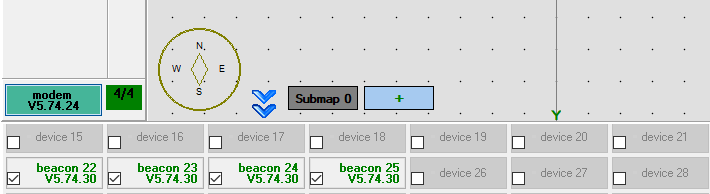

# 超声定位系统使用指南

## 准备工作

1.打开包装，连接 micro USB 线给定位标签充电，可使用手机充电器或者电脑 USB 接口等充电。充电时定位标签上红色 LED 指示灯闪烁，充满电后停止闪烁。从低电量到充满电大概需要1-2小时。

2.打开标签开关，两个拨码开关左侧保持远离 LED 指示灯，右侧为电源开关，拨到靠近 LED 指示灯位置为开。

3.打开 Dashboard 软件，使用 micro USB 线连接标签或路由到电脑，Dashboard 识别后显示配置信息。

4.对于路由，点击右下 Default 按钮加载默认配置。

5.对于固定标签，首先点击右下 Default 按钮加载默认配置，然后查看标签 id (Device address)并标记到标签外壳上方便使用过程中进行区分。也可对标签 id 进行修改，注意不要出现重复的 id。

6.对于车载移动标签，除了与固定标签相同的操作外，还需要将配置 Hedgehog mode 设置为 enable，将配置 Interfaces 的第一个子项 UART speed 设置为115200。

## 使用入门

以室内4个固定标签为例，快速搭建一个小范围的定位系统（需要4个固定标签+1个车载移动标签+1个路由，关闭其他用不到的标签电源开关），步骤如下。

1.按照以下规则，将已经打开电源开关的4个固定标签固定到墙壁或其他可安装位置上。

>为减少遮挡的情况，标签位置尽量高，例如1.8m 以上

>标签相对地面等高且需要测量出高度值

>标签必须两两之间可见（无遮挡、有换能器相对）

>标签尽量分散开，避免4个标签中有3个甚至全部在一条直线上

>建议任意标签之间的距离控制在20m 以内（理论最大30m）

>移动标签应尽量在固定标签围成的区域内部运动，布置固定标签时还应考虑此因素

2.打开 Dashboard 连接路由，连接成功后左下角显示 modem。如果不是首次使用，路由中可能已经存储有地图，点击设备列表右侧的 Erase map 按钮清除地图。然后点击 Submap 0 按钮。

3.点击设备列表中固定标签对应编号唤醒标签，过程大概需要10s。

4.点击设备列表中某个在线的标签，则右侧列表为该标签的参数设置。依次设置4个固定标签的 Height 参数为第1步布置的高度，注意单位为 m。

5.地图会自动构建。等待地图显示中四个绿色固定信标位置基本不再变化、左上角距离表全部为白色、且 freeze map 按钮上方显示橙色 `Freeze submap!` 字样后，点击 freeze map 按钮锁定地图。如果锁定后的地图与实际情况手性相反（例如地图中从1到2到3是逆时针而实际布置的是顺时针），点击镜像按钮翻转地图。

6.类似第3、4步的操作唤醒车载标签并设置车载标签相对地面的高度。

7.定位系统已经开始工作了，移动车载标签在 Dashboard 中查看运动轨迹。之后使用系统定位已经不再依赖 Dashboard 软件，只要给路由供电，数秒后即可从移动标签的串口读取到定位坐标。

8.路由连接 Dashboard 可在参数列表中查看所有标签的电量（电压），标签电量过低时界面上会有红色文字提示。

9.停止使用时路由断电即可，1min 后所有标签会自动进入睡眠状态。长时间不使用时请关闭标签电源开关。

