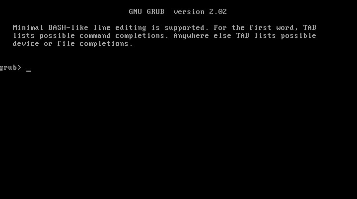
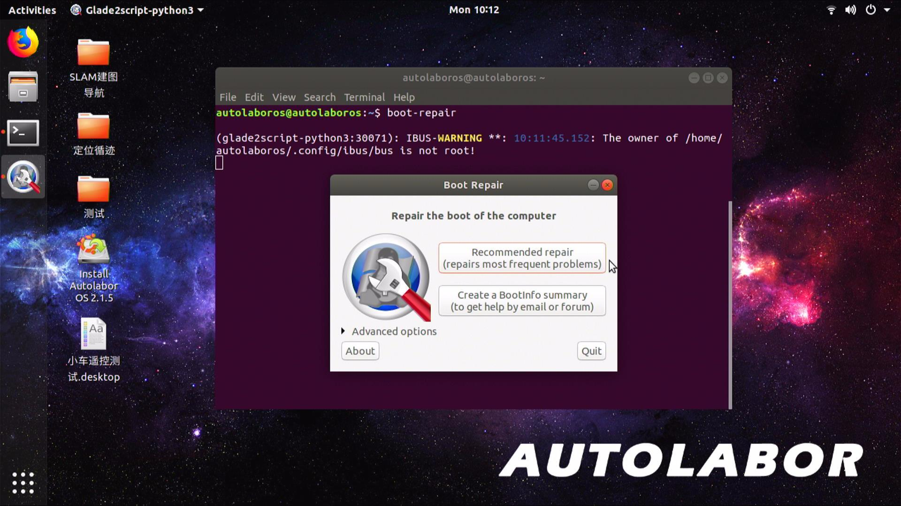

# 引导修复

当你的设备显示类似这样的画面，并且无法进入系统时，这表明是操作系统的引导出了故障，本文将帮助你修复系统引导。

  

## 准备

1. *重要！* 进入`Live`版AutolaborOS[参考此处](/usedoc/navigationKit2/common/os/live/doc)

2. 通过Wi-Fi或网线将Live版AutolaborOS接入互联网

## 开始

1. 在终端中依次运行如下命令

  * 添加软件源
  ```
  sudo add-apt-repository ppa:yannubuntu/boot-repair
  ```

  * 安装`boot-repair`
  ```
  sudo apt-get install -y boot-repair
  ```

  * 启动`boot-repair`
  ```
  boot-repair
  ```

2. 选择`Reconmmended repair`

  

3. 引导修复完成后，请弹出U盘并重启

## 常见问题


