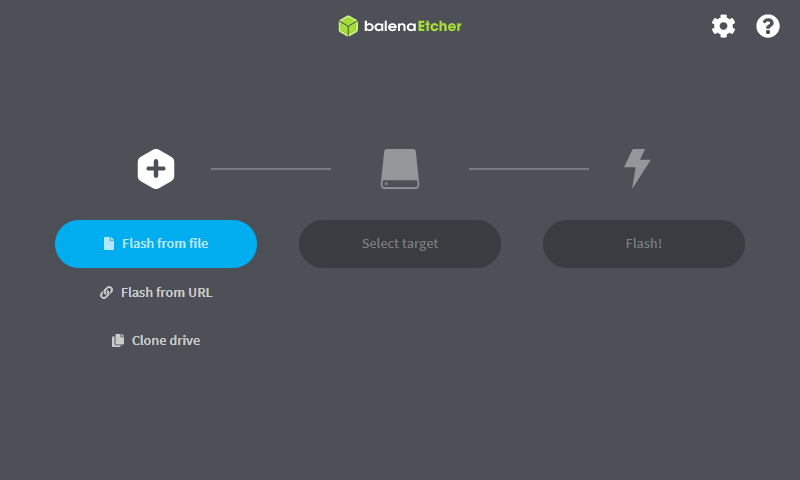
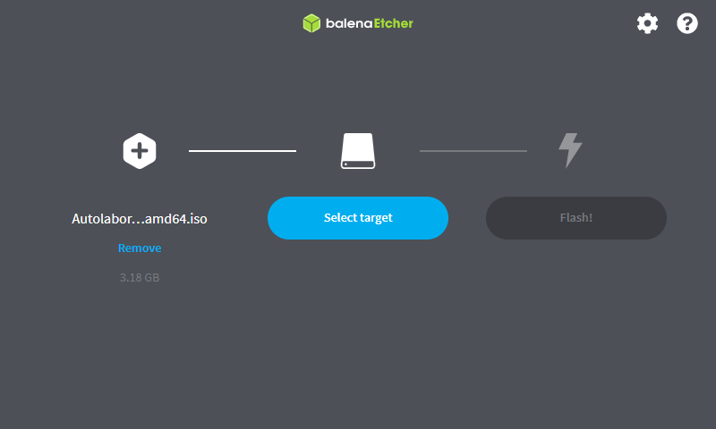
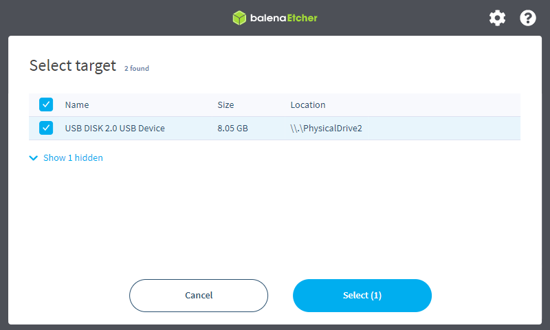
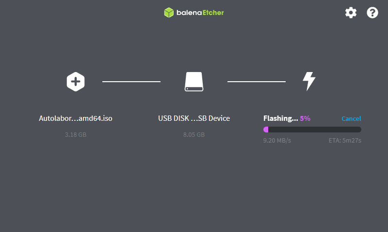
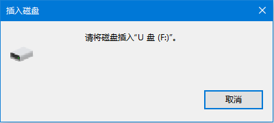
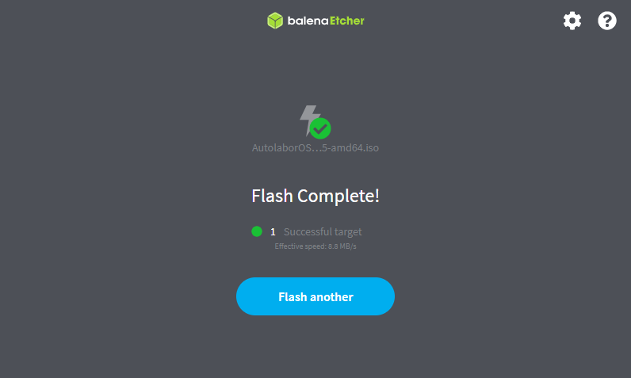

# 镜像烧录指南

如果你需要升级更新版本的AutolaborOS，或者烧录AutolaborOS镜像到一个新的U盘，本文将引导你如何烧录镜像。

## 准备

* U盘：容量为8GB或以上

* 镜像：[AutolaborOS](http://www.autolabor.com.cn/download)

* 烧录工具：[Etcher](https://www.balena.io/etcher/)

  > 适用于Windows、macOS、Linux多平台开源烧录工具

## 开始

> 以Windows平台为例进行介绍，其他平台的操作方法大致相同。

1.启动烧录工具`Etcher`

  

2.单击`Flash from file`（选择文件以烧录），然后选择先前下载的压缩镜像文件

  > Flash from URL功能可能不稳定，不推荐使用该方式。

  

3.将待烧录的优盘插入电脑（若尚未插入）
  > 如果 Windows 弹出如下提示对话框，则单击“Cancel”（取消）（请参阅[此处解释](https://github.com/balena-io/etcher/issues/2024)）：

  

5.单击`Select target`（选择目标设备），并选择刚刚插入的U盘

  

6.单击`Flash!`（烧录！）

  

  > 如果在烧录过程中 Windows 弹出如下提示对话框，请单击“取消”。

  

7.烧录完成，从文件管理器中弹出U盘即可

  

Etcher 烧录完成后，Windows 可能会提示你无法识别该U盘。此时只需单击“取消”，然后弹出U盘即可。

## 常见问题

* “Etcher报错，无法开始烧录？”

  尝试使用管理员身份重新打开Etcher。

