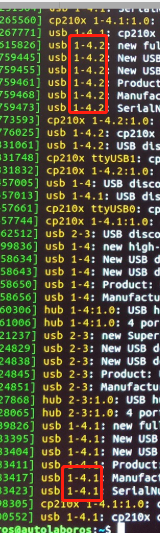

## 设备篇

<a href="/usedoc/navigationKit2/common/q_a/doc1#1">1. 电池充电接口、工控机电源接口、Kinect 集线器的电源接口可以互换适配器吗？</a>
<a href="/usedoc/navigationKit2/common/q_a/doc1#2">2. 为什么风扇噪音非常大？</a>
<a href="/usedoc/navigationKit2/common/q_a/doc1#3">3. 为什么我看不到 Kinect 的数据？</a>
<a href="/usedoc/navigationKit2/common/q_a/doc1#4">4. Mini 计算机上插口都够，为什么还要额外使用 USB-Hub ，我可以不用 Usb-Hub 吗？</a>
<a href="/usedoc/navigationKit2/common/q_a/doc1#5">5. USB-Hub 上面的接口不通用吗？</a>
<a href="/usedoc/navigationKit2/common/q_a/doc1#6">6. 我想换台计算机来作为上位机， OS 系统装好，USB-Hub 也插好了， 除了电脑本身其他什么都没变，为什么测试雷达、定位标签都找不到设备？</a>
<a href="/usedoc/navigationKit2/common/q_a/doc1#7">7.（接上问） 我就想换台计算机，然后把设备用起来，那我该怎么办？</a>
<a href="/usedoc/navigationKit2/common/q_a/doc1#8">8. 电池充电要冲多久才能充满？</a>

***

1. “电池充电接口、工控机电源接口、Kinect 集线器的电源接口可以互换适配器吗？”

少年，劝你别有这么大胆的想法！

尽管这三者物理外形一致，但电气规格**并不通用**，使用时务必注意，错误的接线方式将会导致设备损坏，甚至危及人身安全。

***

2. “为什么风扇噪音非常大？”

众所周知，AMD 旗下 CPU 最大的特点就是~~发热量大~~性能强劲，并且工控机内部结构十分紧凑，只有风扇维持在较高转速才保证系统正常工作。

***

3. “为什么我看不到 Kinect 的数据？”

Kinec集线器的数据线另一端必须插在工控机 **USB3.0** 接口上，否则将无法从工控机读取到Kinect的数据。

***

4. “ Mini 计算机上插口都够，为什么还要额外使用 USB-Hub ，我可以不用 Usb-Hub 吗？”

不行， USB-Hub 上的设备如果直接插计算机，将会找不到设备，程序将无法正常使用。

为了方便用户找到对应的设备，以及对计算机的功率与性能的考虑，特地增加 USB-Hub 。

***

5. “ USB-Hub 上面的接口不通用吗？”

不通用，组装时务必按照文字提示插入设备，错误的接线方式将无法正常建图、定位、避障，甚至危及人身安全。

***

6. “ 我想换台计算机来作为上位机， OS 系统装好，USB-Hub 也插好了， 除了电脑本身其他什么都没变，为什么测试雷达、定位标签都找不到设备？”

根据设备（主要指激光雷达、定位标签与 AP1）插的位置不同，OS 系统中制定了一套规则（rules），以便程序能够找到对应的设备。

如果设备有任何移动，包括但不仅限于以下：

* USB-Hub 在 Mini 计算机上插错位置
* USB-Hub 上的设备相互插错位置
* 设备插在任何非规定插口

都将导致找不到设备，功能无法使用。

***

7. （接上问）“ 我就想换台计算机，然后把设备用起来，那我该怎么办？”

**以下操作内容要求有 Linux 相关知识**

解决方法：修改系统规则（rules）

操作步骤：

1. 将 usb-hub 插到新电脑上

2. 把 usb-hub 上所有设备都拔掉

3. terminal 中执行
      `$ vim /etc/udev/rules/99-position.rules`
      注：box_1 为前雷达，box_2 为后雷达，box_3 为定位标签，autolabor_pro1 为 AP1 机器人

4. 将 hub上的设备依次插上保持不动，每插一个在 terminal 中执行一次
     `$ dmesg`

5. 将 99-position.rules 中对应设备 rules 里面的那一行的 kernels 修改为 $ dmesg 查看到的值

6. 每个设备修改完毕后，保存 99-position.rules 退出

7. 保存完毕，重启电脑

8. 电池充电要冲多久才能充满？

AP1 标准版/导航套件-电源模块：电池从0-100%，需要7小时左右  

AP1 高续航版： 电池从0-100%，需要10小时左右
