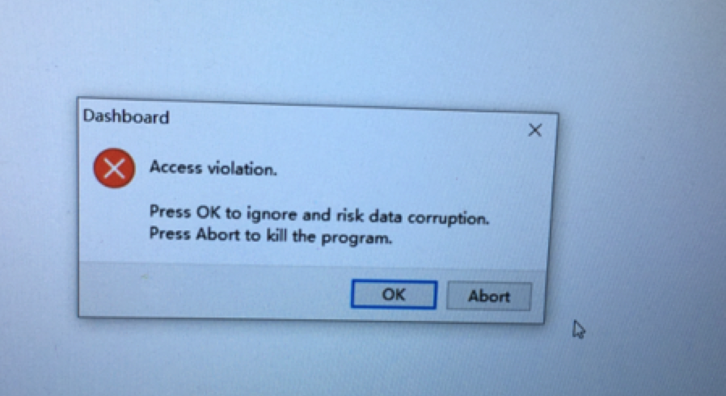
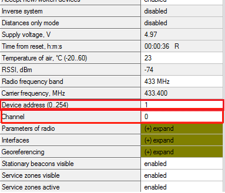

## 常见问题 - 定位巡迹


### 定位标签

<a href="/usedoc/navigationKit2/common/q_a/doc3#1">1. Dashboard 软件打开报错</a>
<a href="/usedoc/navigationKit2/common/q_a/doc3#2">2. Dashboard 无法唤醒对应id的标签</a>
<a href="/usedoc/navigationKit2/common/q_a/doc3#3">3. 唤醒标签后，标签会自动关闭吗</a>
<a href="/usedoc/navigationKit2/common/q_a/doc3#4">4. 设备插上电脑后，电脑无法识别</a>
<a href="/usedoc/navigationKit2/common/q_a/doc3#5">5. 路由连接电脑，Dashboard 软件打开后，无法找到路由 Not found modem connection to computer through USB.</a>


## 巡迹

<a href="/usedoc/navigationKit2/common/q_a/doc3#nav1">1. 录制轨迹保存的路径，是怎么存储的？存储在哪里？</a>
<a href="/usedoc/navigationKit2/common/q_a/doc3#nav2">2. 轨迹是否可以保存多个，如何选择不同的轨迹进行巡迹任务？</a>
<a href="/usedoc/navigationKit2/common/q_a/doc3#nav3">3. 如何调整机器人在巡迹时的速度</a>


***

## 定位巡迹-定位标签篇

<h5 id="1">1. Dashboard 软件打开报错</h5>

Dashboard 软件由硬件方提供，在不同系统中兼容性有差异，经我方测试稳定性排名： Window XP > Window 7 > Window 10

推荐使用 WIN7/XP环境。

在 Window 10下有一定几率会出现错误弹窗（见下图），如出现该弹窗，点击abort，多次执行直至正常。





***

<h5 id="2">2. Dashboard 无法唤醒对应id的标签</h5>

1. 请检查标签电源是否打开
2. 如标签距离路由过近，请稍微拿远后再次操作
3. 如已通电，且有一定距离，仍无法唤醒，请将标签连接到电脑上，使用 Dashboard 进行检查（如下图） 

	Channel：是否为 0，如不是则修改

	Device address：是否与标签上贴的数字一致，如不是则修改

	


***

<h5 id="3">3. 唤醒标签后，标签会自动关闭吗</h5>

当路由通电工作时不会，当路由断电1min后，所有标签会休眠。

***

<h5 id="4">4. 设备插上电脑后，电脑无法识别</h5>

定位路由或定位标签（必须要打开电源），插上电脑会自动安装驱动，在设备管理器-端口中，能看到对应设备。

如插上后显示不能识别，端口下无设备，请检查数据线是否插紧，确定插紧后仍未识别：

尝试手动安装驱动，[驱动下载地址](https://marvelmind.com/pics/stm32_vcp.zip)。

如手动安装后仍未能识别，请取2个设备，标签/路由，2根数据线，进行交叉测试。

判断是数据线，还是设备故障。

***

<h5 id="5">5. 路由连接电脑，Dashboard 软件打开后，无法找到路由 Not found modem connection to computer through USB.</h5>

请检查在设备管理器-端口中，是否有设备。

无如设备，请参见第 4 条。

***


## 定位巡迹-巡迹篇

<h5 id="nav1">1. 录制轨迹保存的路径，是怎么存储的？存储在哪里？</h5>

录制的轨迹，记录的是机器人在 map 坐标系中的坐标点，将这些坐标点写入到一个文本文件中，存放在

`catkin_ws/src/navigation/path_server/path_data`

巡迹程序执行巡迹的时，读取文件名称为`default_path.path`的文件。


***

<h5 id="nav2">2. 轨迹是否可以保存多个，如何选择不同的轨迹进行巡迹任务？</h5>

可以，像建图一样，轨迹也会有重命名备份这一操作，在路径文件夹下会存储所有录制成功的轨迹文件。

如需选择不同的路径文件，需在使用的时候对其进行重命名为`default_path.path`，程序会自动载入。


***

<h5 id="nav3">3. 如何调整机器人在巡迹时的速度</h5>

说明：机器人行走速度过快，会影响定位标签定位，影响巡迹效果。

修改以下文件：

`src/launch/autolabor_navigation_launch/two_laser_tracking_param/teb_local_planner_params.yaml`


```
max_vel_x: 0.2 //机器人的最大平移速度
max_vel_x_backwards: 0.2//当向后移动时，机器人的最大绝对平移速度
max_vel_theta: 0.2//机器人的最大旋转速度
```

修改为
```
max_vel_x: 0.8
max_vel_x_backwards: 0.6
max_vel_theta: 0.6
```

注：此建议参数为最高值，用户可根据实际使用情况进行调整。

***
