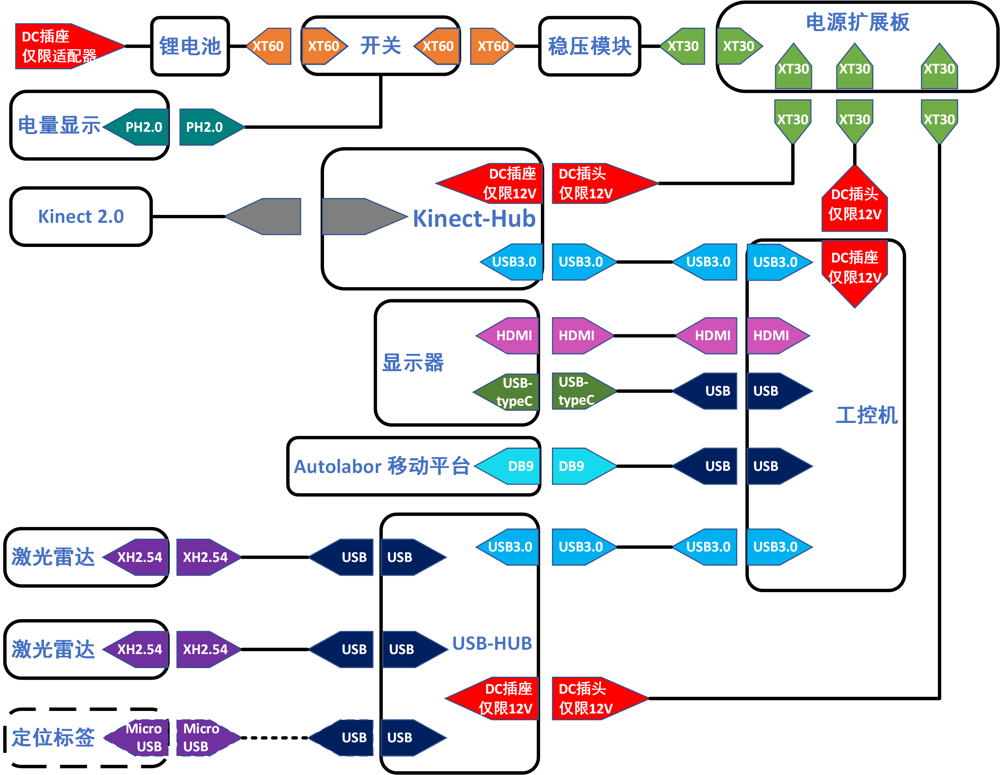

# 组装与测试

    本文将引导你安装导航套件并对各部件进行测试

## 电气拓扑

> Autolabor Box 1.0 的 用户请参考    <a href="./imgs/autolabor_box_v1_electrical_topology.png" >      Autolabor Box 1.0 电气拓扑图</a>

## 组装

    详请参照视频

## 测试

我们提供了一套工具软件，并将其放置在电脑桌面，你可以用来检测导航套件中各部件能否正常工作

1. 激光雷达测试

2. 惯导测试

3. Kinect测试

4. 联合测试

## 常见问题

* “电池充电接口、工控机电源接口、Kinect-Hub电源接口可以互换适配器吗？”

    少年，劝你别有这么大胆的想法！
    
    尽管这三者物理外形一致，但电气规格`并不通用`，使用时务必注意，错误的接线方式将会导致设备损坏，甚至危及人身安全

* “为什么风扇噪音非常大？”

    众所周知，AMD旗下CPU最大的特点就是~~发热量大~~ 性能强劲，并且工控机内部结构十分紧凑，只有风扇维持在较高转速才保证系统正常工作

* “为什么我看不到 Kinect 的数据？”

    Kinect-Hub 的数据线另一端必须插在工控机 `USB3.0` 接口上，否则将无法从工控机读取到Kinect的数据

* “ USB-Hub 上面的接口不通用吗？（仅 Autolabor-BOX 2.0 用户）”

    不通用，组装时务必按照文字提示插入设备，错误的接线方式将无法正常建图、定位、避障，甚至危及人身安全