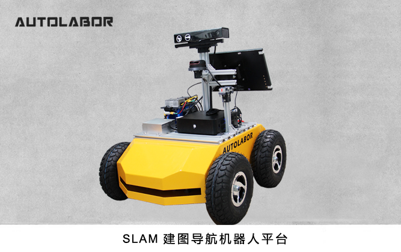
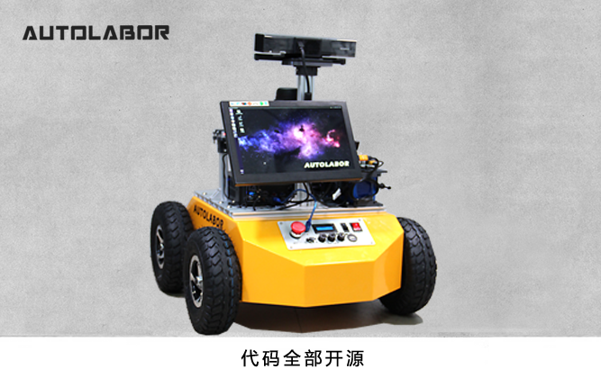
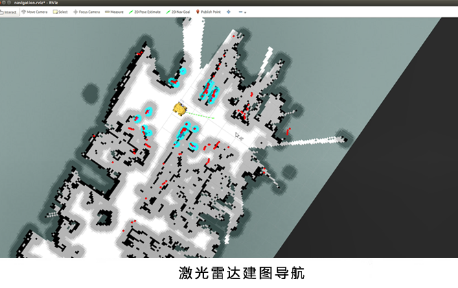
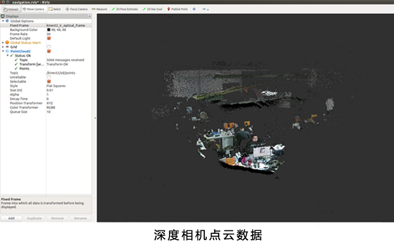
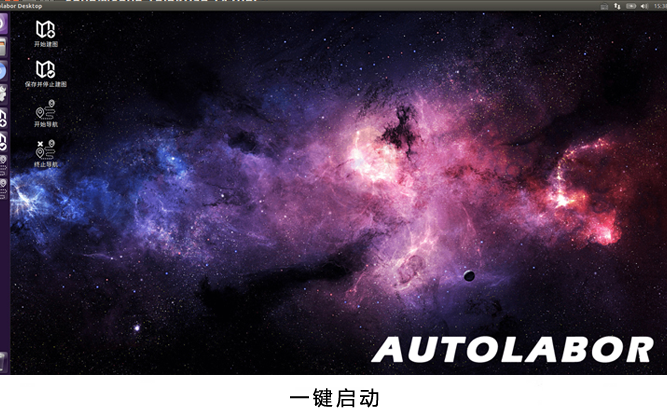
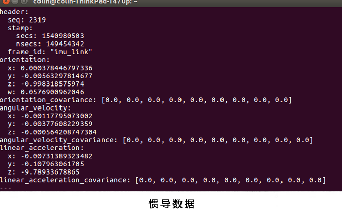

# 产品介绍

Autolabor Pro1 导航平台搭载激光雷达、深度相机、惯导、里程计等传感器，可实现SLAM建图导航、视觉SLAM、图像识别等功能。

定制化操作系统AutolaborOS系统，已实现室内自主导航，无须开发一键式建图导航，操作简单。

系统持续更新，代码全部开源，使用户可以快速上手ROS，基于平台高效的进行二次开发。

# 传感器及设备清单

序号 | 设备 | 型号
:---:|:---:|---
1| 激光雷达 | 思岚 RPLIDAR-A2
2 | 	深度相机 | 	Kinect V2
3| IMU | AH-100B
4 | mini 电脑 | AMD Ryzen 3 2200G/4G/120G
5 | 13.3 寸高清显示屏| 1080P 便携 HDR 显示器
6 | 电源模块 | 24V 10AH 锂电池/稳压模块/电量显示模块/分线板船型电源

# 功能及效果演示

### 驱动列表：
* Autolabor Pro1 驱动包
* 激光雷达驱动包
  * RPLIDAR A1
  * RPLIDAR A2
  * HOKUYO URG-04LX-UG01
* 深度相机驱动包
  * Kinect V2
* 惯导驱动包
  * AH100B

### 功能列表：

* 一键SLAM导航
* 键盘控制机器人运动
* 手柄控制机器人运动
* Gmapping 单线激光雷达SLAM建图
* Amcl 基于单线激光雷达定位
* Navigation 自动导航功能
* Autolabor Simulation 仿真模拟器场景应用

## 应用场景：
* ROS学习
* 算法验证
* 自动驾驶
* 自主导航
* 智能建图

平台可实现的功能包括但不仅限于以上内容，更多功能还在持续开发中，后续功能将通过AutolaborOS更新发布，敬请关注。
