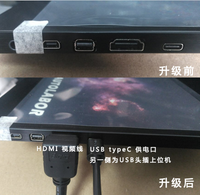
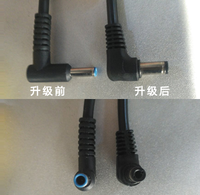

# 组装与测试

    本文将引导你安装导航套件并对各部件进行测试

## 组装

详请参照视频

<video class="standard-video" src="https://video-autolabor-1255388470.cos.ap-beijing.myqcloud.com/AutolaborPro1/%E5%AF%BC%E8%88%AA%E5%A5%97%E4%BB%B6%E7%BB%84%E8%A3%85%E6%95%99%E7%A8%8B.mp4" width="100%" height="100%" controls="controls"></video>

### 注意事项

1. 激光雷达的朝向一定要与视频中一致，否则将影响程序功能。
2. Autolabor Pro1的串口数据线与雷达的数据线需插在工控机的USB2.0接口上
3. 新版显示器不再使用圆形dc电源插口，以USB typec方式供电，USB线另一端直接插在上位机USB口上。(2019-01-04)

4. Kinect集线器电源线升级 (2019-01-04)

### 电气拓扑

## 测试

我们提供了一套工具软件，并将其放置在电脑桌面，用户可以用来检测导航套件中各部件能否正常工作。

1. 激光雷达测试

2. 惯导测试

3. Kinect测试

4. 联合测试

点击`开始建图`，尝试使用键盘方向键控制小车运动。
