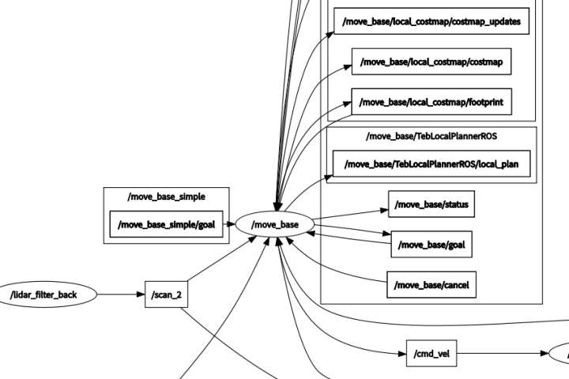
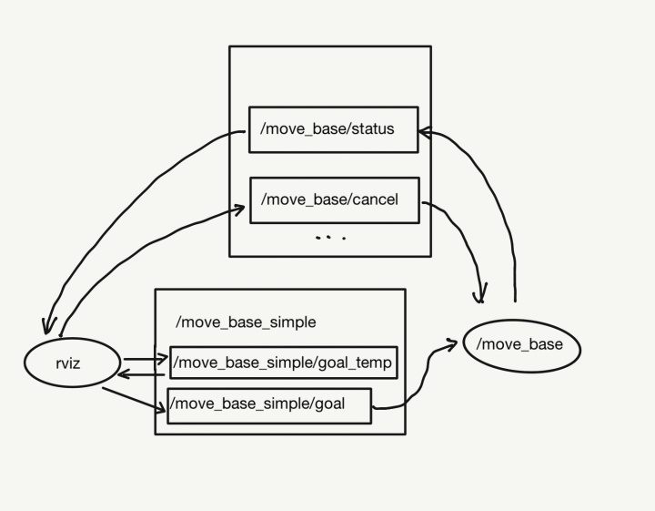
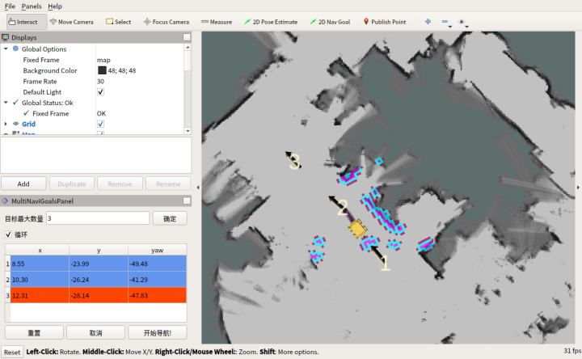

# 激光SLAM-多点导航

本文介绍SLAM导航中[多点导航功能包](/usedoc/navigationKit2/version_two/user_guide/quick_start/multi_slam_doc)的开发思路。


### 开发背景：

在使用 ROS Navigation & RViz 进行 2D Nav Goal 导航的时候，我们会遇到这些情况：

1. 给定导航的目标点只能设置一个，当有多点任务时需要等待一个个任务结束后，再次手动给目标
2. 无法暂停或取消任务
3. 任务不可循环

### 开发目的：

完成多目标点导航，可以对导航环节进行操控，如可循环、取消、重置任务等。

### 开发思路：

1. 2D Nav Goal 的单点导航是如何实现的？

我们可以知道导航目标是通过 RViz 工具栏中 2D Nav Goal发布出去的。

通过查看 RViz的配置文件或者 Panels->Add New Panel-> Tool Property ，可以了解当使用2D Nav Goal 在地图上拉了一个箭头（给定目标点时），其实是向话题 /move_base_simple/goal 发布了 [geometry_msgs/PoseStamped](http://docs.ros.org/en/api/geometry_msgs/html/msg/PoseStamped.html) 类型的消息，这个是目标点的位姿，包含坐标点与朝向。

根据 NodeGraph 可以看到话题 /move_base_simple/goal 被导航包的节点 /move_base 订阅了，进而发给 Navigation 中的各个话题，完成导航。




2. 如何基于单点实现多点导航？

要在单点基础上实现多目标点导航的话，就要设计一个关于多个导航目标点消息geometry_msgs/PoseStamped的数据结构，并对多个目标点进行处理，完成导航。

实现多点的方法有多种，在不打破 ROS Navigation 包的完整性的前提下，我选择在2D Nav Goal的 RViz节点和 /move_base 节点中间添加了一个话题 /move_base_simple/goal_temp，将原本发送给 /move_base_simple/goal 的消息，转发给/move_base_simple/goal_temp，通过此话题来积攒多个 2D Nav Goal（任务队列），并根据任务完成的状态反馈，按顺序将每个导航目标点消息 geometry_msgs/PoseStamped 再发送给话题/move_base_simple/goal，以完成多任务中的单次目标点的导航（如下图示）。




3. 如何来发布多点任务？

像 2D Nav Goal 一样，我们也可以在 RViz 中开发可视化的操作栏，这要使用到 RViz plugin ， ROS中的可视化工具绝大部分都是基于Qt进行开发的，此前古月居有过详细介绍，可参考[这篇文章](https://zhuanlan.zhihu.com/p/39390512)。

### 最终效果

首先，我们来看一下最终的实现效果。

MultiNaviGoalsPanel是多点SLAM导航任务的可视化操作区，包括任务点列表、循环、重置、取消、开始任务。

通过 RViz plugin 设计的Mark Display，能够显示的目标点的标号及箭头（朝向）。




#### 代码实现

#### 1. 头文件 multi_navi_goal_panel.h

Qt说明：

* 文字编辑——QLineEdit
* 按键——QPushButton
* 列表——QTableWidget
* 复选框——QCheckBox
* 文字显示——QString

ROS说明:

Publisher：

* 发送每个目标点消息给/move_base_simple/goal的goal_pub_
* 发送取消指令消息给/move_base/cancel的cancel_pub_
* 发送文字和箭头标记的mark_pub_。

Subsrciber：

* 订阅来自rviz中2D Nav Goal的导航目标点消息的goal_sub_
* 订阅目前导航状态的status_sub_


```
#ifndef MULTI_NAVI_GOAL_PANEL_H
#define MULTI_NAVI_GOAL_PANEL_H


#include <string>

#include <ros/ros.h>
#include <ros/console.h>
#include <tf2_ros/transform_listener.h>
#include <tf2_geometry_msgs/tf2_geometry_msgs.h>

#include <rviz/panel.h>//plugin基类的头文件

#include <QPushButton>//Qt按钮
#include <QTableWidget>//Qt表格
#include <QCheckBox>//Qt复选框

#include <visualization_msgs/Marker.h>
#include <geometry_msgs/PoseArray.h>
#include <geometry_msgs/Point.h>
#include <geometry_msgs/PoseStamped.h>
#include <std_msgs/String.h>
#include <actionlib_msgs/GoalStatus.h>
#include <actionlib_msgs/GoalStatusArray.h>
#include <tf/transform_datatypes.h>


namespace navi_multi_goals_pub_rviz_plugin {

    class MultiNaviGoalsPanel : public rviz::Panel {
    Q_OBJECT
    public:
        explicit MultiNaviGoalsPanel(QWidget *parent = 0);

        virtual void load(const rviz::Config &config);

        virtual void save(rviz::Config config) const;

    public Q_SLOTS:

        void setMaxNumGoal(const QString &maxNumGoal);//设置最大可设置的目标点数量
        void writePose(geometry_msgs::Pose pose);//将目标点位姿写入任务列表
        void markPose(const geometry_msgs::PoseStamped::ConstPtr &pose);//在地图中标记目标位姿
        void deleteMark();//删除标记

    protected Q_SLOTS:

        void updateMaxNumGoal();             // 更新最大可设置的目标点数量
        void initPoseTable();               // 初始化目标点表格

        void updatePoseTable();             // 更新目标点表格
        void startNavi();                   // 开始第一个目标点任务导航
        void cancelNavi();                  // 取消现在进行中的导航
        void addPose();

        void goalCntCB(const geometry_msgs::PoseStamped::ConstPtr &pose);  // 目标数量子回调函数

        void statusCB(const actionlib_msgs::GoalStatusArray::ConstPtr &statuses); // 状态子回调函数

        void checkCycle(); // 确认循环

        void completeNavi();               // 第一个任务到达后，继续进行剩下任务点的导航任务
        void cycleNavi();

        bool checkGoal(std::vector<actionlib_msgs::GoalStatus> status_list);  // 检查是否到达目标点

        static void startSpin(); // 启用ROS订阅
    protected:
        QLineEdit *output_maxNumGoal_editor_;
        QPushButton *output_maxNumGoal_button_, *output_reset_button_, *output_startNavi_button_, *output_cancel_button_, *output_addPoint_button_;
        QTableWidget *poseArray_table_;
        QCheckBox *cycle_checkbox_;

        QString output_maxNumGoal_;

        // The ROS node handle.
        ros::NodeHandle nh_;
        ros::Publisher goal_pub_, cancel_pub_, marker_pub_, init_goal_pub_;
        ros::Subscriber goal_sub_, status_sub_;

        tf2_ros::Buffer tfBuffer_;
        tf2_ros::TransformListener tfListener_;
        // 多目标点任务栏定义
        int maxNumGoal_;
        int curGoalIdx_ = 0, cycleCnt_ = 0;
        bool permit_ = false, cycle_ = false, arrived_ = false;
        geometry_msgs::PoseArray pose_array_;

        actionlib_msgs::GoalID cur_goalid_;


    };

} // end namespace navi-multi-goals-pub-rviz-plugin

#endif // MULTI_NAVI_GOAL_PANEL_H

```

#### 2. cpp文件 multi_navi_goal_panel.cpp

```
#include <cstdio>

#include <ros/console.h>

#include <fstream>
#include <sstream>

#include <QPainter>
#include <QLineEdit>
#include <QVBoxLayout>
#include <QLabel>
#include <QTimer>
#include <QDebug>
#include <QtWidgets/QTableWidget>
#include <QtWidgets/qheaderview.h>


#include "multi_navi_goal_panel.h"

namespace navi_multi_goals_pub_rviz_plugin {


    MultiNaviGoalsPanel::MultiNaviGoalsPanel(QWidget *parent)
            : rviz::Panel(parent), nh_(), maxNumGoal_(1), tfListener_(tfBuffer_) {

        goal_sub_ = nh_.subscribe<geometry_msgs::PoseStamped>("move_base_simple/goal_temp", 100,
                                                              boost::bind(&MultiNaviGoalsPanel::goalCntCB, this, _1));

        status_sub_ = nh_.subscribe<actionlib_msgs::GoalStatusArray>("move_base/status", 1,
                                                                     boost::bind(&MultiNaviGoalsPanel::statusCB, this,
                                                                                 _1));

        goal_pub_ = nh_.advertise<geometry_msgs::PoseStamped>("move_base_simple/goal", 1);

        init_goal_pub_ = nh_.advertise<geometry_msgs::PoseStamped>("move_base_simple/goal_temp", 1);

        cancel_pub_ = nh_.advertise<actionlib_msgs::GoalID>("move_base/cancel", 1);

        marker_pub_ = nh_.advertise<visualization_msgs::Marker>("visualization_marker", 1);

        QVBoxLayout *root_layout = new QVBoxLayout;
        // create a panel about "maxNumGoal"
        QHBoxLayout *maxNumGoal_layout = new QHBoxLayout;
        maxNumGoal_layout->addWidget(new QLabel("目标最大数量"));
        output_maxNumGoal_editor_ = new QLineEdit;
        maxNumGoal_layout->addWidget(output_maxNumGoal_editor_);
        output_maxNumGoal_button_ = new QPushButton("确定");
        maxNumGoal_layout->addWidget(output_maxNumGoal_button_);
        root_layout->addLayout(maxNumGoal_layout);

        QHBoxLayout *second_row_layout = new QHBoxLayout;
        cycle_checkbox_ = new QCheckBox("循环");
        second_row_layout->addWidget(cycle_checkbox_);
        output_addPoint_button_ = new QPushButton("添加机器人当前位置");
        second_row_layout->addWidget(output_addPoint_button_);
        root_layout->addLayout(second_row_layout);

        // creat a QTable to contain the poseArray
        poseArray_table_ = new QTableWidget;
        initPoseTable();
        root_layout->addWidget(poseArray_table_);
        //creat a manipulate layout
        QHBoxLayout *manipulate_layout = new QHBoxLayout;
        output_reset_button_ = new QPushButton("重置");
        manipulate_layout->addWidget(output_reset_button_);
        output_cancel_button_ = new QPushButton("取消");
        manipulate_layout->addWidget(output_cancel_button_);
        output_startNavi_button_ = new QPushButton("开始导航!");
        manipulate_layout->addWidget(output_startNavi_button_);
        root_layout->addLayout(manipulate_layout);

        setLayout(root_layout);
        // set a Qtimer to start a spin for subscriptions
        QTimer *output_timer = new QTimer(this);
        output_timer->start(200);

        // 设置信号与槽的连接
        connect(output_maxNumGoal_button_, SIGNAL(clicked()), this,
                SLOT(updateMaxNumGoal()));
        connect(output_maxNumGoal_button_, SIGNAL(clicked()), this,
                SLOT(updatePoseTable()));
        connect(output_reset_button_, SIGNAL(clicked()), this, SLOT(initPoseTable()));
        connect(output_cancel_button_, SIGNAL(clicked()), this, SLOT(cancelNavi()));
        connect(output_startNavi_button_, SIGNAL(clicked()), this, SLOT(startNavi()));
        connect(output_addPoint_button_, SIGNAL(clicked()), this, SLOT(addPose()));
        connect(cycle_checkbox_, SIGNAL(clicked(bool)), this, SLOT(checkCycle()));
        connect(output_timer, SIGNAL(timeout()), this, SLOT(startSpin()));


    }

// 更新maxNumGoal命名
    void MultiNaviGoalsPanel::updateMaxNumGoal() {
        setMaxNumGoal(output_maxNumGoal_editor_->text());
    }

// set up the maximum number of goals
    void MultiNaviGoalsPanel::setMaxNumGoal(const QString &new_maxNumGoal) {
        // 检查maxNumGoal是否发生改变.
        if (new_maxNumGoal != output_maxNumGoal_) {
            output_maxNumGoal_ = new_maxNumGoal;

            // 如果命名为空，不发布任何信息
            if (output_maxNumGoal_ == "") {
                nh_.setParam("maxNumGoal_", 1);
                maxNumGoal_ = 1;
            } else {
//                velocity_publisher_ = nh_.advertise<geometry_msgs::Twist>(output_maxNumGoal_.toStdString(), 1);
                nh_.setParam("maxNumGoal_", output_maxNumGoal_.toInt());
                maxNumGoal_ = output_maxNumGoal_.toInt();
            }
            Q_EMIT configChanged();
        }
    }

    // initialize the table of pose
    void MultiNaviGoalsPanel::initPoseTable() {
        ROS_INFO("Initialize");
        curGoalIdx_ = 0, cycleCnt_ = 0;
        permit_ = false, cycle_ = false;
        poseArray_table_->clear();
        pose_array_.poses.clear();
        deleteMark();
        poseArray_table_->setRowCount(maxNumGoal_);
        poseArray_table_->setColumnCount(3);
        poseArray_table_->setEditTriggers(QAbstractItemView::NoEditTriggers);
        poseArray_table_->horizontalHeader()->setSectionResizeMode(QHeaderView::Stretch);
        QStringList pose_header;
        pose_header << "x" << "y" << "yaw";
        poseArray_table_->setHorizontalHeaderLabels(pose_header);
        cycle_checkbox_->setCheckState(Qt::Unchecked);

    }

    // delete marks in the map
    void MultiNaviGoalsPanel::deleteMark() {
        visualization_msgs::Marker marker_delete;
        marker_delete.action = visualization_msgs::Marker::DELETEALL;
        marker_pub_.publish(marker_delete);
    }

    //update the table of pose
    void MultiNaviGoalsPanel::updatePoseTable() {
        poseArray_table_->setRowCount(maxNumGoal_);
//        pose_array_.poses.resize(maxNumGoal_);
        QStringList pose_header;
        pose_header << "x" << "y" << "yaw";
        poseArray_table_->setHorizontalHeaderLabels(pose_header);
        poseArray_table_->show();
    }

    // call back function for counting goals
    void MultiNaviGoalsPanel::goalCntCB(const geometry_msgs::PoseStamped::ConstPtr &pose) {
        if (pose_array_.poses.size() < maxNumGoal_) {
            pose_array_.poses.push_back(pose->pose);
            pose_array_.header.frame_id = pose->header.frame_id;
            writePose(pose->pose);
            markPose(pose);
        } else {
            ROS_ERROR("Beyond the maximum number of goals: %d", maxNumGoal_);
        }
    }

    // write the poses into the table
    void MultiNaviGoalsPanel::writePose(geometry_msgs::Pose pose) {

        poseArray_table_->setItem(pose_array_.poses.size() - 1, 0,
                                  new QTableWidgetItem(QString::number(pose.position.x, 'f', 2)));
        poseArray_table_->setItem(pose_array_.poses.size() - 1, 1,
                                  new QTableWidgetItem(QString::number(pose.position.y, 'f', 2)));
        poseArray_table_->setItem(pose_array_.poses.size() - 1, 2,
                                  new QTableWidgetItem(
                                          QString::number(tf::getYaw(pose.orientation) * 180.0 / 3.14, 'f', 2)));

    }

    // when setting a Navi Goal, it will set a mark on the map
    void MultiNaviGoalsPanel::markPose(const geometry_msgs::PoseStamped::ConstPtr &pose) {
        if (ros::ok()) {
            visualization_msgs::Marker arrow;
            visualization_msgs::Marker number;
            arrow.header.frame_id = number.header.frame_id = pose->header.frame_id;
            arrow.ns = "navi_point_arrow";
            number.ns = "navi_point_number";
            arrow.action = number.action = visualization_msgs::Marker::ADD;
            arrow.type = visualization_msgs::Marker::ARROW;
            number.type = visualization_msgs::Marker::TEXT_VIEW_FACING;
            arrow.pose = number.pose = pose->pose;
            number.pose.position.z += 1.0;
            arrow.scale.x = 1.0;
            arrow.scale.y = 0.2;
            number.scale.z = 1.0;
            arrow.color.r = number.color.r = 1.0f;
            arrow.color.g = number.color.g = 0.98f;
            arrow.color.b = number.color.b = 0.80f;
            arrow.color.a = number.color.a = 1.0;
            arrow.id = number.id = pose_array_.poses.size();
            number.text = std::to_string(pose_array_.poses.size());
            marker_pub_.publish(arrow);
            marker_pub_.publish(number);
        }
    }

    // check whether it is in the cycling situation
    void MultiNaviGoalsPanel::checkCycle() {
        cycle_ = cycle_checkbox_->isChecked();
    }

    void MultiNaviGoalsPanel::addPose() {
        std::string target_frame = "map";
        std::string child_frame = "base_link";
        if (tfBuffer_.canTransform(target_frame, child_frame, ros::Time(0), ros::Duration(4.0))) {
            geometry_msgs::TransformStamped transformStamped = tfBuffer_.lookupTransform(target_frame, child_frame,
                                                                                         ros::Time(0),
                                                                                         ros::Duration(4.0));
            geometry_msgs::PoseStamped pose;
            pose.header.frame_id = target_frame;
            pose.header.stamp = transformStamped.header.stamp;
            pose.pose.position.x = transformStamped.transform.translation.x;
            pose.pose.position.y = transformStamped.transform.translation.y;
            pose.pose.position.z = transformStamped.transform.translation.z;
            pose.pose.orientation = transformStamped.transform.rotation;

            init_goal_pub_.publish(pose);
        }

    }

    // start to navigate, and only command the first goal
    void MultiNaviGoalsPanel::startNavi() {
        curGoalIdx_ = curGoalIdx_ % pose_array_.poses.size();
        if (!pose_array_.poses.empty() && curGoalIdx_ < maxNumGoal_) {
            geometry_msgs::PoseStamped goal;
            goal.header = pose_array_.header;
            goal.pose = pose_array_.poses.at(curGoalIdx_);
            goal_pub_.publish(goal);
            ROS_INFO("Navi to the Goal%d", curGoalIdx_ + 1);
            poseArray_table_->item(curGoalIdx_, 0)->setBackgroundColor(QColor(255, 69, 0));
            poseArray_table_->item(curGoalIdx_, 1)->setBackgroundColor(QColor(255, 69, 0));
            poseArray_table_->item(curGoalIdx_, 2)->setBackgroundColor(QColor(255, 69, 0));
            curGoalIdx_ += 1;
            permit_ = true;
        } else {
            ROS_ERROR("Something Wrong");
        }
    }

    // complete the remaining goals
    void MultiNaviGoalsPanel::completeNavi() {
        if (curGoalIdx_ < pose_array_.poses.size()) {
            geometry_msgs::PoseStamped goal;
            goal.header = pose_array_.header;
            goal.pose = pose_array_.poses.at(curGoalIdx_);
            goal_pub_.publish(goal);
            ROS_INFO("Navi to the Goal%d", curGoalIdx_ + 1);
            poseArray_table_->item(curGoalIdx_, 0)->setBackgroundColor(QColor(255, 69, 0));
            poseArray_table_->item(curGoalIdx_, 1)->setBackgroundColor(QColor(255, 69, 0));
            poseArray_table_->item(curGoalIdx_, 2)->setBackgroundColor(QColor(255, 69, 0));
            curGoalIdx_ += 1;
            permit_ = true;
        } else {
            ROS_ERROR("All goals are completed");
            permit_ = false;
        }
    }

    // command the goals cyclically
    void MultiNaviGoalsPanel::cycleNavi() {
        if (permit_) {
            geometry_msgs::PoseStamped goal;
            goal.header = pose_array_.header;
            goal.pose = pose_array_.poses.at(curGoalIdx_ % pose_array_.poses.size());
            goal_pub_.publish(goal);
            ROS_INFO("Navi to the Goal%lu, in the %dth cycle", curGoalIdx_ % pose_array_.poses.size() + 1,
                     cycleCnt_ + 1);
            bool even = ((cycleCnt_ + 1) % 2 != 0);
            QColor color_table;
            if (even) color_table = QColor(255, 69, 0); else color_table = QColor(100, 149, 237);
            poseArray_table_->item(curGoalIdx_ % pose_array_.poses.size(), 0)->setBackgroundColor(color_table);
            poseArray_table_->item(curGoalIdx_ % pose_array_.poses.size(), 1)->setBackgroundColor(color_table);
            poseArray_table_->item(curGoalIdx_ % pose_array_.poses.size(), 2)->setBackgroundColor(color_table);
            curGoalIdx_ += 1;
            cycleCnt_ = curGoalIdx_ / pose_array_.poses.size();
        }
    }

    // cancel the current command
    void MultiNaviGoalsPanel::cancelNavi() {
        if (!cur_goalid_.id.empty()) {
            cancel_pub_.publish(cur_goalid_);
            ROS_ERROR("Navigation have been canceled");
        }
    }

    // call back for listening current state
    void MultiNaviGoalsPanel::statusCB(const actionlib_msgs::GoalStatusArray::ConstPtr &statuses) {
        bool arrived_pre = arrived_;
        arrived_ = checkGoal(statuses->status_list);
//        if (arrived_) { ROS_ERROR("%d,%d", int(arrived_), int(arrived_pre)); }
        if (arrived_ && arrived_ != arrived_pre && ros::ok() && permit_) {
            if (cycle_) cycleNavi();
            else completeNavi();
        }
    }

    //check the current state of goal
    bool MultiNaviGoalsPanel::checkGoal(std::vector<actionlib_msgs::GoalStatus> status_list) {
        bool done;
        if (!status_list.empty()) {
            for (auto &i : status_list) {
                if (i.status == 3) {
                    done = true;
//                    ROS_INFO("completed Goal%d", curGoalIdx_);
                } else if (i.status == 4) {
//                    ROS_ERROR("Goal%d is Invalid, Navi to Next Goal%d", curGoalIdx_, curGoalIdx_ + 1);
                    return false;
                } else if (i.status == 0) {
                    done = true;
                } else if (i.status == 1) {
                    cur_goalid_ = i.goal_id;
                    done = false;
                } else done = false;
            }
        } else {
//            ROS_INFO("Please input the Navi Goal");
            done = false;
        }
        return done;
    }

// spin for subscribing
    void MultiNaviGoalsPanel::startSpin() {
        if (ros::ok()) {
            ros::spinOnce();
        }
    }
    //读取目标点
    void MultiNaviGoalsPanel::load(const rviz::Config &config) {
        Panel::load(config);
        QString goal_number;
        if (config.mapGetString("multi_goal_panel_number", &goal_number)) {
            output_maxNumGoal_editor_->setText(goal_number);
            updateMaxNumGoal();
            updatePoseTable();

            QString goal_var;
            if (config.mapGetString("multi_goal_panel_data", &goal_var)) {
                QStringList goal_list = goal_var.split("|");
                for (int i = 0; i < goal_list.size(); i++) {
                    QStringList goal = goal_list.at(i).split(",");

                    geometry_msgs::PoseStamped pose;
                    pose.header.frame_id = "map";
                    pose.header.stamp = ros::Time::now();
                    pose.pose.position.x = goal.at(0).toDouble();
                    pose.pose.position.y = goal.at(1).toDouble();
                    pose.pose.position.z = 0.0;

                    pose.pose.orientation = tf::createQuaternionMsgFromYaw(goal.at(2).toDouble() / 180 * 3.14);
                    init_goal_pub_.publish(pose);
                }
            }

            bool cycle_flag;
            if (config.mapGetBool("multi_goal_panel_cycle", &cycle_flag)) {
                if (cycle_flag) {
                    cycle_checkbox_->setCheckState(Qt::CheckState::Checked);
                } else {
                    cycle_checkbox_->setCheckState(Qt::CheckState::Unchecked);
                }
                checkCycle();
            }

        }
    }

    //保存目标点
    void MultiNaviGoalsPanel::save(rviz::Config config) const {
        Panel::save(config);
        config.mapSetValue("multi_goal_panel_cycle", cycle_checkbox_->isChecked());
        if (!output_maxNumGoal_editor_->text().isEmpty()) {
            int goal_number = output_maxNumGoal_editor_->text().toInt();
            if (goal_number > 0) {
                config.mapSetValue("multi_goal_panel_number", goal_number);

                QString *goal_list = new QString();
                for (int i = 0; i < pose_array_.poses.size(); i++) {
                    for (int j = 0; j < 3; j++) {
                        goal_list->append(poseArray_table_->item(i, j)->text());
                        if (j != 2) {
                            goal_list->append(",");
                        }
                    }
                    if (i != goal_number - 1) {
                        goal_list->append("|");
                    }
                }

                if (!goal_list->isEmpty()) {
                    config.mapSetValue("multi_goal_panel_data", *goal_list);
                }

            }
        }
    }

} // end namespace navi-multi-goals-pub-rviz-plugin

// 声明此类是一个rviz的插件

#include <pluginlib/class_list_macros.h>

PLUGINLIB_EXPORT_CLASS(navi_multi_goals_pub_rviz_plugin::MultiNaviGoalsPanel, rviz::Panel)


```


