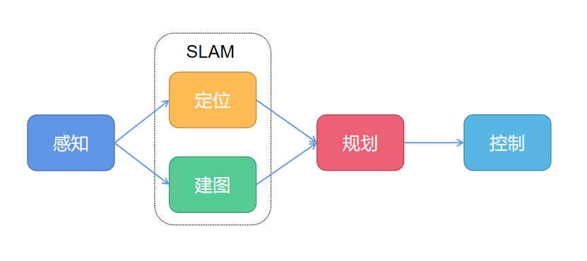
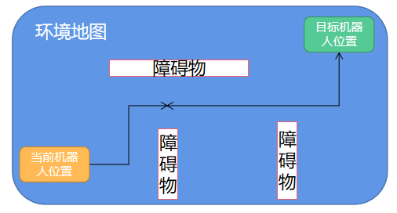
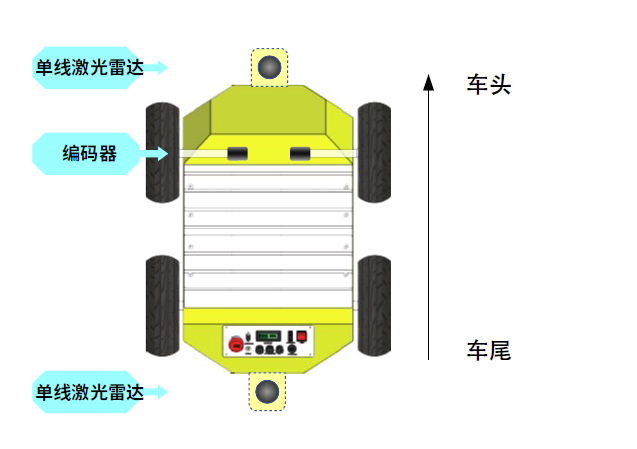
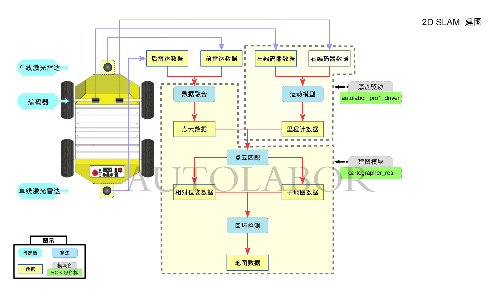
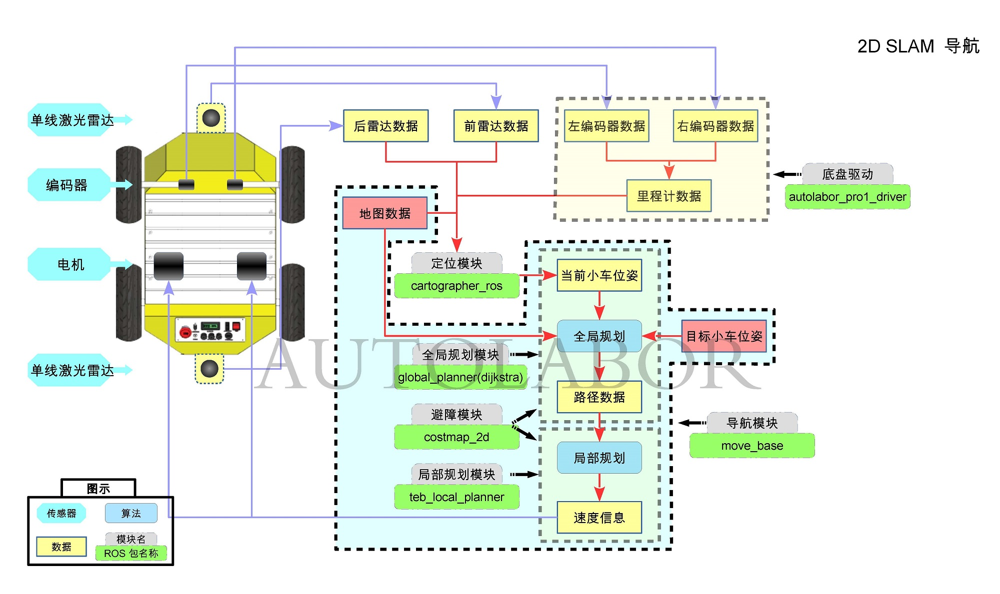
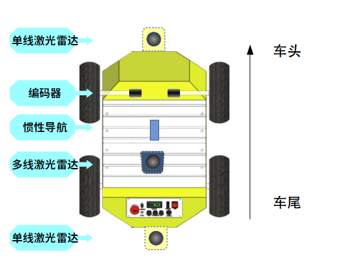
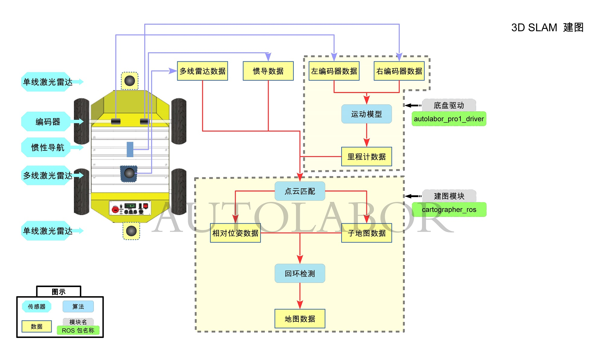
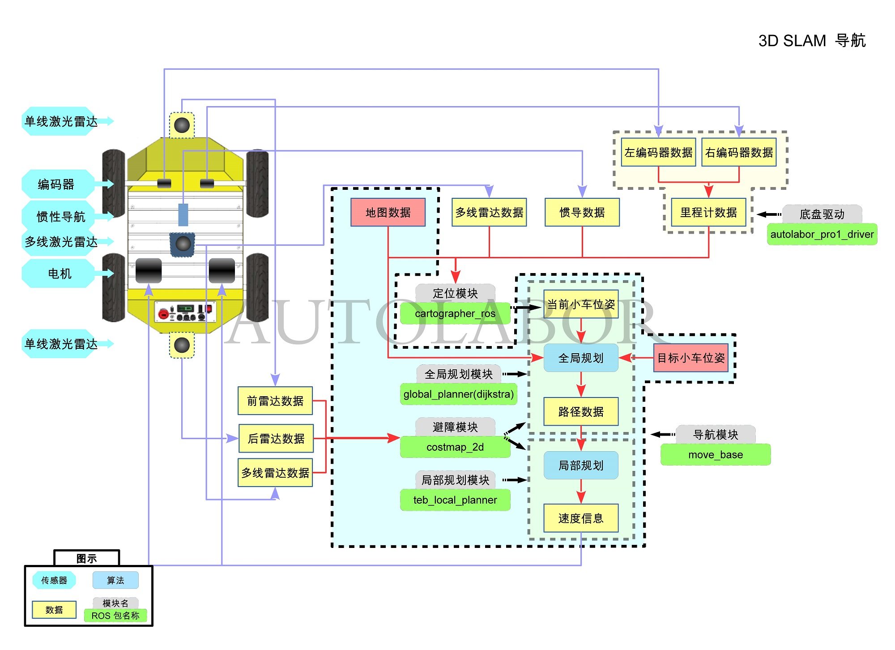

# 激光SLAM

## 目录

* SLAM介绍
* 基于激光SLAM的机器人自主导航
* Autolabor Pro1 SLAM 导航功能详解
    * 2D SLAM 实现原理
    * 3D SLAM 实现原理


## SLAM介绍

**SLAM**，全称是 Simultaneous Localization and Mapping，同时定位与地图构建。

SLAM 技术解决的是，我在哪里？（**定位**Localization ）我周围是什么样？（**建图**Mapping）这两个问题。

移动设备从未知环境中的某一点开始运动，根据传感器获取到的数据，即时计算获取传感器的位置并绘制周围的环境。


SLAM 的应用很广泛，有扫地机器人、无人驾驶汽车、无人机，三维场景重建等。

根据使用传感器不同，SLAM的可分为激光SLAM和视觉SLAM（VSLAM），本文介绍的是激光SLAM，对视觉SLAM相关知识感兴趣的可以[看这里](/usedoc/navigationKit2/version_two/development/vslamintro)。


## 基于激光SLAM的机器人自主导航

激光SLAM导航，指的是使用激光雷达采集的数据进行建图与定位（SLAM），并在构建的环境地图中自动导航（规划+控制）。



地图构建完成后，给出目标点，根据当前位置信息与已知环境地图规划出可行走路径，控制机器人运动，最终达到目标点。



以上只是简单概述了机器人导航的流程，但 SLAM 与 路径规划/Planning 都是很复杂的内容，在此不做过多的探讨。


## Autolabor Pro1 SLAM 导航功能详解

Autolabor SLAM 导航使用的是谷歌开源的 [Cartographer](https://github.com/googlecartographer/cartographer_ros)，支持多平台和传感器配置，提供2D和3D实时同步定位与建图，使用回环检测消除建图产生的累积误差，建图效果更好，在国内外众多机器人应用上得到了广泛使用。

> Cartographer is a system that provides real-time simultaneous localization and mapping (SLAM) in 2D and 3D across multiple platforms and sensor configurations.


###  2D SLAM 实现原理


#### 传感器介绍

2D SLAM 用到的传感器有：


* 单线激光雷达x2，安装在AP1前后底部
* 编码器/轮速里程计x2，安装在车体内部前侧




####  2D SLAM 建图


  
| 步骤 | 输入数据  | 操作  |  输出数据 | 使用ROS包 | 
|--|--|--|--|--|
|1 | 左编码器数据 右编码器数据 | 使用运动模型计算编码器数据，得到符合ROS标准的里程计数据|  里程计数据| [autolabor_pro_driver](http://www.autolabor.com.cn/usedoc/ap1/sendCommand)|
|2 | 前雷达数据 后雷达数据 | 过滤并融合前后激光雷达采集的数据，得到机器人周围环境点云数据| 雷达点云数据 | [cartographer_ros](https://google-cartographer-ros.readthedocs.io/en/latest/)  [laser_filters](http://wiki.ros.org/laser_filters) |
|3 | 里程计数据 点云数据 | 点云匹配| 相对位姿数据  子地图数据 |   [cartographer_ros](https://google-cartographer-ros.readthedocs.io/en/latest/)|
|4 | 相对位姿数据  子地图数据 | 回环检测，得到子地图拼接的全地图数据 | 地图数据 |   [cartographer_ros](https://google-cartographer-ros.readthedocs.io/en/latest/)|


Cartographer 2D 建图 launch配置示例

```

    <!-- 建图节点 -->
    <node name="cartographer_node" pkg="cartographer_ros"
        type="cartographer_node" args="
            -configuration_directory $(find autolabor_navigation_launch)/params/cartographer
            -configuration_basename second_generation_mapping.lua"
        output="screen">
    </node>
   
   <node name="cartographer_occupancy_grid_node" pkg="cartographer_ros" type="cartographer_occupancy_grid_node" args="-resolution 0.05" />


```

####  2D SLAM 导航



| 步骤 | 输入数据  | 操作  |  输出数据 | 使用ROS包 | 
|--|--|--|--|--|
|1 | 左编码器数据 右编码器数据 | 使用运动模型计算编码器数据，得到符合ROS标准的里程计数据|  里程计数据| [autolabor_pro_driver](http://www.autolabor.com.cn/usedoc/ap1/sendCommand)|
|2|前雷达数据 后雷达数据 里程计数据 地图数据|将机器人的实时数据与已构建的地图进行匹配|当前机器人在环境中的位姿| [cartographer_ros](https://google-cartographer-ros.readthedocs.io/en/latest/)|
|3| 目标机器人位姿| 给机器人制定一个目标点|  |[move_base](http://wiki.ros.org/move_base/)|
|4| 当前机器人位姿 地图数据 目标机器人位姿| 根据机器人当前位姿与地图数据，进行全局规划路线| 路径数据（初步预估导航路线） |[global_planner(dijkstra) ](http://wiki.ros.org/global_planner)|
|5| 路径数据 地图数据  前雷达数据 后雷达数据 | 根据规划路径开始导航，进行过程中随着实际环境、障碍物变化，进行局部路径规划，实时避障| 局部路径规划  避障 |[costmap_2d ](http://wiki.ros.org/cost_map)[teb_local_planner](http://wiki.ros.org/teb_local_planner)|
|6| 速度信息 /cmd_vel | 向底发送速度命令 |  |[move_base](http://wiki.ros.org/move_base/)|

说明：

 1. move_base, global_planner(dijkstra), costmap_2d 这些功能包(package)都从属于
    Navigation 导航这个大的功能包集，teb_local_planner 是navigation包的一个插件。
 2. 机器人导航过程中，会按照周围环境、实时障碍物做调整不断规划调整路径，向底层发布指令，步骤五和六是一个多次的过程，并非一次就结束了。

Cartographer 2D 导航 launch配置示例

```
    <!-- 定位模块 -->
    <node name="cartographer_node" pkg="cartographer_ros"
        type="cartographer_node" args="
            -configuration_directory $(find autolabor_navigation_launch)/params/cartographer
            -configuration_basename second_generation_location.lua
            -load_state_filename $(find autolabor_navigation_launch)/map/map.pbstream"
        output="screen">
    </node>

    <node name="cartographer_occupancy_grid_node" pkg="cartographer_ros" 
        type="cartographer_occupancy_grid_node" args="
            -resolution 0.05
            --noinclude_unfrozen_submaps" 
        output="screen">
    </node>

    <node pkg="cartographer_initialpose" type="cartographer_initialpose" name="cartographer_initialpose" >
        <param name="configuration_directory" value="$(find autolabor_navigation_launch)/params/cartographer" />
        <param name="configuration_basename" value="second_generation_location.lua" />
    </node>

    <!-- 导航模块 -->
    <node pkg="move_base" type="move_base" respawn="false" name="move_base" output="screen">
        <rosparam file="$(find autolabor_navigation_launch)/params/navigation/move_base/navigation_move_base.yaml" command="load" />
        <rosparam file="$(find autolabor_navigation_launch)/params/navigation/costmap/two_laser_global_costmap_params.yaml" command="load" ns="global_costmap"/>
        <rosparam file="$(find autolabor_navigation_launch)/params/navigation/costmap/two_laser_local_costmap_params.yaml" command="load" ns="local_costmap"/>
        <rosparam file="$(find autolabor_navigation_launch)/params/navigation/global_planer/global_planner_params.yaml" command="load" ns="GlobalPlanner"/>
        <rosparam file="$(find autolabor_navigation_launch)/params/navigation/local_planer/navigation_teb_local_planner_params.yaml" command="load" ns="TebLocalPlannerROS"/>
    </node>

```


###  3D SLAM 实现原理


#### 传感器介绍

3D SLAM 用到的传感器有：

* 多线激光雷达，安装在AP1车顶板上
* 单线激光雷达x2，安装在AP1前后底部
* 编码器/轮速里程计x2，安装在车体内部前侧
* 惯导，安装在AP1车顶板上




####  3D SLAM 建图


  
| 步骤 | 输入数据  | 操作  |  输出数据 | 使用ROS包 | 
|--|--|--|--|--|
|1 | 左编码器数据 右编码器数据 | 使用运动模型计算编码器数据，得到符合ROS标准的里程计数据|  里程计数据| [autolabor_pro_driver](http://www.autolabor.com.cn/usedoc/ap1/sendCommand)|
|2 | 多线雷达数据 惯导数据 里程计数据  | 点云匹配| 相对位姿数据  子地图数据 |   [cartographer_ros](https://google-cartographer-ros.readthedocs.io/en/latest/)|
|3 | 相对位姿数据  子地图数据 | 回环检测，得到子地图拼接的全地图数据 | 地图数据 |   [cartographer_ros](https://google-cartographer-ros.readthedocs.io/en/latest/)|


Cartographer 3D 建图 launch配置示例

```
    <!-- 建图节点 -->
    <node name="cartographer_node" pkg="cartographer_ros"
        type="cartographer_node" args="
            -configuration_directory $(find autolabor_navigation_launch)/params/cartographer
            -configuration_basename third_generation_mapping.lua"
        output="screen">
        <remap from="points2" to="rslidar_points" />
    </node>

    <node name="cartographer_occupancy_grid_node" pkg="cartographer_ros" type="cartographer_occupancy_grid_node" args="-resolution 0.05" />

    <node name="rviz" pkg="rviz" type="rviz" args="-d $(find autolabor_navigation_launch)/rviz/3d_mapping.rviz" />
```

####  3D SLAM 导航



| 步骤 | 输入数据  | 操作  |  输出数据 | 使用ROS包 | 
|--|--|--|--|--|
|1 | 左编码器数据 右编码器数据 | 使用运动模型计算编码器数据，得到符合ROS标准的里程计数据|  里程计数据| [autolabor_pro_driver](http://www.autolabor.com.cn/usedoc/ap1/sendCommand)|
|2|多线雷达数据 惯导数据 里程计数据 地图数据|将机器人的实时数据与已构建的地图进行匹配|当前机器人在环境中的位姿| [cartographer_ros](https://google-cartographer-ros.readthedocs.io/en/latest/)|
|3| 目标机器人位姿| 给机器人制定一个目标点|  |[move_base](http://wiki.ros.org/move_base/)|
|4| 当前机器人位姿 地图数据 目标机器人位姿| 根据机器人当前位姿与地图数据，进行全局规划路线| 路径数据（初步预估导航路线） |[global_planner(dijkstra) ](http://wiki.ros.org/global_planner)|
|5| 路径数据 地图数据  前雷达数据 后雷达数据 多线雷达数据 | 根据规划路径开始导航，进行过程中随着实际环境、障碍物变化，进行局部路径规划，实时避障| 局部路径规划  避障 |[costmap_2d ](http://wiki.ros.org/cost_map)[teb_local_planner](http://wiki.ros.org/teb_local_planner)|
|6| 速度信息 /cmd_vel | 向底发送速度命令 |  |[move_base](http://wiki.ros.org/move_base/)|

说明：

 1. move_base, global_planner(dijkstra), costmap_2d 这些功能包(package)都从属于
    Navigation 导航这个大的功能包集，teb_local_planner 是navigation包的一个插件。
 2. 机器人导航过程中，会按照周围环境、实时障碍物做调整不断规划调整路径，向底层发布指令，步骤五和六是一个多次的过程，并非一次就结束了。


Cartographer 3D 导航 launch配置示例

```
    <!-- 定位模块 -->
    <node name="cartographer_node" pkg="cartographer_ros"
        type="cartographer_node" args="
            -configuration_directory $(find autolabor_navigation_launch)/params/cartographer
            -configuration_basename  third_generation_location.lua
            -load_state_filename $(find autolabor_navigation_launch)/map/map_3d.pbstream"
        output="screen">
        <remap from="points2" to="rslidar_points" />
    </node>

    <node pkg="map_server" type="map_server" name="map_server" args="$(find autolabor_navigation_launch)/map/map_3d.yaml" />

    <node pkg="cartographer_initialpose" type="cartographer_initialpose" name="cartographer_initialpose" >
        <param name="configuration_directory" value="$(find autolabor_navigation_launch)/params/cartographer" />
        <param name="configuration_basename" value="third_generation_location.lua" />
    </node>

    <!-- 导航模块 -->
    <node pkg="move_base" type="move_base" respawn="false" name="move_base" output="screen">
        <rosparam file="$(find autolabor_navigation_launch)/params/navigation/move_base/navigation_move_base.yaml" command="load" />
        <rosparam file="$(find autolabor_navigation_launch)/params/navigation/costmap/3d_global_costmap_params.yaml" command="load" ns="global_costmap"/>
        <rosparam file="$(find autolabor_navigation_launch)/params/navigation/costmap/3d_local_costmap_params.yaml" command="load" ns="local_costmap"/>
        <rosparam file="$(find autolabor_navigation_launch)/params/navigation/global_planer/global_planner_params.yaml" command="load" ns="GlobalPlanner"/>
        <rosparam file="$(find autolabor_navigation_launch)/params/navigation/local_planer/navigation_teb_local_planner_params.yaml" command="load" ns="TebLocalPlannerROS"/>
        <param name="TebLocalPlannerROS/xy_goal_tolerance" value="0.2" />
        <param name="TebLocalPlannerROS/yaw_goal_tolerance" value="0.5" />
    </node>

```