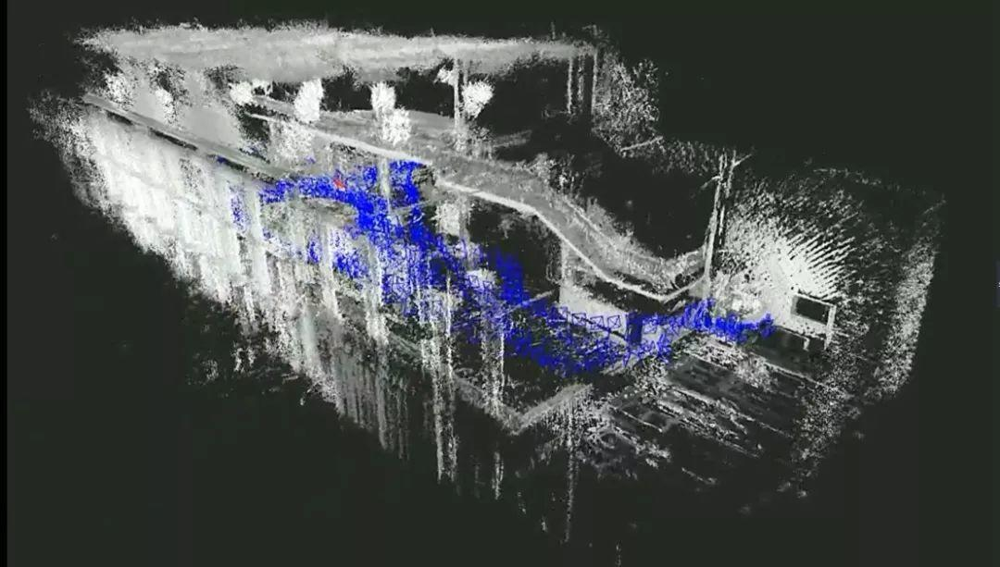
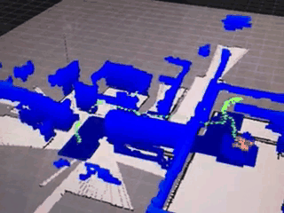
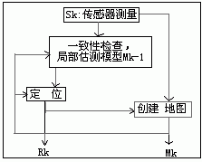
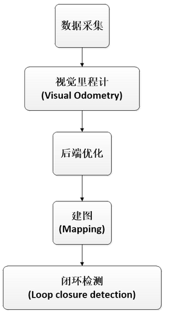
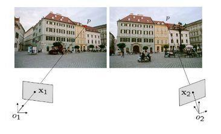
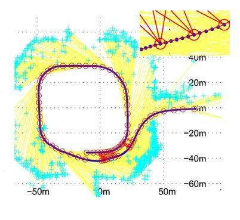
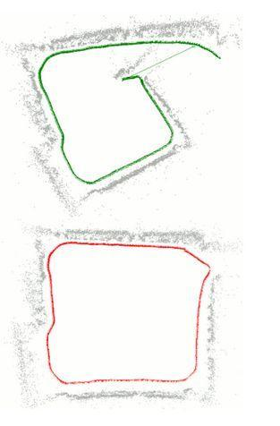

# 视觉SLAM

>本文主要对SLAM技术进行介绍，叙述了VSLAM的框架及关键技术和方法，并总结了目前已有的VSLAM系统和相关资料。

## 目录

1. SLAM技术介绍
2. VSLAM系统及相关资料介绍
3. SLAM框架
	1. SLAM的基本过程
	2. SLAM的主要模块

  
## 1.SLAM技术介绍

**SLAM**，全称是Simultaneous Localization and Mapping，即**同时定位与建图**，指机器人在自身位置不确定的条件下,在完全未知环境中创建地图，同时利用地图进行自主定位和导航。因此可知SLAM的主要工作是**定位**以及**建图**。

目前SLAM有很多实现方法，根据使用传感器不同，主要分为：

**（1）激光雷达传感器；**
**（2）视觉传感器；**

**视觉SLAM**（Visual SLAM 简称VSLAM）包括使用**单目SLAM**、**双目SLAM**和以**Kinect**为代表的深度摄像头的**RGB-D SLAM**。相比使用激光雷达传感器，视觉传感器的成本更低，因此也越来越受青睐。

目前SLAM被广泛应用于无人驾驶汽车、无人机、VR和AR等领域。

下面是宾大的教授kumar做的特别有名的一个demo，是在无人机上利用二维激光雷达做的SLAM。

## 2.VSLAM系统及相关资料介绍

目前在VSLAM领域实现较好的SLAM系统有：

- 单目、双目SLAM:

(1).**PTAM**(Parallel Tracking And Mapping):2007年很流行的SLAM项目，是**第一个**使用BA完成**实时SLAM**的系统。但其缺乏**回环检测和重定位等功能**，只能作用于小规模的场景，且稳定性也不是很高。（http://www.robots.ox.ac.uk/~gk/PTAM/）

(2).**DTAM**(Dense tracking and mapping in real-time):2011年，Direct SLAM方法的**鼻祖**;

(3).**LSD-SLAM**(Large-Scale Direct Monocular SLAM):2014年一个半稠密SLAM系统。（http://vision.in.tum.de/research/vslam/lsdslam）

(4).**ORB-SLAM**:2015年一个比较完整的基于特征点的SLAM系统。
（http://webdiis.unizar.es/~raulmur/orbslam/）

- RGB-D SLAM:

(1).**KinectFusion** 2011
（http://www.microsoft.com/en-us/research/project/kinectfusion-project-page/）

(2).**RGBD-SLAM2** 2014 （http://felixendres.github.io/rgbdslam_v2/）

(3).**ElasticFusion** 2015 （http://www.imperial.ac.uk/dyson-robotics-lab/downloads/elastic-fusion/）

当然除了上述项目的学习外，对于slam的学习入门，有一些经典教材如：
**Multiple View Geometry in Computer Vision (Second Edition)**
（http://www.robots.ox.ac.uk/~vgg/hzbook/）也有中文版为《计算机视觉中的多视图几何》。

**Robotics Vision and Control**（http://www.petercorke.com/RVC/） 本书是面向实践的，详细介绍了机器人和机器视觉。也有了中文版，叫做《机器人学、机器视觉与控制》。
此外，对于slam入门学习推荐高博的**一起做RGB-D SLAM**其博客为半闲居士（http://www.cnblogs.com/gaoxiang12/p/4633316.html）

## 3.SLAM框架

### 3.1 SLAM的基本过程

描述为:机器人在未知环境中从一个未知位置开始移动,在移动过程中根据位置估计和传感器数据进行自身定位,同时建造增量式地图。

（1）**定位(localization)**：机器人必须知道自己在环境中位置。

（2）**建图(mapping)**：机器人必须记录环境中特征的位置（如果知道自己的位置）

（3）**SLAM**：机器人在定位的同时建立环境地图。其基本原理是运过概率统计的方法，通过多特征匹配来达到定位和减少定位误差的。

### 3.2 VSLAM的主要模块

 视觉SLAM主要分为几个模块：**数据采集、视觉里程计(Visual Odometry)、后端优化、建图(Mapping)、闭环检测(Loop closure detection)**。如下图所示：

#### 3.2.1 视觉里程计

视觉里程计是利用一个图像序列或者一个视频流，计算摄像机的方向和位置的过程。一般包括图像获取后、畸变校正、特征检测匹配或者直接匹配对应像素、通过对极几何原理估计相机的旋转矩阵和平移向量。

#### 3.2.2 后端优化

理论上来说，如果视觉里程计模块估计的相机的旋转矩阵R和平移向量t都正确，就能得到完美的定位和建图了。但实际试验中，我们得到的数据往往有很多噪声，且由于传感器的精度、错误的匹配等，都对造成结果有误差。并且由于我们是只把新的一帧与前一个关键帧进行比较，当某一帧的结果有误差时，就会对后面的结果产生**累计误差**，导致误差越来越大。**为了解决这个问题，引入后端优化**。

后端优化一般采用捆集调整(BA)、卡尔曼滤波(EKF)、图优化等方式来解决。其中**基于图优化的后端优化**，效果最好。Graph-based SLAM一般使用g2o求解器，进行图优化计算。

#### 3.2.3 闭环检测

后端优化可能得到一个比较优的解，但当运动回到某一个之前去过的地方，如果能认出这个地方，找到并与当时的关键帧进行比较，就可以得到比单用后端优化更准确更高效的结果。闭环检测就是要解决这个问题。

闭环检测有两种方式，一是根据估计出来的相机的位置，看是否与之前否个位置邻近；**另外一种是根据图像，自动识别出来这个场景之前到过，并找到当时的关键帧**。目前常用的后一种方法，其实是一个非监督的模式识别问题。比较常用的方法是采用Bag-of-Words(BOW)，**ORB-SLAM**就是使用这个方法来进行**闭环检测**。

