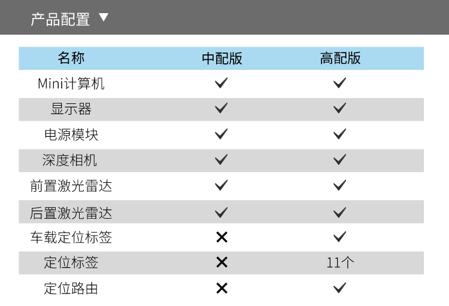
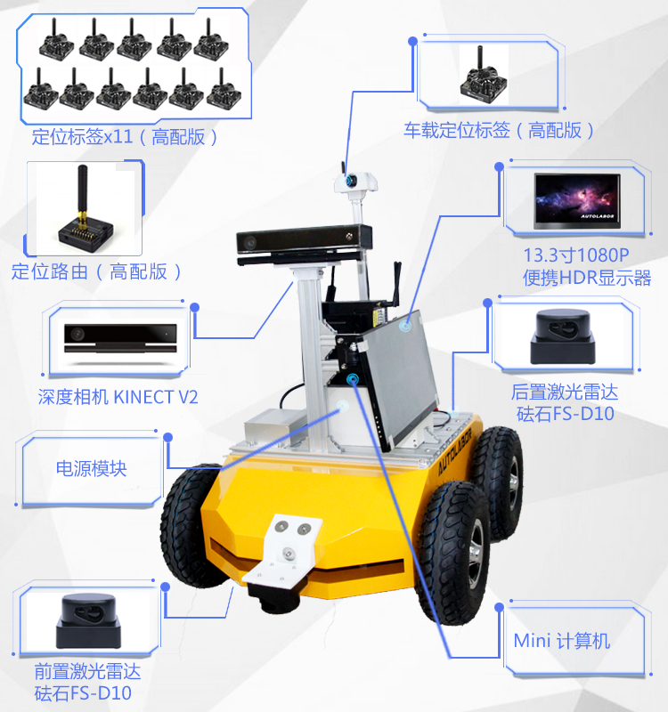
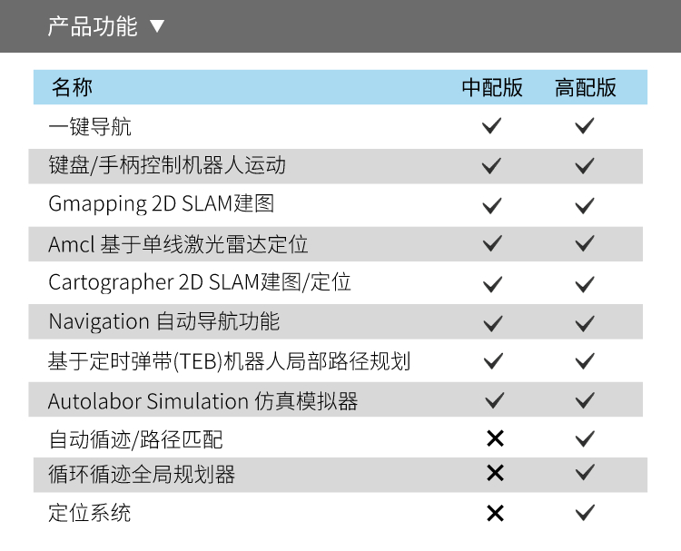
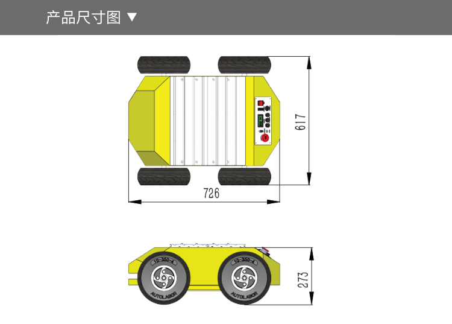
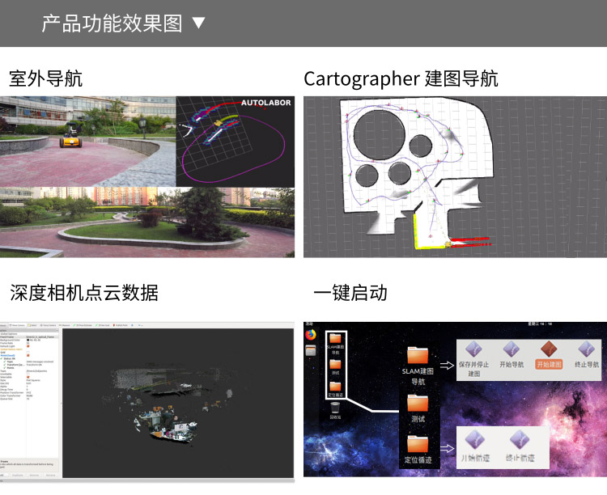

# 产品概览

> 介绍视频

<video class="standard-video" controls="controls" src="http://video.autolabor.com.cn/AutolaborPro1/AP1%E4%BA%8C%E4%BB%A3%E5%A5%97%E4%BB%B6%E4%BB%8B%E7%BB%8D-final.mp4 " width="100%" height="100%"></video>

Autolabor Pro 1 是由清华大学科研团队打造的无人驾驶平台，该平台实现了室内外高精度定位、SLAM建图、路径规划、自动导航、自动循迹、自动避障等功能。

平台搭载了激光雷达、深度相机、高精度定位标签、Mini 计算机等设备，同时预留了接口提供扩展性。

丰富的教程及资料，一键式导航操作，极大降低了用户的使用门槛，使用户可以快速上手并进行高效的二次开发，代码全部开源，软件持续更新，给用户提供更好的使用体验。

根据搭载的套件不同产品分为**中配版**与**高配版**，不同的版本的硬件配置与功能不同。

注：产品描述仅供参考，若因产品升级或其他原因造成与实物存在差异时，请以实物为准
