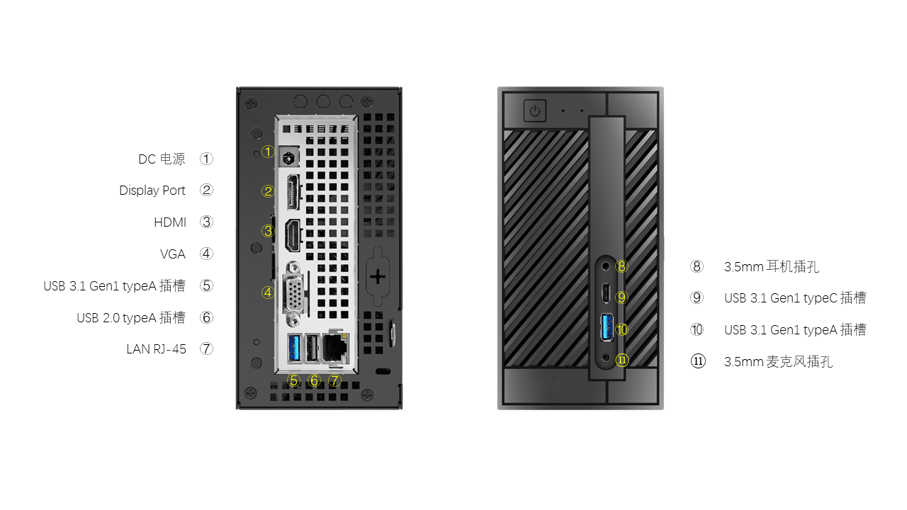

# 规格参数

## Autolabor PC 

| 项目                 | 规格            |
| ------------------- | --------------- |
| CPU          | AMD® Ryzen3 2200G / AMD® Ryzen3 3200G |
| 芯片组        | AMD® A300 |
| RAM          | DDR4 8GB    |
| ROM           | SSD 250GB         |
| Wi-Fi        | 支持          |
| 蓝牙         | 支持          |
| 扩展接口        | 参见[接口图片](#interface) |

### CPU1

| 项目              |           |        |
| ---------------- | -------------------------- | -------------------------- |
| 型号              | AMD® Ryzen3 2200G          | AMD® Ryzen3 3200G          |
| 核心频率          | 3.5 GHz                   | 3.6 GHz |
| 加速频率          | 3.7 GHz                   | 4.0 GHz |
| 核心/线程         | 4 / 4                       | 4 / 4 |
| GPU核心           | 8                         | 8 |
| 核显              | Radeon™ Vega 8 1100 MHz2    | Radeon™ Vega 8 1250MHz3 |
| FP16（half）      | 2.253 TFLOPS （2：1）     | 2.560 TFLOPS (2:1)  |
| FP32（float）     | 1126 GFLOPS              | 1280 GFLOPS |
| FP64（double）    | 70.40 GFLOPS （1:16）     | 80.00 GFLOPS (1:16)  |

1 附CPU性能天梯图供参考：https://www.mydrivers.com/zhuanti/tianti/cpu/index.html

2 参考链接：https://www.techpowerup.com/gpu-specs/radeon-vega-8.c3042

3 参考链接：https://www.techpowerup.com/gpu-specs/radeon-vega-8.c3286

## 电源组件

| 项目                 | 规格            |
| ------------------- | --------------- |
| 电池容量              | 10AH @ 24V    |
| 输出电压              | DC 12V        |
| 输出电流              | 20A           |
| 纹波电压              | < 100mV       |

## 显示器

| 项目                 | 规格            |
| ------------------- | --------------- |
| 尺寸              | 13.3 英寸      |
| 比例              | 16: 9         |
| 分辨率            | 1920*1080     |
| 亮度              | 300 cd/m²     |
| 对比度            | 800: 1         |
| 触摸              | 否            |

## 激光雷达（FS-D10）

|项目|规格|
|:----|:----|
|测量距离¹|0.15～10m，6m@10%|
|重复精度²|±3cm@10m@10Hz|
|扫描角度|360°|
|扫描频率³|10Hz|
|测量频率|142800 次/秒|
|输出接口|TTL|
|最小距离分辨率|1cm|
|光源|激光二极管 905nm，≤1mW； 符合 GB7247.1-2001 I 类激光人眼安全要求|
|供电|DC5V±10%，＜3W；启动电流>1.5A|
|体积|78×7 8×56mm|
|操作温度范围|－10℃～＋50℃|
|存储温度范围|－20℃～＋70℃|
|防护等级|IP54|
|重量|190g|
|使用寿命|标准条件下 5 万小时|

注：
1. 指在 6m 处可以测到仅 10%反射率的物体（深黑），最远量程 10 米（柯达白）；
2. ±3cm@10m@10Hz 是指在 10m 处扫描频率 10Hz 情况下的扫描测量精度；
3. 额定转速为每秒钟 10 圈；

## 激光雷达（LD19）

### 电气与机械参数
|参数名称|单位|最小值 | 典型值 | 最大值 | 备注 | 
|:----|:----|:----|:----|:----|:----|
|输入电压|V|4.5V | 5V | 5.5V |   | 
|PWM 控制频率|KHz|20 | 30 | 50 | 方波信号 | 
|PWM 高电平|V|3.0 | 3.3 | 5.0 |   | 
|PWM  低电平|V|-0.3 | 0 | 0.5 |   | 
|PWM  占空比 |%| 0 | 40 | 100 | 40%  占空比扫描频率为 10Hz | 
|启动电流|mA|- | 300 | - |   | 
|工作电流|mA|- | 180 | - |   | 
|整机尺寸|mm| - |  54x46.29x34.8 (长宽高) | -  |   | 
|整机重量|g|- | 47 | - | 不含连接线 | 
|通讯接口|-|-| UART @ 230400 |- |   |
|UART  高电平|V|2.9 | 3.3 | 3.5 |   | 
|UART  低电平|V|-0.3 | 0 | 0.4 |   | 
|驱动电机|-|BLDC | - | - | 无刷电机 | 
|工作温度|℃|-10 | 25 | 40 |   | 
|存储温度|℃|-30 | 25 | 70 |   | 

### 光学参数
|参数名称|单位 | 最小值 | 典型值 | 最大值 | 备注|
|:----|:----|:----|:----|:----|:----|
|激光波长|nm | 895 | 905 | 915 | 红外波段|
|激光功率|W | - | 25 | - | 激光二极管峰值功率 实际使用功率远低于此值|
|激光脉宽|ns | - | 1 | - |  |
|激光安全等级|- | - |  IEC-60825 Class 1 | - |  |
|俯仰角|° | 0 | 0.5 | 2 |  |

### 性能参数
|参数名称 |单位 | 最小值 | 典型值 | 最大值 | 备注|
|:----|:----|:----|:----|:----|:----|
|测距范围 |  m | 0.02 | - | 12 | 70%目标反射率|
|扫描频率 |  Hz | 5 |  10 | 13 | 外部提供PWM 控速|
|测距频率 |  Hz | - |  4500 | - | 固定频率|
|测距精度 |  mm | - |  - | - | 测距小于0.3m时，有数据输出。 测距数据变化趋势与实际距离变化趋势一致|
|测距精度  |  m | -45 |  - | 45 | 测距范围在300mm到12000mm时，测量100次的平均值(70%漫反射面)|
|测距标准差 |  mm | - |  10 | - | 测距范围在300mm到12000mm时|
|测量分辨率 |  mm | - |  15 | - |  |
|角度误差 |  ° | - | - | 2 |  |
|角度分辨率 |  ° | - |  1 | - |  |
|抗环境光 |  KLux | - |  - | 30 |  |
|整机寿命 |  h | 10000 |  - | - |  |

## 深度相机（Kinect V2）

| 项目                 | 规格            |
| ------------------- | --------------- |
| 原理                  | TOF  |
| RGB流           | 1920 x 1280 @ 30 FPS           |
| 深度流           | 512 x 424 @ 30 FPS          |
| 红外流          | 512 x 424 @ 30 FPS        |
| 深度距离             | 0.4 m - 4.5 m |
| 水平视角             | 70 °            |
| 垂直视角             | 60 °            |
| 通信接口              | USB 3.0       |

## 深度相机（Vzense DCAM710）

| 项目                 | 规格            |
| ------------------- | --------------- |
|尺寸 | 103mmx33mmx22mm|
| 传感器       | ToF CCD+RGB          |
| 激光发射器   |940nm VCSEL |
| ToF分辨率帧率   | 640X480, Max.30fps| 
|RGB分辨率帧率|1920X1080, 30fps|
| ToF FOV  | 69°(H) × 51°(V)         |
| RGB FOV      | 73°(H)X42°(V)          | 
| 输出格式 | RAW12(深度,IR), MJPEG(RGB)|
|检测距离|0.35m~4.4m|
|工作温度|-10℃~50℃|

## 定位系统

| 项目                 | 规格            |
| ------------------- | --------------- |
| 标签距离 |  30m (理想情况下测试结果) |
|         |  <20m (常规建图定位建议距离) |
| 定位精度 | 绝对精度：距离的1~3% |
|         | 差分精度：±2cm |
| 定位频率 | 1/20Hz ~ 45Hz |
|         | 与移动标签到固定标签的距离有关（距离越近频率越高） |
|         | 与移动标签的数量有关（数量越多频率越低） |
| 供电    | 内部：1000mAh 锂电池（根据使用情况可续航2天到数月） |
|         | 外部：USB供电 |
| 尺寸    | 55 x 55 x 33 mm（含天线：55 x 55 x 65 mm）|

