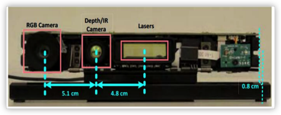

# 简介

## 产品介绍

Kinect v2是微软发布的一款3D体感摄影机，是一种体感交互设备，可以获取物体的深度信息，判断物体的位置，深度检测是Kinect的核心技术，Kinect v2的深度检测用的是TOF（Time Of Light）的方式：
通过红外摄像头投射红外线形成反射光，根据光线飞行时间判断物体位置，形成深度图像。

## 结构图

## 基本参数

| 项目                 | 规格            |
| ------------------- | --------------- |
| 尺寸       | 24.9cm x 6.6cm x 6.7cm          |
| 彩色影像   |1920 x 1080 @ 30 / 15 FPS（根据环境亮度） |
| 深度影像   | 512 x 424 @ 30 FPS、16bit 距离值（mm）、可侦测范围0.5 ~ 4.5 m|
| 红外线影像  | 512 x 424 @ 30 FPS、16bit 强度值        |
| FOV       | 70°x 60°          |
 
 

