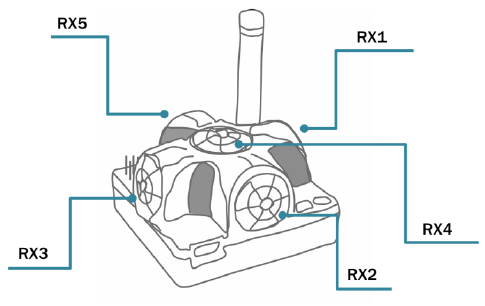
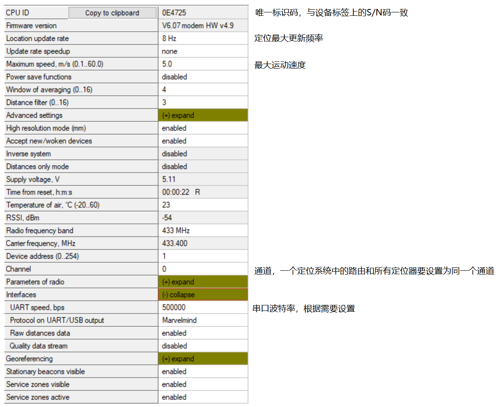

# Dashboard 说明

## 软件概述

使用 Dashborad 软件对定位标签或路由进行设置、构建地图以及查看可视化定位结果。软件界面如下图所示

下载地址：TODO

## 显示设置

设置移动标签运动轨迹的显示。

## 距离表

距离表显示系统中所有定位标签之间的距离。固定标签之间的距离用来计算地图，移动标签与固定标签之间的距离用来计算移动标签在地图中的坐标。固定标签之间的距离可以通过超声自动测量，也可以用户手动测量，下面详细介绍。

### 超声自动测量

大多数情况下，表中的距离由系统自动测量完成。距离值波动较小且背景色为白色表示测距结果稳定可信，如下图。

如果背景色不是白色，根据下文颜色的定义解决对应的问题。

只有所有的背景色都是白色的话才能锁定地图（使用这些距离数据构建地图）。

### 用户手动测量

固定标签之间的距离难以自动测量时，可以通过其他方式手动测量标签间的距离然后输入到距离表格，这种情况下距离背景色为绿色。在要修改的距离上右键点击 `Enter distance for pair` 菜单项完成距离手动输入，如下图。

可以看到输入后背景色变为绿色，如下图。

背景色定义：

 白色表示距离可靠，可以锁定地图了。

 黄色表示测距存在异常，锁定地图前还需要对距离与标签进行检查。

 红色表示距离严重错误，不要在此状态下锁定地图。

 绿色表示锁定了距离值（手动输入后会自动锁定），可以锁定地图。

## 换能器开关

对于特定的安装位置与工作范围，只需要部分换能器工作，此时可通过此处关闭不用的换能器。定位标签上换能器分布如下图所示。不能明确需要哪些换能器时，则开启所有换能器。

## 设备参数设置

打开 Dashbord 后，USB 连接定位标签或者路由设置相应参数。

> 注意：设备（定位标签/路由）会被电脑识别为串口，请确保安装了相应 USB 串口驱动（安装Dashbord时在安装选项中选中 USB Driver 项）!

定位标签参数设置如下图，一般情况下只需关注或设置图中注释的参数，其他参数保持默认。

路由参数设置如下图，一般情况下只需关注或设置图中注释的参数，其他参数保持默认。

## 设备列表

设备列表包含系统中所有标签，如下图。

列表中的设备分为固定标签与移动标签两类。固定标签显示为绿色，移动标签显示为蓝色，右键菜单不同，如下图所示。

## 地图设置

`Save map` 将地图保存为 ini 文件到 "Dashboard 安装路径/maps"

`Load map` 从 ini 文件加载地图

`Erase map` 清除地图

## 定位标签快速设置面板

`Reset` 重置设备

`Sleep` 控制设备进入睡眠模式（省电模式）

`Wake up` 从睡眠模式唤醒设备

`Default` 恢复所有设置到出厂状态

`Time sync` 发送 PC 的时间到设备

其中 `Reset`、`Sleep`、`Wake up` 可批量设置，按下 Ctrl 键时这三个按钮变为黑体，此时点击按钮对所有设备生效。
