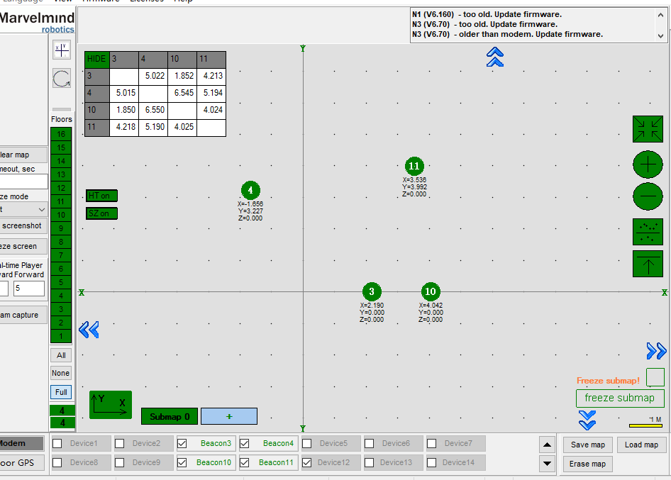
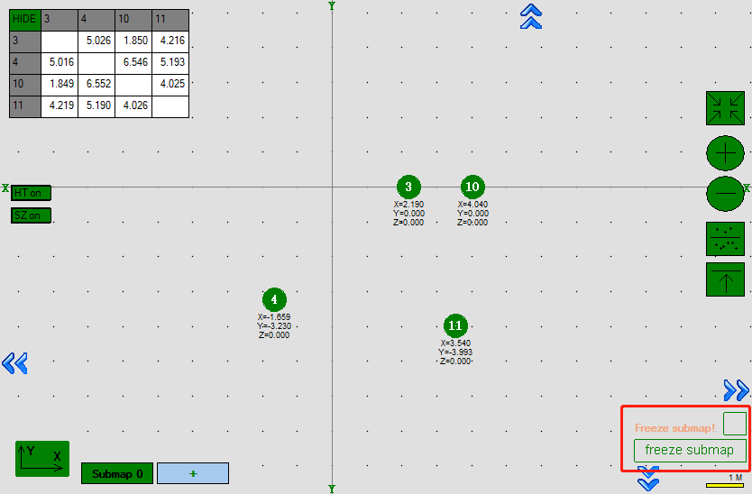
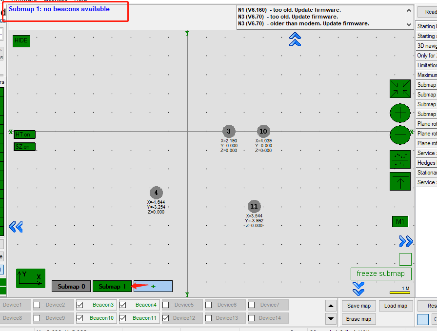
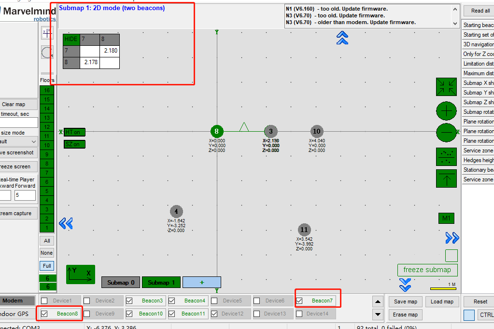
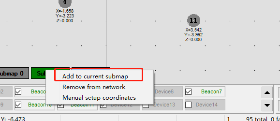
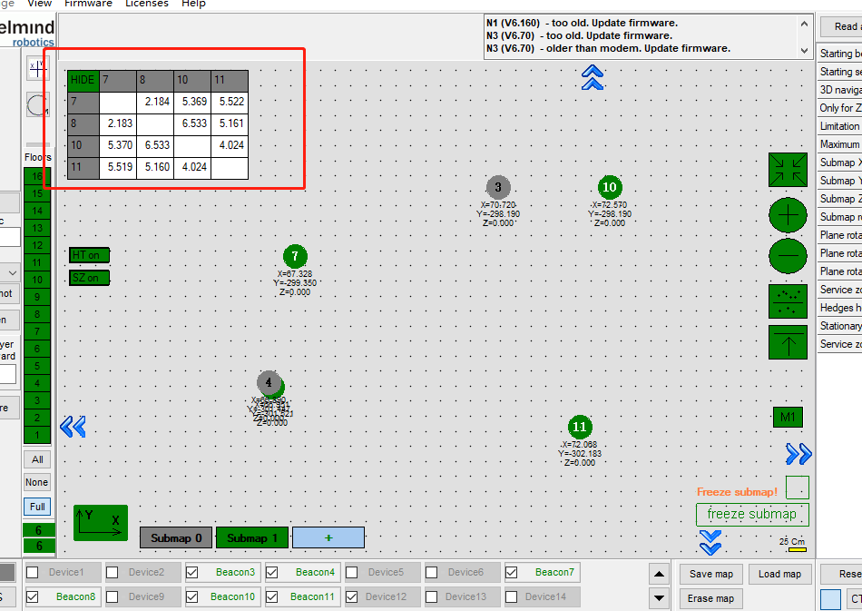
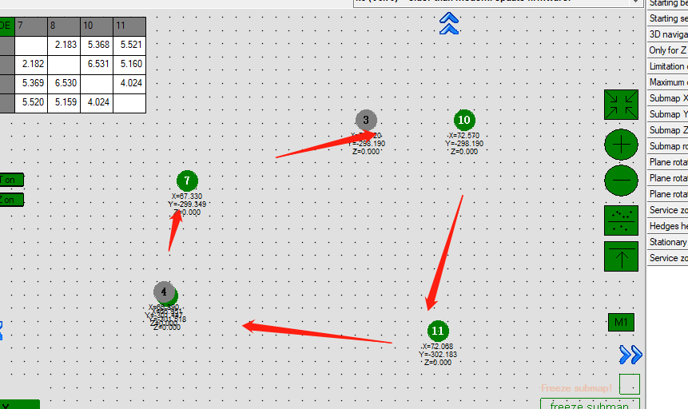
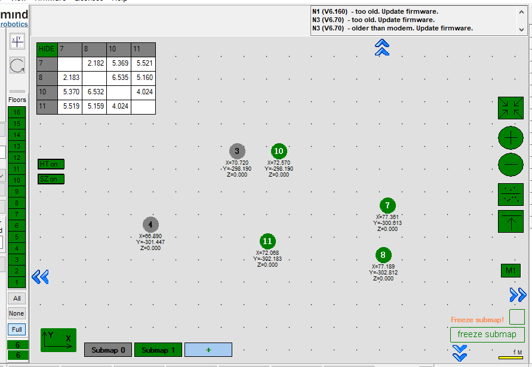
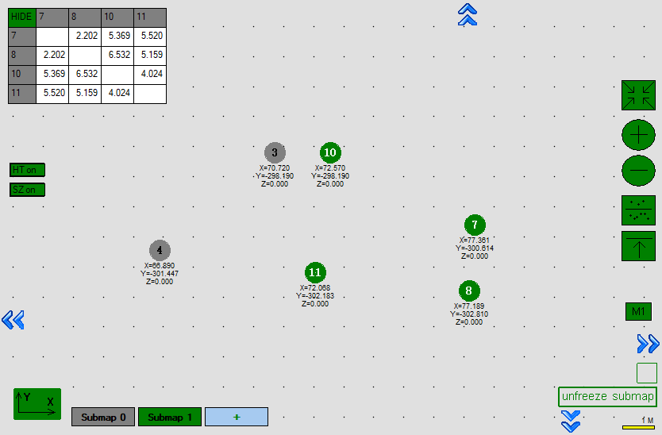

# 定位循迹 - 进阶使用

## 地图拼接

子地图最小部署单元以4个定位标签为一组（标签间的距离<20m），如使用环境面积较大，可以搭建多个子地图，将子地图拼接在一起，形成一个大地图。

准备工作：
* 固定标签6个
* Dashboard软件

## 一、打开标签电源，摆放标签

以下摆放位置为例：
3 10 7
4 11 8

### 1、先建立submap0
3 10
4 11

### 2、然后建立 submap1
10 7
11 8

## 二、进入dashboard

### 1、建立submap0

勾选并激活 标签3、4、10、11 

标签的实际摆放位置：
3 10
4 11

顺时针数的顺序是3->10->11>4>3，Dashboard中顺时针的是3->4->11->10->3，软件与实际环境不符，进行地图翻转操作。

翻转后，确认无误，freeze submap锁定地图 

### 2、建立submap1

#### 1）点击 + ，新增submap1，此时地图中无标签

#### 2）勾选并激活 标签7、8，7和8加入地图中

#### 3）	分别右键选择10、11，选择 add to current submap

待7、8、10、11都加入地图后，检查标签顺时针顺序
Submap1：10->7->8->11->10
10 7
11 8

软件是10->11->8->7->10，继续做翻转，freeze submap锁定submap1

此时dashboard地图与目标地图一致，地图拼接完毕
3 10 7
4 11 8

