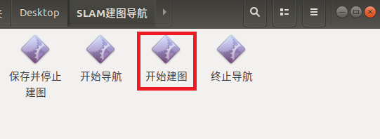
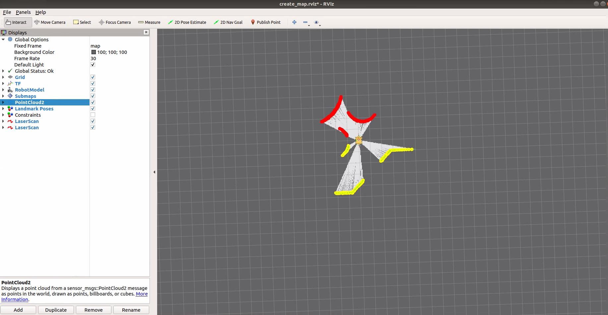
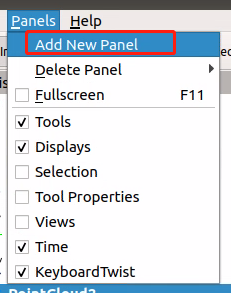
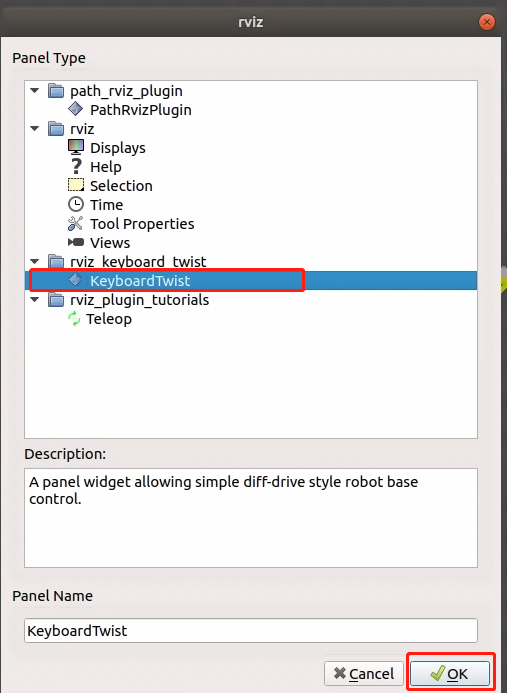
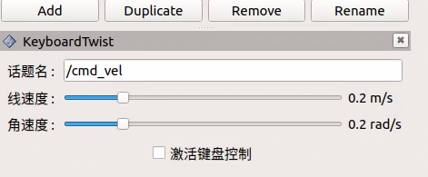
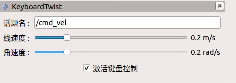

# 远程控制-键盘插件

使用远程连接到 AP1 上后，我们想要控制 AP1运动，发现键盘控制车不动。

在 OS 系统中程序默认识别的是插在车载电脑上的键盘外设，远程主机的键盘命令程序无法接收，键盘控制指令则无法执行。

为了解决远程连接控制的问题，我们需要安装一个键盘功能包，获取远程主机键盘的按键指令，将控制命令发送到车载主机上。


## rviz_keyboard_plugin


### 描述：

该功能包为Autolabor 机器人远程连接时，提供用户端主机键盘控制功能。

### 要求:

必须基于 Autolabor OS 使用


### 一、下载与编译


#### 1. 下载程序包

进入 /home/autolabor/catkin_ws/src 目录，执行

```
git clone https://github.com/autolaborcenter/rviz_keyboard_plugin.git
```

或访问 https://github.com/autolaborcenter/rviz_keyboard_plugin.git 下载源代码，放入 /home/autolabor/catkin_ws/src 目录中

给新加入的文件添加操作权限，在/home/autolabor/catkin_ws 目录下，右键打开终端，执行

`sudo chmod -R 777 /home/autolabor/catkin_ws/src/`

输入密码 `autolabor`，回车

#### 2. 编译

还是在 /home/autolabor/catkin_ws 目录下，终端执行

`sudo rm -rf build/ devel/ logs/ .catkin_tools/`

输入密码 `autolabor`，回车，然后执行

`catkin build`


### 二、安装

以**建图**为例，演示该插件的安装方法。


####　1. 远程连接

使用远程桌面工具，连接到车载电脑上。

#### 2. 点击【开始建图】



程序启动，RVIZ打开。



#### 3. 加载插件

RViz 的左上角依次点击 Panels -> Add New Panel -> rviz_keyboard_twist -> KeyboardTwist



<div style="clear: both;"></div>

***

**加载完毕：**



***

**做完以上操作后 Ctrl  + S 保存 RViz 配置，如忘记保存，则下次进来要重复操作。**

### 三、使用


#### 1. 激活键盘控制

鼠标勾选激活键盘控制




#### 2. 键盘控制

使用键盘上下左右控制，此时车能够被远程控制。

#### 3. 取消键盘控制

键盘控制完成后，必须取消，否则键盘按键失灵无法使用。


### 四、重要说明

1. 需要远程使用的应用都需要在 RViz 中单独添加该插件，单个RViz中添加的插件不会应用到全局程序。
2. 使用该插件远程控制前，要求在本机确认机器人的键盘控制是正常的。
3. 键盘控制使用完毕后，必须要取消键盘控制。


