# 远程连接

## 外网连接

步骤：

1. 登录云服务设备管理端，获取机器人的远程连接地址
2. 使用远程桌面软件 或 SSH ，进行远程连接

### 一、获取地址

使用外网远程连接，每次连接前都需要**重新获取**远程访问地址。使用情况包括：

* 第一次进行远程连接
* 机器人开机状态，用户端曾经连接过，但远程连接软件关闭或者连接断开
* 机器人设备关机/重启/断开后，重新打开

#### 操作步骤：

1. 使用微信扫描随车附上的 `云服务管理员-绑定二维码`，扫描后该微信用户与产品绑定成功。 **此二维码只能使用一次，绑定成功后失效，用户无法自行解绑，请谨慎操作**。
2. 访问 `cloud.autolabor.com.cn`，使用微信扫码登录，进入云服务管理界面。

    

3. 在设备管理中，可以看到该微信用户名下绑定的所有设备。

    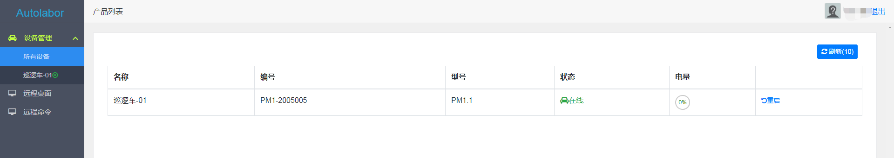

    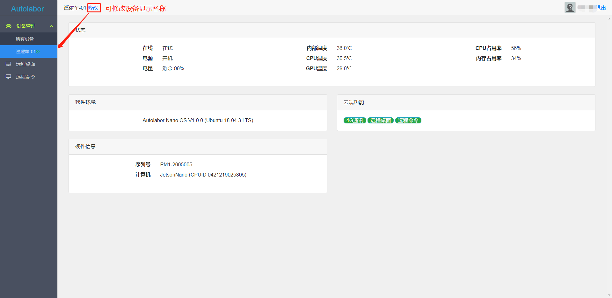
 
4. 左侧管理菜单中，有 `远程桌面` 与 `远程命令` 两个菜单栏，分别对应的是获取机器人  图形化界面 与 SSH 的远程连接地址 。

    推荐用户使用 `远程桌面`，有图形化界面操作更方便，还可直接与用户端主机传输文件。

    **1. 获取远程桌面访问地址**

    点击进入 `远程桌面`页面：
    
    ① 点击右上角的`刷新`按钮，刷新设备状态
    ② 选择对应的设备
    ③ 点击`启动`

    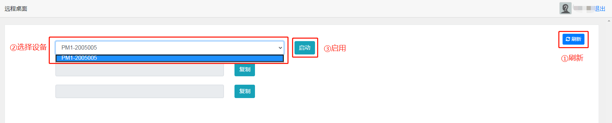

    启动后得到远程桌面地址：cloud.autolabor.com.cn 端口：xxxxx

    请记住该地址，之后在使用远程桌面连接时会用到。

    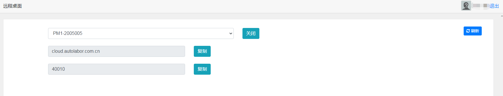

    **2 获取远程命令访问地址**

    点击进入 `远程命令`页面：

    ① 点击右上角的`刷新`按钮，刷新设备状态
    ② 选择对应的设备
    ③ 点击`启动`
    
    

    启动后得到远程命令地址： cloud.autolabor.com.cn 端口：xxxxx

    

    请记住该地址，之后使用 SSH 连接会用到。

5. 得到远程访问地址，下一步进行设备连接。

### 二、设备连接

#### 远程桌面

远程桌面使用的是 NoMachine，这是一个多平台的远程桌面访问工具，图形化操作界面，支持 Windows/Mac/Linux，同一时间仅限 1 人连接（可理解为teamviewer）。

#### 下载NoMachine

[Windows](http://download.autolabor.com.cn/software/nomachine_6.11.2_1.exe)/[OS X](http://download.autolabor.com.cn/software/nomachine_6.11.2_13.dmg)/[Ubuntu](http://download.autolabor.com.cn/software/nomachine_6.11.2_1_amd64.deb)

#### 安装

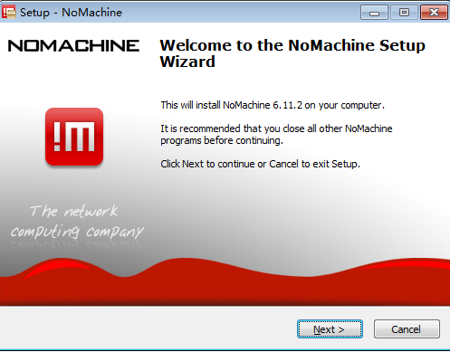

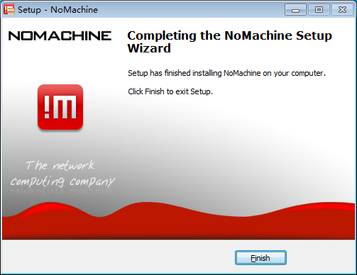

#### 启动

得到的外网访问远程桌面地址：cloud.autolabor.com.cn 端口:xxxxx

1. 打开 NoMachine 软件，点击 `new` 新建连接
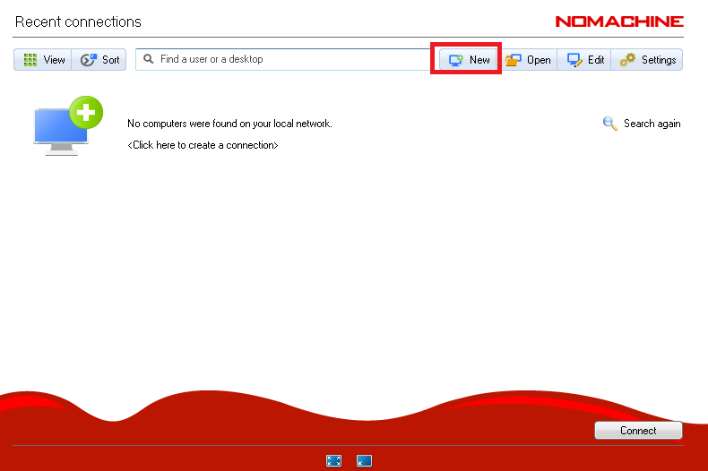

注：如之前曾经连接过，列表中已有设备，则不必新增，右键设置修改地址 Host 与端口号 Port 即可。

2. 默认协议 Protocol 为 `NX` ，点击 `continue`
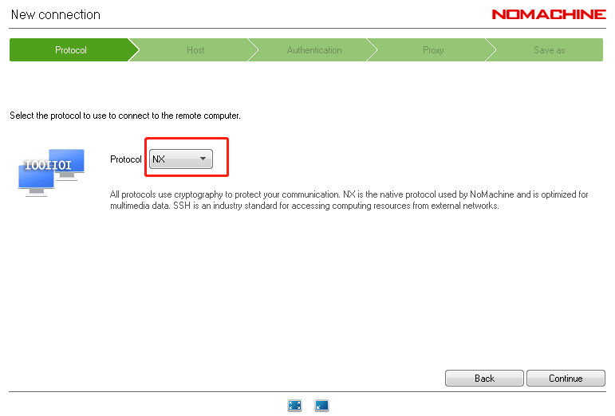

3. 填写 `Host` 与 `Port`，点击 `continue`
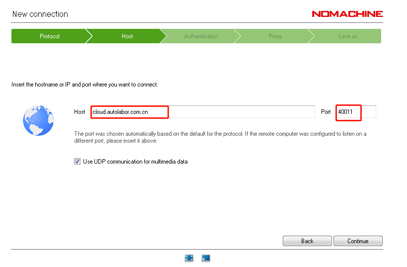

4. 按照默认配置，继续 `continue`
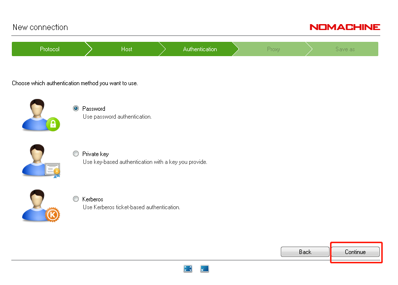
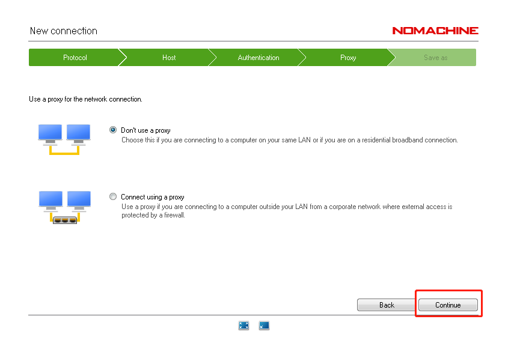

5. 名称可自定义，点击 `Done`
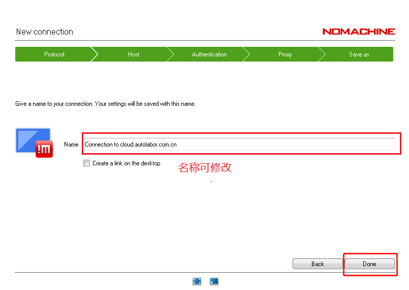

6. 连接新建完成后，回到了设备列表页面，选择设备，点击 `connect`
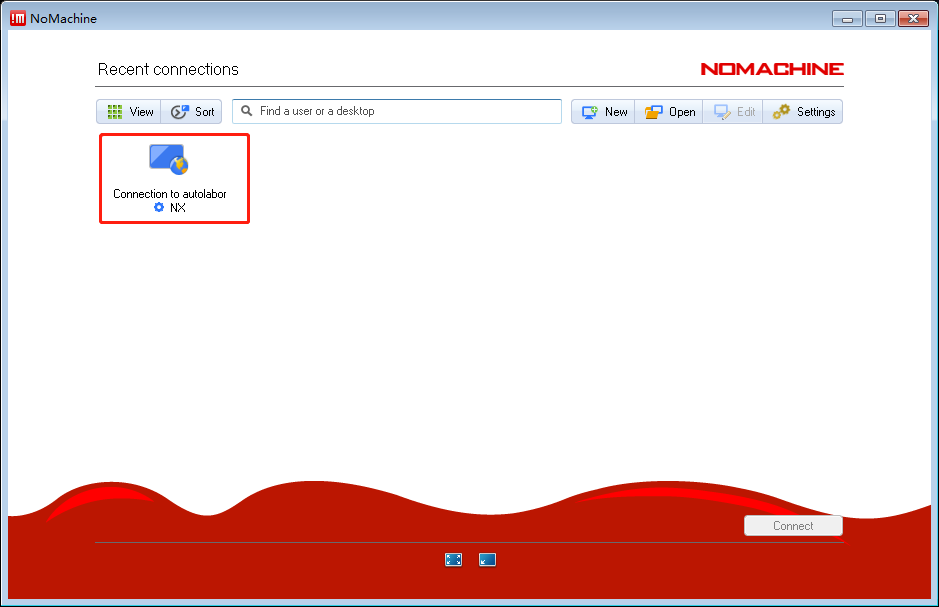

7. 开始连接，点击 `yes`
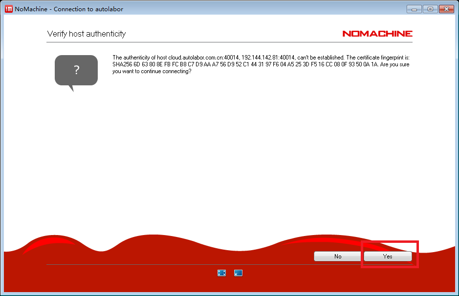

8. 输入  用户名： autolabor 密码： autolabor
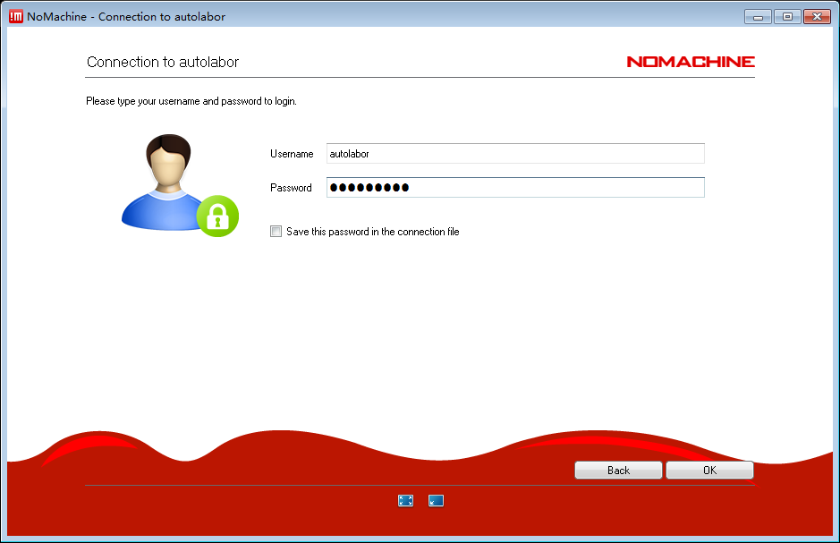

9. 点击 `OK`，成功连接到机器人上。
    
    此时桌面上弹出了一个对话框，是远程桌面软件的设置窗口，左下角勾选之后会不再显示，点击 `OK` 关闭。

    注：如果连接的时候显示白屏，此时系统图形化界面加载中，请等待片刻。
    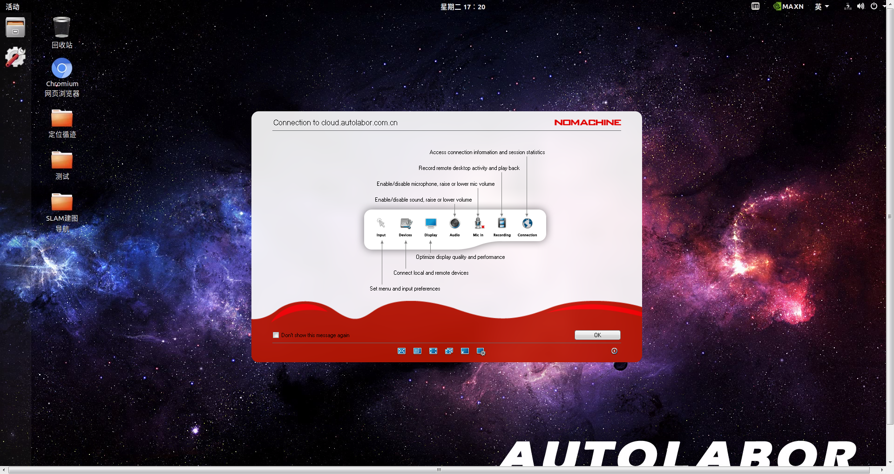

***

#### SSH

此处用 windows 下的 putty 介绍，SSH 的连接方式。

1. 打开 putty 软件，Host: `cloud.autolabor.com.cn` Port: `xxxxx`，`open` 打开。

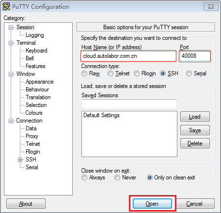

2. 选择 `是`

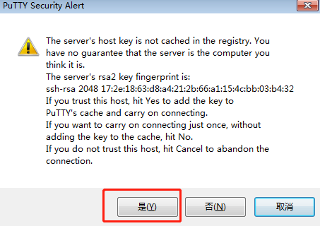

3. 输入 用户名：autolabor 密码：autolabor，回车连接

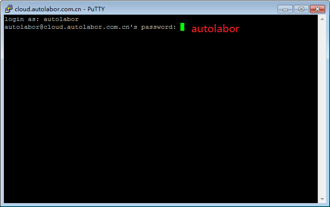

4. 登录成功

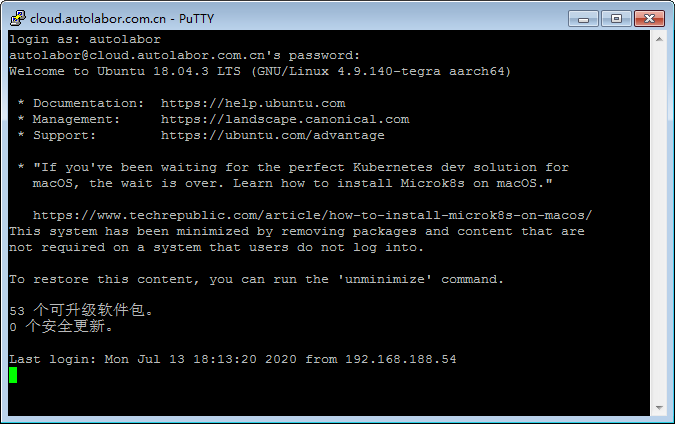

