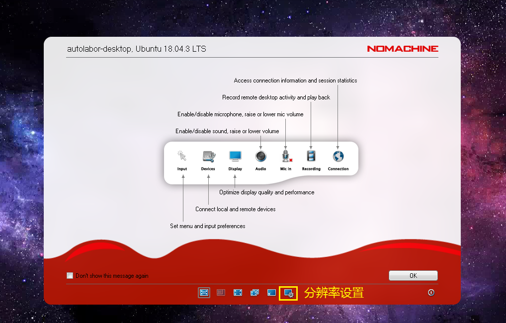
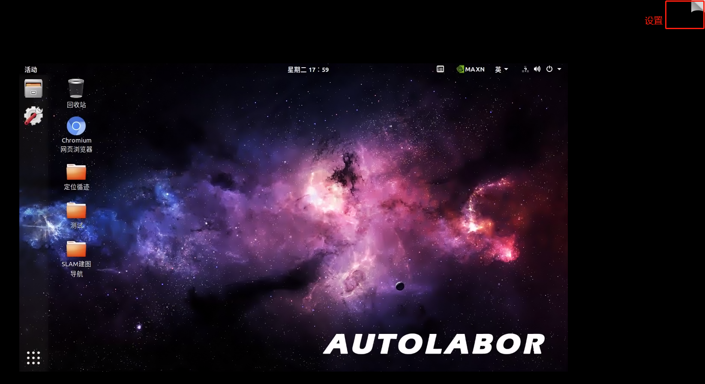
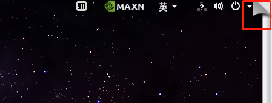
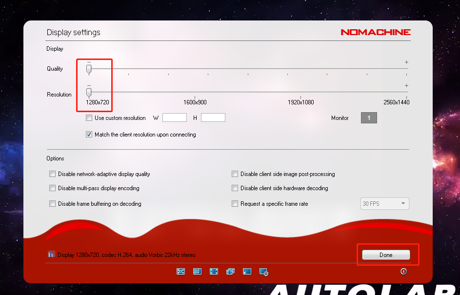
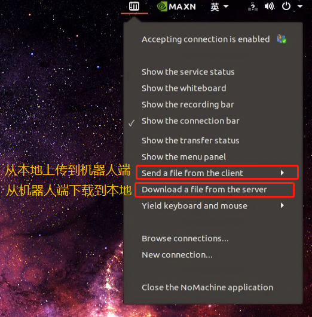
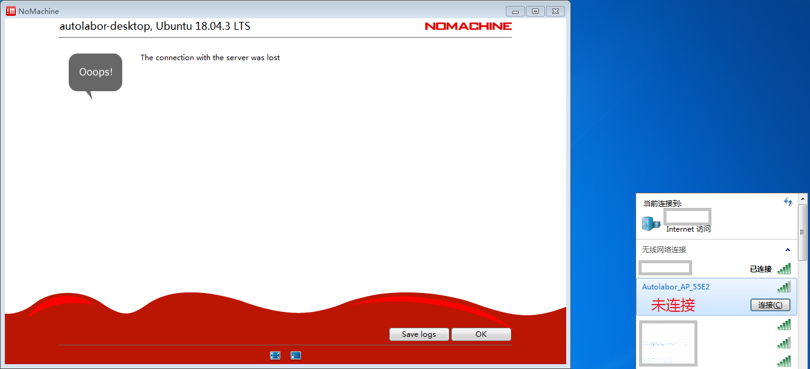
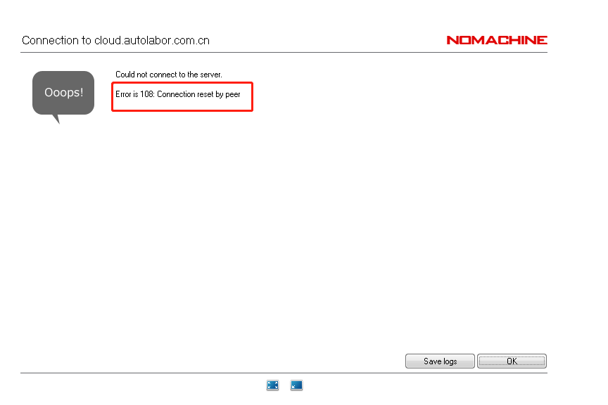
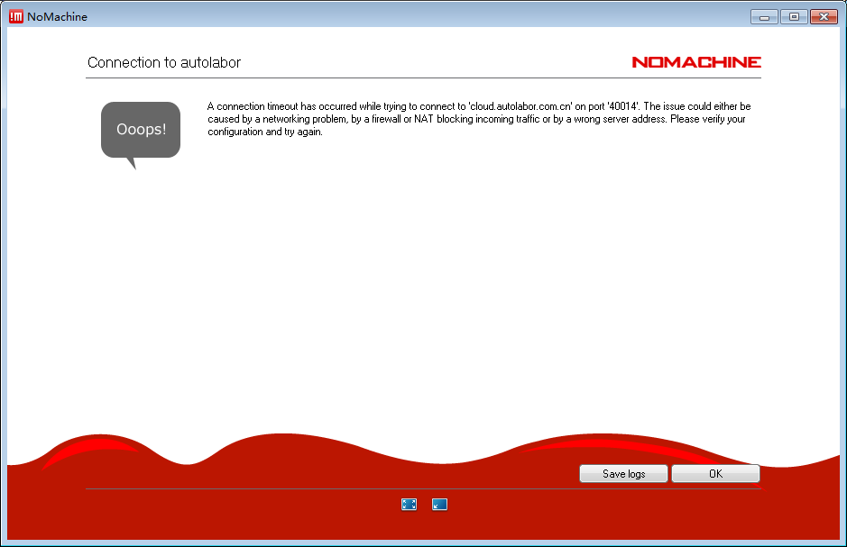

# 常见问题

## 目录

#### 远程桌面软件 NoMachine

1. 如何调整分辨率与画质
2. 如何远程传输文件
3. 报错：`The connection with the sever was lost`
4. 报错：`Could not connect to the sever. Error is 108: Connection reset by peer`
5. 报错：`A connection timeout has occurred while trying to connect ‘cloud.autolabor.com.cn' on port 'XXXXX'. The issue could either by a networking problem.....`
6. 远程连接成功后，一直显示 `NIVIDIA`的图标，卡住了

***

## 远程桌面软件 NoMachine

1. 如何调整分辨率与画质

入口一：

进入系统后，在引导对话框修改。

入口二：

关闭对话框后，鼠标滑到右上角，显示出 “翻页效果”，点击 “翻页”。

进入修改页，调整到最低，`Done` 生效。

2. 如何远程传输文件

3. 报错：`The connection with the sever was lost`

请检查，是否连接上机器人 Wifi 。

4. 报错：`Could not connect to the sever. Error is 108: Connection reset by peer`

远程连接服务已断开，可能原因是：

* 远程端口关闭
* 机器人主机重启
* 机器人电源关闭

操作：

* 内网：检查 Wifi 是否连接
* 外网：重新获取远程连接地址与端口，如显示之前的端口未关闭，请关闭后重新开启

注：设备电源重启后远程连接自动断开，需重新请求远程地址

5. 报错：`A connection timeout has occurred while trying to connect ‘cloud.autolabor.com.cn' on port 'XXXXX'. The issue could either by a networking problem.....`

该端口无法连接，常见于：

* 机器人主机重启
* 机器人电源关闭
* 重新启用了新端口

操作：

重新获取远程连接地址与端口，如显示之前的端口未关闭，请关闭后重新开启。
之后再用新端口尝试。

6. 远程连接成功后，一直显示 `NIVIDIA`的图标，卡住了

远程桌面连接要求主机 HDMI 必须有连接，才能进行显示。

请检查机器人主控单元主机的虚拟HDMI设备（下图） 是否插紧，如发现没有插设备，请插上出厂时附带的虚拟HDMI设备。

