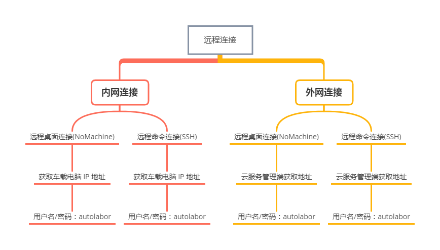

# 远程连接

## 连接说明

### 内网

要求：

* 有无线局域网
* 用户端主机必须有网卡
* 用户端主机与机器人主机的距离不能超过无线局域网的有效范围，距离过远或遮挡都会影响连接
* 用户端主机与机器人主机都已安装 Nomachine 远程连接软件

特点：局域网，适用于近距离控制，速度快。

### 外网

要求：

* 用户已购买 Autolabor 4G/5G 云服务
* 用户端主机必须能够上外网
* 如机器人所在地无 4G/5G 信号覆盖，则无法进行远程连接
* 用户端主机与机器人主机都已安装 Nomachine 远程连接软件

特点：广域网，适用于远距离控制，通信消耗流量，通信与操作与内网相比较慢。

***

## 选择相应的网络连接

<a href="/usedoc/navigationKit2/version_two/network/inner-connect">内网</a>

<a href="/usedoc/navigationKit2/version_two/network/outer-connect">外网</a>

日常近距使用建议选择内网连接

## 结构图

