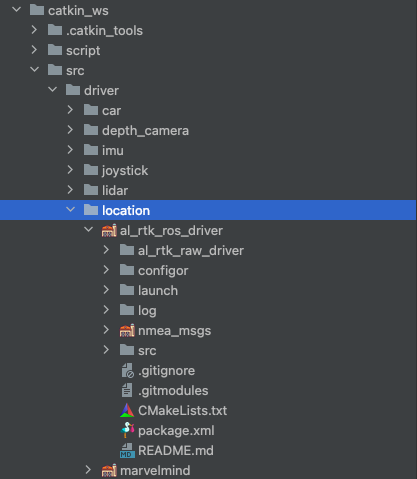
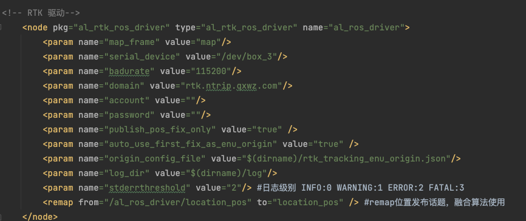

# RTK循迹模块使用说明
## 开发引导

实现RTK定位功能的软件包含两部分 RTK RAW 驱动和 RTK ROS包

位于src/driver/location/al_rtk_ros_driver 



#### RTK RAW驱动

raw 驱动部分包含从串口获取RTK的数据进行解析 ，并包含支持千寻服务的nrtip client。 可通过配置账号和密码直接获得Fixed解的位置， 其输出格式为WGS84坐标。


#### RTK ROS包

ROS驱动包除实现与ROS的接口外，实现了WGS84坐标系到ENU坐标的转换。ENU的直角坐标可直接被路径规划等算法使用。由于ENU坐标需要参考原点，此软件包会根据设置在第一次获得Fixed解时将当前坐标作为ENU坐标系x=0,y=0点。



RTK 驱动的所有功能都通过launch文件中的 rtk node 节点进行配置 具体功能如下

*  map_frame 定义发布位置的坐标系，默认为map 无需修改

* serival_device 计算机连接RTK接收机的串口地址，对于AP1套件已固定为/dev/box_3 对应USB hub#3接口。 如需在其他环境使用修改为对应串口地址即可

* badurate  串口通讯速率 固定为115200 不能修改

* domain 千寻ntrip 服务域名 无需修改

* account 千寻ntrip 账号

* password 千寻ntrip密码

* publish_pos_fix_only 是否只在固定解情况下发布位置。 当设置为true时，尽在RTK接收机可以解算出固定解（即误差1-2cm的高精度位置）时发布位置话题的数据，如果无法获得固定解将不发布位置信息。设置为false将不考虑当前解的状态，可能输出误差10米左右的普通定位信息。
* auto_use_first_fix_as_enu_origin 是否使用第一次收到的固定解位置作为ENU坐标系的原点。当设置为false时将不自动设置ENU坐标系原点，需要手动调用相应方法设置。默认为true，非必要无需修改
* origin_config_file 保存enu原点WGS84坐标的文件，如果想清除已经设定的ENU坐标原点可手动编辑此文件或将其删除
* log_dir LOG文件输出目录
* stderrthreshold 日志输出级别，在调试过程中可将此级别设置为0 INFO，将输出驱动内部的详细工作信息。

### AutolaborOS平台编译

由于Autolabor OS 已经包含了RTK所有需要使用的库，使编译工作变得极为简单，仅需要进入驱动目录，使用catkin 编译即可

可输入如下命令

```
cd ~/catkin_ws/src/driver/location/al_rtk_ros_driver/
catkin build --this
```

在编译前，强烈建议您清空已编译版本，并修改swap大小，进行一次完整的工作空间编译，以防止编译缓存造成的编译错误。

清空已编译的内容可通过如下命令实现

```
cd ~/catkin_ws
catkin clean -y
```

由于编译过程中需要使用大量的内存，通常物理内存不能满足要求，可能出现因为内存空间不足导致的编译失败。通常编译过程会通过使用swap空间的方式确保有足够的内存，我们已经提供了自动化修改swap空间的工具 您可通过 如下命令启动，并将swap空间设置15G以上通常可以满足编译的要求。

```
sudo ~/Tools/modifyswap.sh
```

进行整个工作空间的编译

```
cd ~/catkin_ws
catkin build
```


### 自行安装ROS编译

al_rtk_raw_driver 依赖于[libevent](https://libevent.org/) ，编译前请确保已经安装。

在Ubuntu 18.04 可利用apt工具进行安装

```
sudo apt update
sudo apt install libevent-dev
```

al_rtk_ros_driver 所依赖的库都已在源代码目录包含，可直接在项目目录编译。

```
catkin build --this
```


