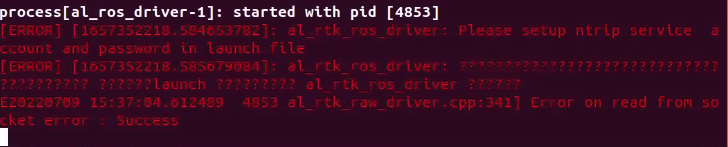
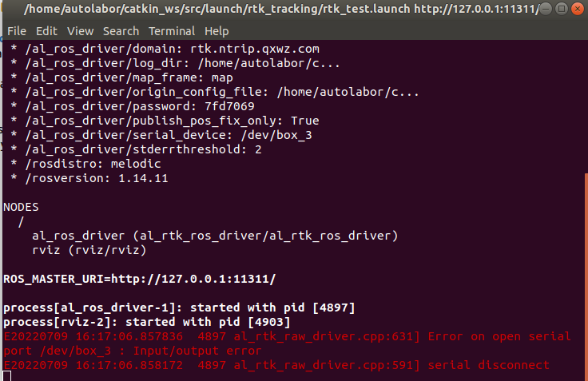
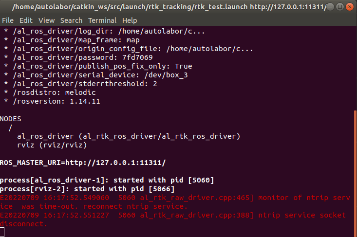
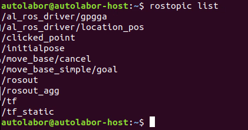
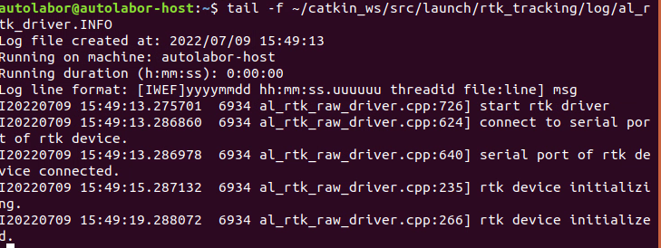
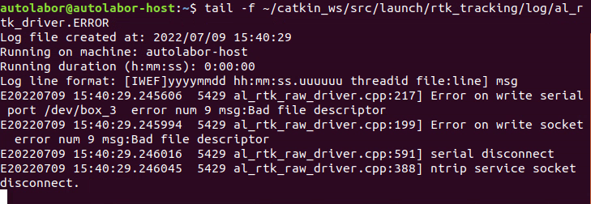

# RTK循迹模块使用说明
## 常见问题

最常见导致故障有以下几种

- 未正确配置NRTIP服务账号密码
- 主机没有互联网连接
- USB接口插错
- 主天线未连接或未连接在ANT1接口
- 所处位置接收卫星信号不佳

通常启动rtk测试功能或循迹功能将会在控制台输出出错信息，通过此信息可以排除大部分故障。

例如：

### 没有互联网连接

当出现此提示时，表示ntrip client 程序无法连接ntrip server，代表本机没有互联网连接。当出现此提示时，可打开浏览器访问常见网站，以检查是否网络连接正常。



### USB口接口插错


当出现如下图提示时，代表驱动程序没有检测到卫星接收机硬件，造成这种情况通常时卫星接收的没有插在AP1套件USB HUB对应的#3接口上，如果您使用的不是AP1套件要确保将launch 文件中串口地址修改为您的接口地址， 通常为/dev/ttyUSB0 或者 /dev/ttyUSB1 可通过ls /dev/tty* 查看。 

除此以外，另外一端的type-c插头要确保插在 卫星接收机的UART1 接口上， 插在UART2、UART3接口无法正常工作，如果需要使用UART2、UART3接口请修改驱动程序启用相应接口。




### 主天线未连接/连接错误

正常情况下，在遮挡不是极为严重的环境卫星接收机都会收到定位信息，即GPGGA消息。驱动程序会将第一包GPGGA信息发送给NTRIP服务以获取后续的差分数据。但是当主天线未连接或者未连接到ANT1接口时，卫星接收机将完全无法收到GPGGA数据，这将导致NTRIP服务等待过长时间超时，出现如下错误。

（当然当网络不佳的情况下，也有可能出现同样的超时错误。）





### 判断故障的工具

#### ROS 话题

多数情况下，您可以通过rostopic 工具将卫星接收机的输出显示出来，以协助判断。

首先，您需要引入当前工作空间的环境变量，通过

```
source ~/catkin_ws/devel/setup.bash
```

其次您可以通过 rostopic list命令显示所有的话题，确认驱动程序是否已经运行。

```
rostopic list
```




如果出现了/al_ros_driver/gpgga /al_ros_driver/location_pos 代表卫星接收机驱动已经工作正常。

/al_ros_driver/gpgga 代表卫星接收机原始的gpgga数据，即未解算的收星数据，通过如下命令可进行显示

```
rostopic echo /al_ros_driver/gpgga 
```


其中包含经纬度，utc时间，收星数量，高度等信息。此为卫星接收机的原始数据，如此信息输出正常，代表卫星接收机的 USB口、主天线都连接正确。

/al_ros_driver/localtion_pos 话题输出的是固定解位置经ENU坐标系转换后的坐标， 此话题的数据仅仅在卫星接收机处于输出高精度固定解的时候输出。 如果此话题输出数据意味着nrtip 服务配置正确、互联网连接正常、卫星收星数量优秀，可以进行无人导航使用。


#### 日志文件

al_rtk_raw_driver 会将所有过程以日志形式存储在 rtk_tracking/log 目录下， 通过查看日志文件可以判断卫星接收机的工作状态，可通过如下命令分别查看INFO日志和ERROR日志

```
tail -f ~/catkin_ws/src/launch/rtk_tracking/log/al_rtk_driver.INFO
```





```
tail -f ~/catkin_ws/src/launch/rtk_tracking/log/al_rtk_driver.ERROR 
```


