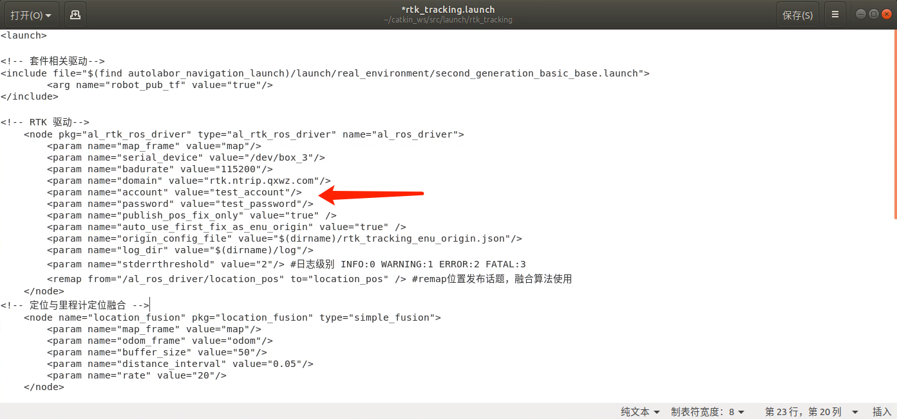

# RTK循迹模块使用说明
## 安装设置
### 互联网连接
由于RTK定位的原理需要使用通过网络分发的差分信号，首先要确保您的AP1套件已经连接互联网，考虑到信号质量和工作范围建议您使用4G网络。如果您手头没有4G路由器和数据卡可从京东等渠道购买。

我们建议采用USB接口的华为4G随身WIFI，此设备经过我们验证可正常工作。在京东等渠道有包含数据卡的套装出售。

华为4G随身WIFI

检查物联网连接的方式可通过使用Firefox浏览器访问qq.com 等常见网站，如网站可正常显示则互联网连接已经可用。

### NTRIP服务账号

RTK接收，差分信号有几种形式，可自建基站，也可使用已有的差分服务。NTRIP是一种差分服务的协议，目前是服务商提供服务的主流。Autolabor RTK驱动中内置了差分服务商[千寻™](https://www.qxwz.com/)的支持，可直接去其官网购买NTRIP账号。 当然也可以通过我们的商务人员通过折扣价购买。

Autolabor商务人员

目前Autolabor RTK 驱动程序仅支持互联网差分服务和千寻服务商。之后会通过软件升级的方式支持其他互联网服务商和自建基站的模式。

#### 配置账号

位于桌面的硬件测试快捷方式和RTK循迹快捷方式会启动不同的launch文件，需要分别配置账号。

####硬件测试launch文件

1.通过Ctrl+Alt+T 打开控制台

2.输入如下命令

> sudo gedit ~/catkin_ws/src/launch/rtk_tracking/rtk_tracking.launch

3.编辑 account 和 passsword 节点的value字段内容， 输入您的账号和密码。 

请仔细核对账号内容和双引号正确，否则一旦工作不正常难以查找原因。

4.点击 Save按钮，保存退出

####RTK巡线launch文件
1.通过Ctrl+Alt+T 打开控制台

2.输入如下命令

> sudo gedit ~/catkin_ws/src/launch/rtk_tracking/rtk_test.launch

3.编辑 account 和 passsword 节点的value字段内容， 输入您的账号和密码。 

请仔细核对账号内容和双引号正确，否则一旦工作不正常难以查找原因。

4.点击 Save按钮，保存退出

####RTK巡线脚本

### 电气连接

#### 天线

1.连接主信号线

随机附带有两根信号线，用于连接接收机和天线，其中较短的一根为主信号线。将其一端连接在RTK接收机的ANT1接口，并将另外一端连接位于雷达上方的天线。

2.连接次信号线
将较长一根信号线连接与接收机ANT2接口，并将另一端连接位于车尾处天线。

主天线用于获取定位的位置信息，次信息线用户获取方向信息。由于当前采用融合算法生成方向信息，次天线可以不接。

#### USB数据线

将Type-C USB接口一端连接在RTK接收机的UART1接口。 另一端连接在USB HUB的3#接口。

注意，由于软件绑定了相应的接口，两端接口不可改变。

