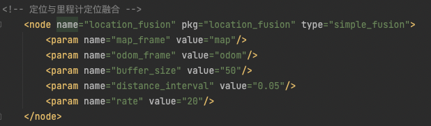

# RTK循迹模块使用说明
## 安装设置
### 互联网连接
由于RTK定位的原理需要使用通过网络分发的差分信号，首先要确保您的AP1套件已经连接互联网，考虑到信号质量和工作范围建议您使用4G网络。如果您手头没有4G路由器和数据卡可从京东等渠道购买。


我们建议采用USB接口的华为4G随身WIFI，此设备经过我们验证可正常工作。在京东等渠道有包含数据卡的套装出售。


华为4G随身WIFI


检查物联网连接的方式可通过使用Firefox浏览器访问qq.com 等常见网站，如网站可正常显示则互联网连接已经可用。

### NTRIP服务账号

RTK接收，差分信号有几种形式，可自建基站，也可使用已有的差分服务。NTRIP是一种差分服务的协议，目前是服务商提供服务的主流。Autolabor RTK驱动中内置了差分服务商[千寻™](https://www.qxwz.com/)的支持，可直接去其官网购买NTRIP账号。 当然也可以通过我们的商务人员通过折扣价购买。


Autolabor商务人员


目前Autolabor RTK 驱动程序仅支持互联网差分服务和千寻服务商。之后会通过软件升级的方式支持其他互联网服务商和自建基站的模式。


#### 配置账号

位于桌面的硬件测试快捷方式和RTK循迹快捷方式会启动不同的launch文件，需要分别配置账号。

####硬件测试launch文件

1.通过Ctrl+Alt+T 打开控制台

2.输入如下命令

> sudo gedit ~/catkin_ws/src/launch/rtk_tracking/rtk_tracking.launch

3.编辑 account 和 passsword 节点的value字段内容， 输入您的账号和密码。 


请仔细核对账号内容和双引号正确，否则一旦工作不正常难以查找原因。

4.点击 Save按钮，保存退出

####RTK巡线launch文件
1.通过Ctrl+Alt+T 打开控制台

2.输入如下命令

> sudo gedit ~/catkin_ws/src/launch/rtk_tracking/rtk_test.launch

3.编辑 account 和 passsword 节点的value字段内容， 输入您的账号和密码。 


请仔细核对账号内容和双引号正确，否则一旦工作不正常难以查找原因。

4.点击 Save按钮，保存退出

####RTK巡线脚本

### 电气连接

#### 天线

1.连接主信号线

随机附带有两根信号线，用于连接接收机和天线，其中较短的一根为主信号线。将其一端连接在RTK接收机的ANT1接口，并将另外一端连接位于雷达上方的天线。

2.连接次信号线
将较长一根信号线连接与接收机ANT2接口，并将另一端连接位于车尾处天线。

主天线用于获取定位的位置信息，次信息线用户获取方向信息。由于当前采用融合算法生成方向信息，次天线可以不接。

#### USB数据线

将Type-C USB接口一端连接在RTK接收机的UART1接口。 另一端连接在USB HUB的3#接口。

注意，由于软件绑定了相应的接口，两端接口不可改变。


## 使用步骤

### 硬件测试

请点击位于桌面硬件测试文件夹内RTK测试的图标

-->


等待若干秒后 rviz将自动启动， 静待几十秒钟待RTK达到收星数量，将会在地图中心显示一紫色圆形，代表卫星接收机已经达到足够的收星数量，并成功输出了固定解位置，即实现了高精度的RTK定位。此圆形代表WGS84经纬度坐标系转化到ENU坐标系的坐标。

获得RTK高精度定位的速度取决于测试环境的情况，测试环境越开阔无遮挡获得固定位置解的速度越快，通常可在1分钟之内完成。如周围有较高建筑或者山峰则可能无法达到获得固定解位置的收星数要求，无法获得固定解的位置。

如果测试环境良好但无法出现下图的情况，请参考[故障排除](## 故障排除)章节处理。


小范围移动主天线的位置，界面紫点会同时移动，即表示工作正常，可以进行下一步RTK循线的测试。


### 录制RTK路线

请将AP1套件置于室外空阔卫星收星良好处，并确保已经正确配置nrtip 账号，具备互联网连接。在进行完RTK硬件测试，确认RTK接收机工作正常后，双击打开桌面北斗RTK室外循迹文件夹，点击运行 RTK循迹

->


等待几十秒钟，待屏幕出现紫色原点，表明RTK已经获得固定解位置，出于差分工作状态。

使用键盘上下左右按钮，遥控机器人前进约1m，使里程计与卫星定位位置融合校准。在遥控过程中可观察到机器人位置突然跳了一下，即意味已经融合校准完成。

点击录制路径按钮，同时使用键盘遥控机器人行进，将看到一条白线绘制到小车经过区域，该线即为录制的路线。

遥控完成所有路线后，点击保存路线按钮，即将路线保存到 /src/navigation/path_server/path_data/default_path.path 中。

### 沿路线自动导航

启动RTK循迹功能，完成里程计与卫星定位融合校准后，使用键盘将机器人遥控到路线起点附近，点击“开始任务"即可。在循迹过程中机器人会根据障碍物情况进行绕行，在任何时刻点击“取消任务“可终止循线。

## 循线工作原理

卫星接收接收到的WGS84坐标（即经纬度），并不能直接提供给导航和路径规划使用，需要将其转换为平面直角坐标系的坐标。因此al_rtk_ros_driver 将 WGS84坐标转换为ENU坐标后输出。 在转化过程中需要指定一个ENU坐标系的原点坐标，即ENU坐标系的x=0,y=0 对应的经纬度是多少。 为了使用上的方便，al_rtk_ros_driver 会将第一次收到RTK固定解的经纬度坐标设置为ENU坐标系原点。当然您也可以通过参数关闭此功能手动设置。


获得平面直角坐标后，并不能直接用于导航定位，主要原因在于

1.卫星接收机的定位数据频率太低（1Hz）

2.仅有位置无法获悉方向。

因此，需要将卫星的ENU坐标与里程计进行融合，输出频率更高的位姿以提供给定位导航算法。

这一过程是由Autolabor自行研发的一个简单位置融合算法实现的，源代码位于/src/navgation/location_fusion/simple_fusion.cpp 

在launch文件中相应配置为。




此融合算法的原理也很简单， 将里程计输出的一系列位置点与ENU的一系列位置点进行匹配。 并发布 odom 坐标系和 map 坐标系之间的变换（我们的卫星定位是绝对的，使用map坐标系）。

在进行路线录制时，按照里程计每一定间隔记录base_link 位于 map坐标系的坐标，作为路线的“路点”。 一系列路点组成了一条路线。

循迹过程中 path_server 会将路线从文件中读出，并作为/recorded_path 话题发布。

LoopPathPlanner 作为全局路径规划器在收到/recorded_path.的数据后，将结合机器人的位置决定将路线未走到的部分作为全局路径规划发布，并为局部路径规划器指定下一个目标。

在完成整条路线后，如果设置loop 和 round都设置为true， 则LoopPathPlanner则会路点顺序反转，实现从路线结尾走回到路线开始。

默认配置中，使用teb_local_planner作为局部路径规划器,以实现遇到障碍物灵活的绕行行为。

因为teb_local_planner主要使用优化的方法进行路径规划，其行为较为灵活的同时较不为可控，可能出现预期之外的行为。这种预期之外的行为不一定适应所有使用情景。

如果需要严格循线的效果，可将teb路径规划器更换为carrot_planner 或者自行开发局部路径规划算法。


## 开发指引

实现RTK定位功能的软件包含两部分 RTK RAW 驱动和 RTK ROS包

位于src/driver/location/al_rtk_ros_driver 


####RTK RAW驱动

raw 驱动部分包含从串口获取RTK的数据进行解析 ，并包含支持千寻服务的nrtip client。 可通过配置账号和密码直接获得Fixed解的位置， 其输出格式为WGS84坐标。


####RTK ROS包

ROS驱动包除实现与ROS的接口外，实现了WGS84坐标系到ENU坐标的转换。ENU的直角坐标可直接被路径规划等算法使用。由于ENU坐标需要参考原点，此软件包会根据设置在第一次获得Fixed解时将当前坐标作为ENU坐标系x=0,y=0点。


RTK 驱动的所有功能都通过launch文件中的 rtk node 节点进行配置 具体功能如下

*  map_frame 定义发布位置的坐标系，默认为map 无需修改

* serival_device 计算机连接RTK接收机的串口地址，对于AP1套件已固定为/dev/box_3 对应USB hub#3接口。 如需在其他环境使用修改为对应串口地址即可

* badurate  串口通讯速率 固定为115200 不能修改

* domain 千寻ntrip 服务域名 无需修改

* account 千寻ntrip 账号

* password 千寻ntrip密码

* publish_pos_fix_only 是否只在固定解情况下发布位置。 当设置为true时，尽在RTK接收机可以解算出固定解（即误差1-2cm的高精度位置）时发布位置话题的数据，如果无法获得固定解将不发布位置信息。设置为false将不考虑当前解的状态，可能输出误差10米左右的普通定位信息。
* auto_use_first_fix_as_enu_origin 是否使用第一次收到的固定解位置作为ENU坐标系的原点。当设置为false时将不自动设置ENU坐标系原点，需要手动调用相应方法设置。默认为true，非必要无需修改
* origin_config_file 保存enu原点WGS84坐标的文件，如果想清除已经设定的ENU坐标原点可手动编辑此文件或将其删除
* log_dir LOG文件输出目录
* stderrthreshold 日志输出级别，在调试过程中可将此级别设置为0 INFO，将输出驱动内部的详细工作信息。

### AutolaborOS平台编译

由于Autolabor OS 已经包含了RTK所有需要使用的库，使编译工作变得极为简单，仅需要进入驱动目录，使用catkin 编译即可

可输入如下命令

```
cd ~/catkin_ws/src/driver/location/al_rtk_ros_driver/
catkin build --this
```

在编译前，强烈建议您清空已编译版本，并修改swap大小，进行一次完整的工作空间编译，以防止编译缓存造成的编译错误。

清空已编译的内容可通过如下命令实现

```
cd ~/catkin_ws
catkin clean -y
```

由于编译过程中需要使用大量的内存，通常物理内存不能满足要求，可能出现因为内存空间不足导致的编译失败。通常编译过程会通过使用swap空间的方式确保有足够的内存，我们已经提供了自动化修改swap空间的工具 您可通过 如下命令启动，并将swap空间设置15G以上通常可以满足编译的要求。

```
sudo ~/Tools/modifyswap.sh
```

进行整个工作空间的编译

```
cd ~/catkin_ws
catkin build
```


### 自行安装ROS编译

al_rtk_raw_driver 依赖于[libevent](https://libevent.org/) ，编译前请确保已经安装。

在Ubuntu 18.04 可利用apt工具进行安装

```
sudo apt update
sudo apt install libevent-dev
```

al_rtk_ros_driver 所依赖的库都已在源代码目录包含，可直接在项目目录编译。

```
catkin build --this
```

## 故障排除


最常见导致故障有以下几种

- 未正确配置NRTIP服务账号密码
- 主机没有互联网连接
- USB接口插错
- 主天线未连接或未连接在ANT1接口
- 所处位置接收卫星信号不佳

通常启动rtk测试功能或循迹功能将会在控制台输出出错信息，通过此信息可以排除大部分故障。

例如：

### 没有互联网连接

当出现此提示时，表示ntrip client 程序无法连接ntrip server，代表本机没有互联网连接。当出现此提示时，可打开浏览器访问常见网站，以检查是否网络连接正常。


### USB口接口插错


当出现如下图提示时，代表驱动程序没有检测到卫星接收机硬件，造成这种情况通常时卫星接收的没有插在AP1套件USB HUB对应的#3接口上，如果您使用的不是AP1套件要确保将launch 文件中串口地址修改为您的接口地址， 通常为/dev/ttyUSB0 或者 /dev/ttyUSB1 可通过ls /dev/tty* 查看。 

除此以外，另外一端的type-c插头要确保插在 卫星接收机的UART1 接口上， 插在UART2、UART3接口无法正常工作，如果需要使用UART2、UART3接口请修改驱动程序启用相应接口。


### 主天线未连接/连接错误

正常情况下，在遮挡不是极为严重的环境卫星接收机都会收到定位信息，即GPGGA消息。驱动程序会将第一包GPGGA信息发送给NTRIP服务以获取后续的差分数据。但是当主天线未连接或者未连接到ANT1接口时，卫星接收机将完全无法收到GPGGA数据，这将导致NTRIP服务等待过长时间超时，出现如下错误。

（当然当网络不佳的情况下，也有可能出现同样的超时错误。）


### 判断故障的工具

#### ROS 话题

多数情况下，您可以通过rostopic 工具将卫星接收机的输出显示出来，以协助判断。

首先，您需要引入当前工作空间的环境变量，通过

```
source ~/catkin_ws/devel/setup.bash
```

其次您可以通过 rostopic list命令显示所有的话题，确认驱动程序是否已经运行。

```
rostopic list
```


如果出现了/al_ros_driver/gpgga /al_ros_driver/location_pos 代表卫星接收机驱动已经工作正常。

/al_ros_driver/gpgga 代表卫星接收机原始的gpgga数据，即未解算的收星数据，通过如下命令可进行显示

```
rostopic echo /al_ros_driver/gpgga 
```


其中包含经纬度，utc时间，收星数量，高度等信息。此为卫星接收机的原始数据，如此信息输出正常，代表卫星接收机的 USB口、主天线都连接正确。

/al_ros_driver/localtion_pos 话题输出的是固定解位置经ENU坐标系转换后的坐标， 此话题的数据仅仅在卫星接收机处于输出高精度固定解的时候输出。 如果此话题输出数据意味着nrtip 服务配置正确、互联网连接正常、卫星收星数量优秀，可以进行无人导航使用。


#### 日志文件

al_rtk_raw_driver 会将所有过程以日志形式存储在 rtk_tracking/log 目录下， 通过查看日志文件可以判断卫星接收机的工作状态，可通过如下命令分别查看INFO日志和ERROR日志

```
tail -f ~/catkin_ws/src/launch/rtk_tracking/log/al_rtk_driver.INFO
```


```
tail -f ~/catkin_ws/src/launch/rtk_tracking/log/al_rtk_driver.ERROR 
```


