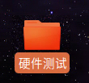
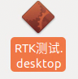
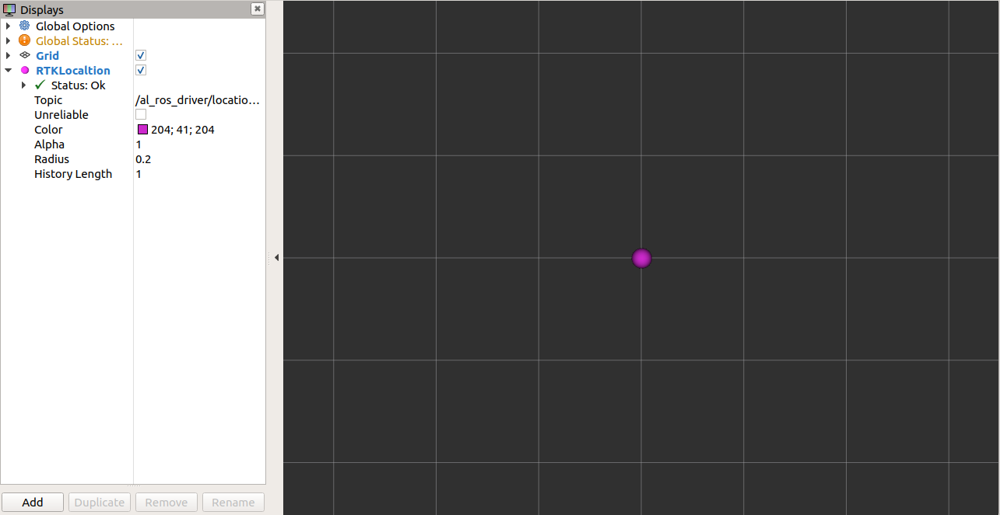
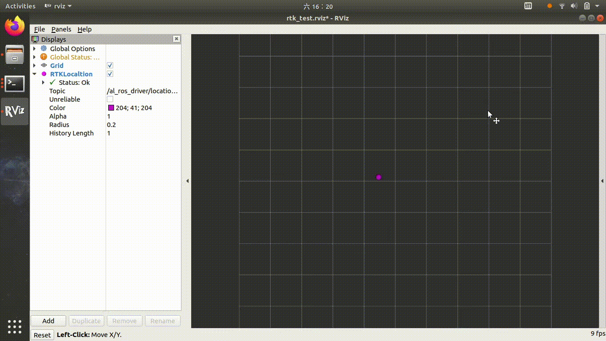
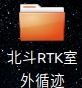
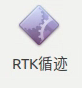

# RTK循迹模块使用说明
## 使用步骤

### 硬件测试

请点击位于桌面硬件测试文件夹内RTK测试的图标

-->

等待若干秒后 rviz将自动启动， 静待几十秒钟待RTK达到收星数量，将会在地图中心显示一紫色圆形，代表卫星接收机已经达到足够的收星数量，并成功输出了固定解位置，即实现了高精度的RTK定位。此圆形代表WGS84经纬度坐标系转化到ENU坐标系的坐标。

获得RTK高精度定位的速度取决于测试环境的情况，测试环境越开阔无遮挡获得固定位置解的速度越快，通常可在1分钟之内完成。如周围有较高建筑或者山峰则可能无法达到获得固定解位置的收星数要求，无法获得固定解的位置。

如果测试环境良好但无法出现下图的情况，请参考[故障排除](## 故障排除)章节处理。

小范围移动主天线的位置，界面紫点会同时移动，即表示工作正常，可以进行下一步RTK循线的测试。

### 录制RTK路线

请将AP1套件置于室外空阔卫星收星良好处，并确保已经正确配置nrtip 账号，具备互联网连接。在进行完RTK硬件测试，确认RTK接收机工作正常后，双击打开桌面北斗RTK室外循迹文件夹，点击运行 RTK循迹

->

等待几十秒钟，待屏幕出现紫色原点，表明RTK已经获得固定解位置，出于差分工作状态。

使用键盘上下左右按钮，遥控机器人前进约1m，使里程计与卫星定位位置融合校准。在遥控过程中可观察到机器人位置突然跳了一下，即意味已经融合校准完成。

点击录制路径按钮，同时使用键盘遥控机器人行进，将看到一条白线绘制到小车经过区域，该线即为录制的路线。

遥控完成所有路线后，点击保存路线按钮，即将路线保存到 /src/navigation/path_server/path_data/default_path.path 中。

### 沿路线自动导航

启动RTK循迹功能，完成里程计与卫星定位融合校准后，使用键盘将机器人遥控到路线起点附近，点击“开始任务"即可。在循迹过程中机器人会根据障碍物情况进行绕行，在任何时刻点击“取消任务“可终止循线。

