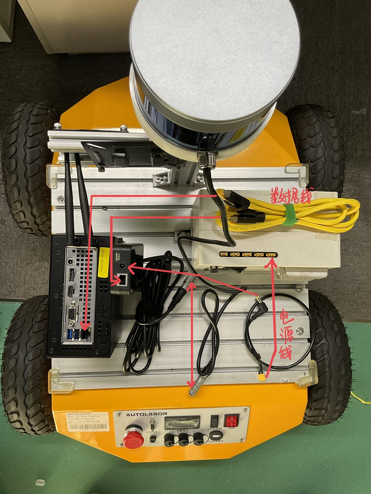
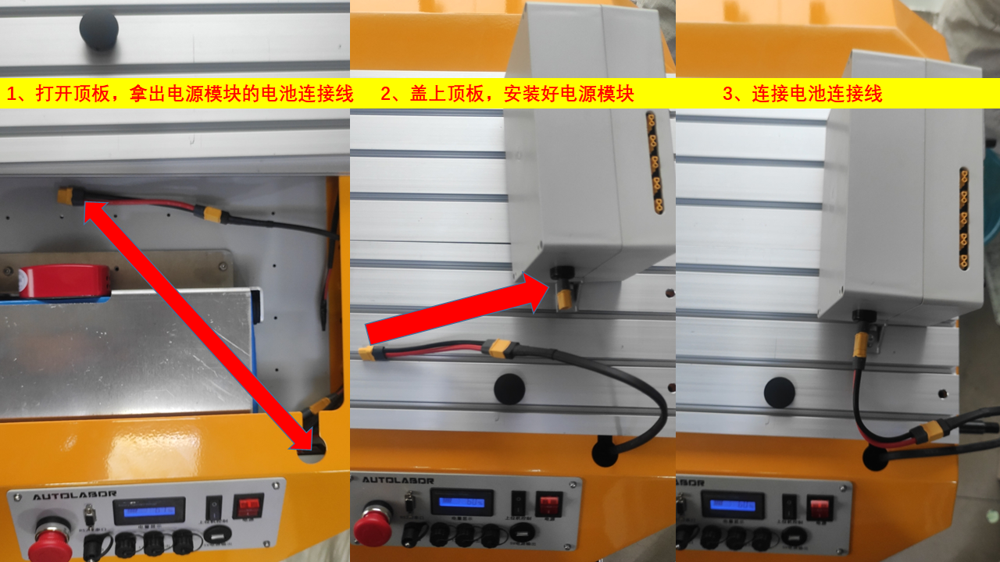
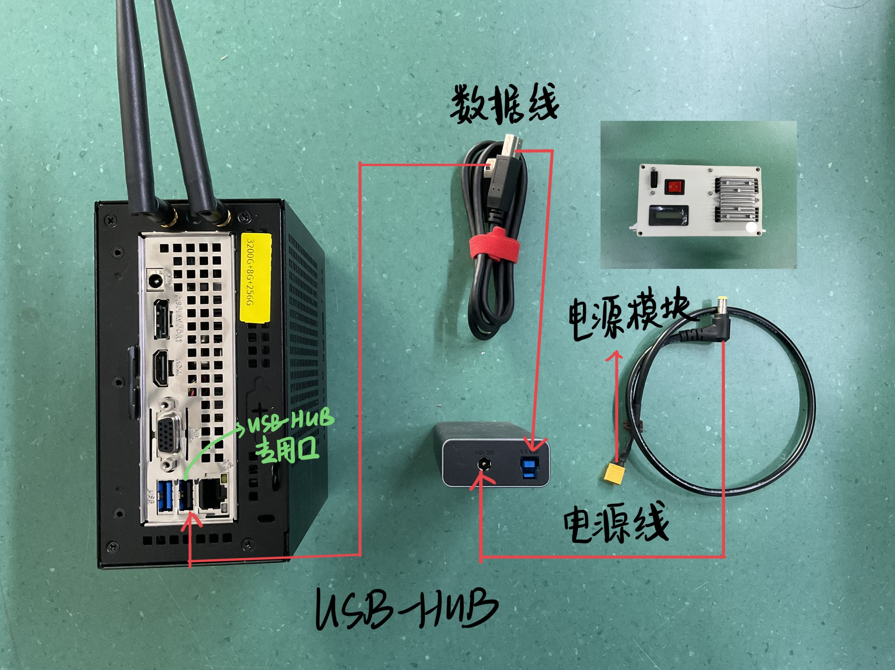
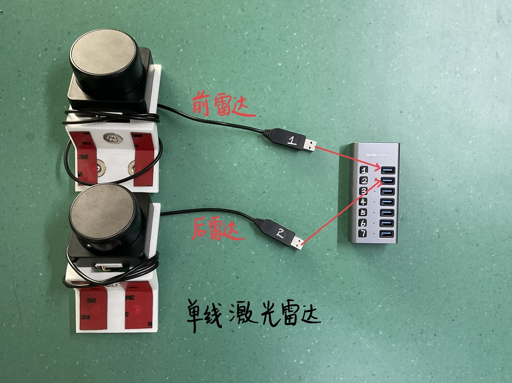
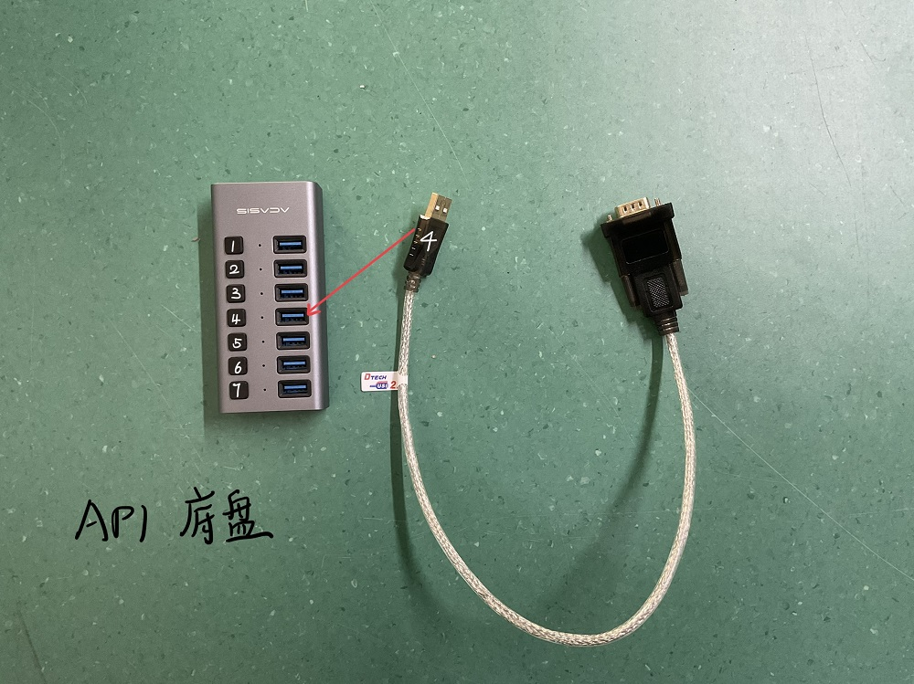
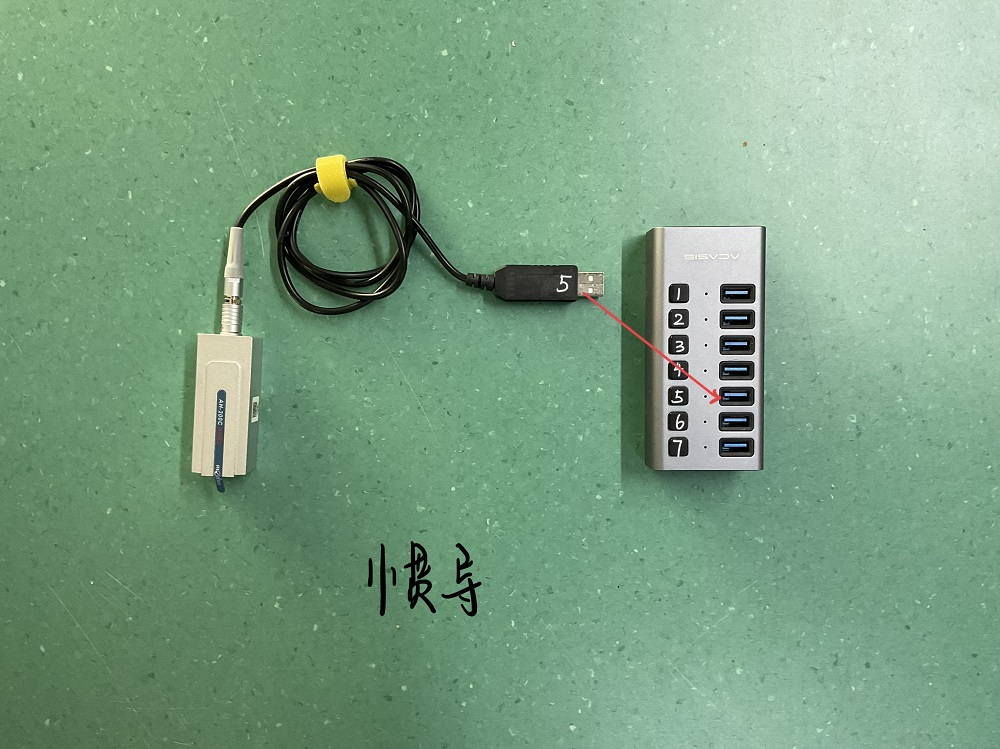
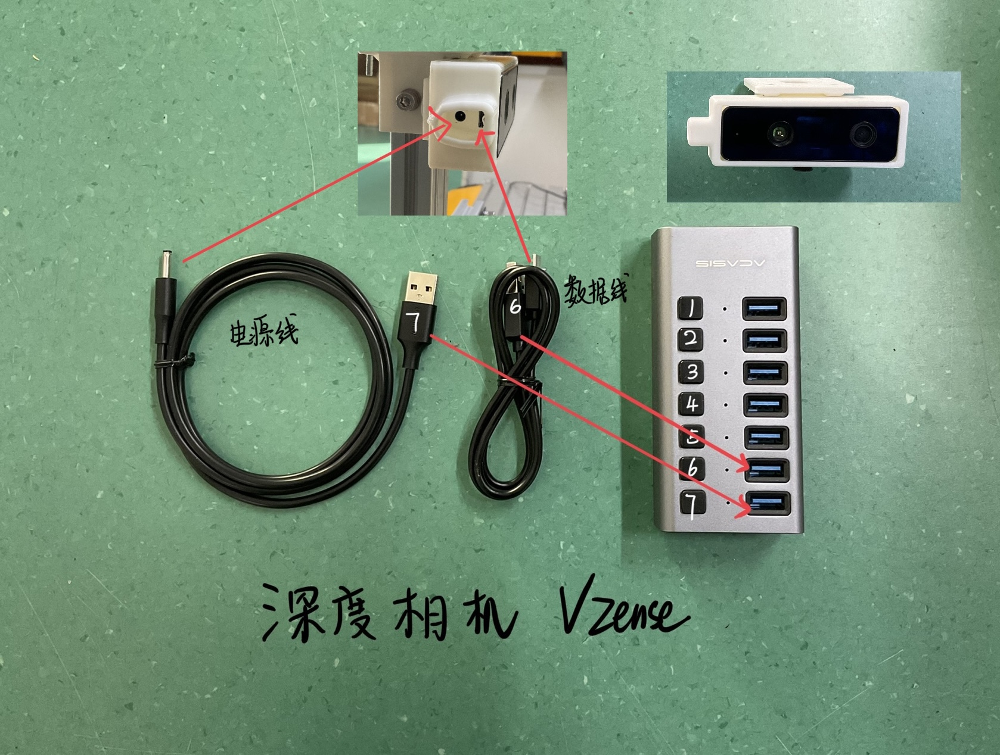

# 3D SLAM 版

## 电气拓扑结构图

## 支架

<video class="standard-video" src="http://video.autolabor.com.cn/AutolaborPro1/AP1%E5%AF%BC%E8%88%AA%E5%A5%97%E4%BB%B62021-%E6%94%AF%E6%9E%B6.mp4" width="100%" height="100%" controls="controls"></video>

## 深度相机 Vzense

<video class="standard-video" src="http://video.autolabor.com.cn/AutolaborPro1/AP1%E5%AF%BC%E8%88%AA%E5%A5%97%E4%BB%B62021-%E6%B7%B1%E5%BA%A6%E7%9B%B8%E6%9C%BAVzense.mp4" width="100%" height="100%" controls="controls"></video>

## 多线激光雷达

<video class="standard-video" src="http://video.autolabor.com.cn/AutolaborPro1/AP1%E5%AF%BC%E8%88%AA%E5%A5%97%E4%BB%B62021-%E5%A4%9A%E7%BA%BF%E6%BF%80%E5%85%89%E9%9B%B7%E8%BE%BE.mp4" width="100%" height="100%" controls="controls"></video>

## 计算机

<video class="standard-video" src="http://video.autolabor.com.cn/AutolaborPro1/AP1%E5%AF%BC%E8%88%AA%E5%A5%97%E4%BB%B62021-%E8%AE%A1%E7%AE%97%E6%9C%BA.mp4" width="100%" height="100%" controls="controls"></video>

## 显示器

<video class="standard-video" src="http://video.autolabor.com.cn/AutolaborPro1/AP1%E5%AF%BC%E8%88%AA%E5%A5%97%E4%BB%B62021-%E6%98%BE%E7%A4%BA%E5%99%A8.mp4" width="100%" height="100%" controls="controls"></video>

## 电源模块

<video class="standard-video" src="http://video.autolabor.com.cn/AutolaborPro1/AP1%E5%AF%BC%E8%88%AA%E5%A5%97%E4%BB%B62021-%E7%94%B5%E6%BA%90%E6%A8%A1%E5%9D%97.mp4" width="100%" height="100%" controls="controls"></video>

### 说明： 因产品升级，电源模块内不再含电池，安装电源模块时请注意电池连线。

## 集线盒

<video class="standard-video" src="http://video.autolabor.com.cn/AutolaborPro1/AP1%E5%AF%BC%E8%88%AA%E5%A5%97%E4%BB%B62021-%E9%9B%86%E7%BA%BF%E7%9B%92.mp4" width="100%" height="100%" controls="controls"></video>

## 单线激光雷达

<video class="standard-video" src="http://video.autolabor.com.cn/AutolaborPro1/AP1%E5%AF%BC%E8%88%AA%E5%A5%97%E4%BB%B62021-%E5%8D%95%E7%BA%BF%E6%BF%80%E5%85%89%E9%9B%B7%E8%BE%BE.mp4" width="100%" height="100%" controls="controls"></video>

## 惯导

<video class="standard-video" src="http://video.autolabor.com.cn/AutolaborPro1/AP1%E5%AF%BC%E8%88%AA%E5%A5%97%E4%BB%B62021-%E6%83%AF%E5%AF%BC.mp4" width="100%" height="100%" controls="controls"></video>

## USB-HUB

