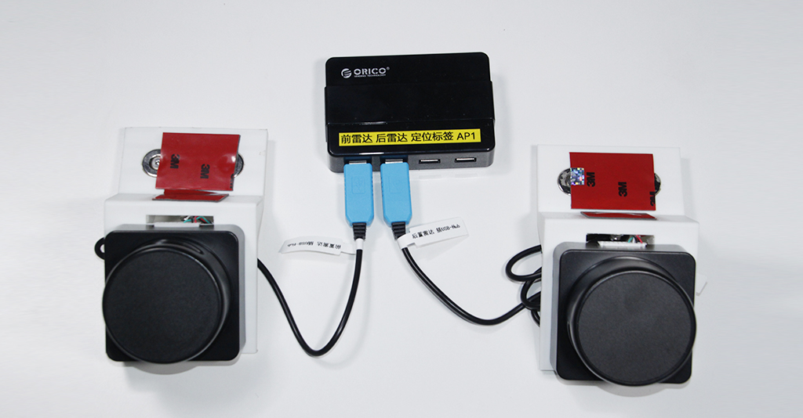
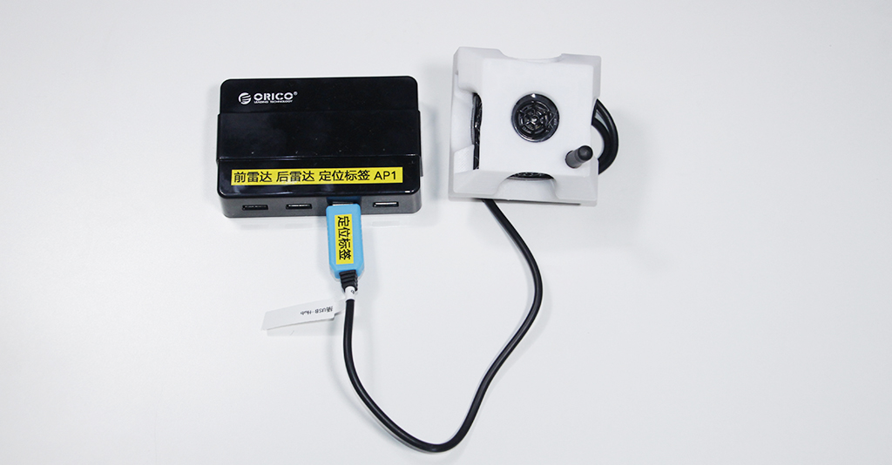

# 组装与测试

    本文将引导你安装导航套件并对各部件进行测试

## 组装

> 组装视频

<video class="standard-video" src="http://video.autolabor.com.cn/AutolaborPro1/AP1%E4%BA%8C%E4%BB%A3%E5%A5%97%E4%BB%B6%E5%AE%89%E8%A3%85%E6%95%99%E7%A8%8B.mp4" width="100%" height="100%" controls="controls"></video>

### 线材连接

* Mini 计算机

* 显示器

* 深度相机

* 激光雷达

* USB-Hub

> 注：USB-Hub数据线**必须**插到计算机上**指定插口**（如下图），否则将影响功能。

#### 定位系统

> 注：
> * 仅室外导航套件含此组件
> * 仅车载定位标签需要进行线材连接

### 电气拓扑

## 测试

我们提供了一套工具软件，并将其放置在电脑桌面的**测试**文件夹中，用户可以用来检测导航套件中各部件能否正常工作。

1. 激光雷达测试

2. 深度相机测试

3. 车载定位标签测试
