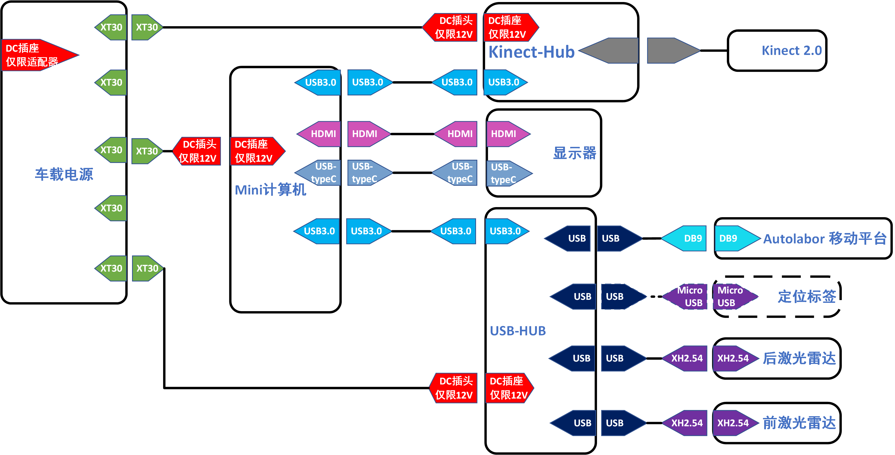

> 以下内容适用于下图挂式 Mini 计算机的导航套件。

### 组装视频

<video class="standard-video" src="http://video.autolabor.com.cn/AutolaborPro1/AP1%E5%AF%BC%E8%88%AA%E5%A5%97%E4%BB%B6%E5%8D%87%E7%BA%A7%E7%89%88%E7%BB%84%E8%A3%85%E6%95%99%E7%A8%8B.mp4" width="100%" height="100%" controls="controls"></video>

### 电气拓扑

