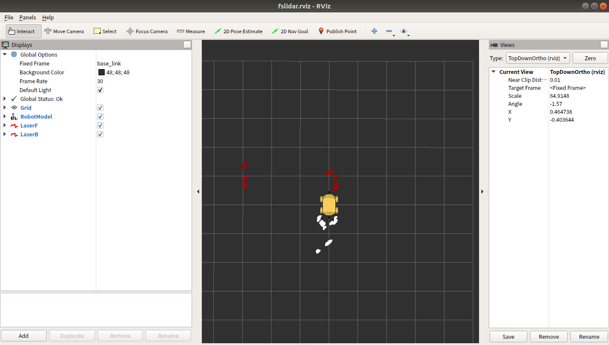

## 测试

准备工作：

1. AP1 导航机器人
2. 键盘鼠标

## 操作步骤

### 一、连接键鼠
鼠标键盘建议使用普通成套的无线键鼠，避免使用机械键盘、游戏鼠标，请不要同时使用有线、无线鼠标或键盘。

### 二、启动系统
打开电源，打开工控机，等待 Autolabor OS 系统启动，输入密码 autolabor，字母全部是小写，回车。

我们提供了一套工具软件，并将其放置在电脑桌面的**测试**文件夹中，用户可以用来检测导航套件中各部件能否正常工作。

* kinect测试
* 定位标签测试
* 激光雷达测试

注：进行定位标签测试前必须先[搭建定位系统](/usedoc/navigationKit2/version_two/location/guide/doc)。

### 常见问题

#### 激光雷达测试

测试通过：

测试未通过：

提示 “雷达连接(前)/(后)失败，请检查雷达是否连接至上位机”

1. 检查前/后雷达是否插在 USB-Hub 指定接口上
2. 检查 USB-HUB 的电源线是否插好，数据线是否插在 Mini 计算机的指定接口上
3. 检查激光雷达蓝色指示灯是否亮着，检查数据线两头是否插紧，拔插数据线，尝试恢复指示灯
4. 如一个雷达指示灯亮起，另一个雷达指示灯不亮，交换数据线，判断是否是雷达数据线故障
5. 如确认某根数据线故障，拔插该激光雷达数据线，在 terminal 中执行以下命令内容，将打出日志从后往前翻，查看是否有红色报错，将报错信息截图发送给客服

  `$ dmesg`
