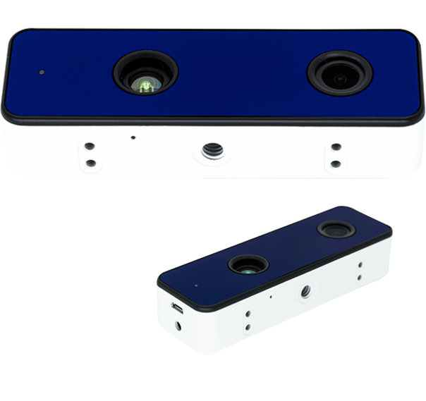
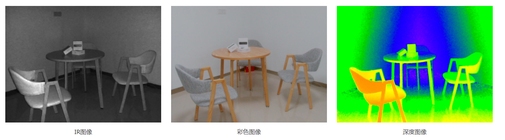
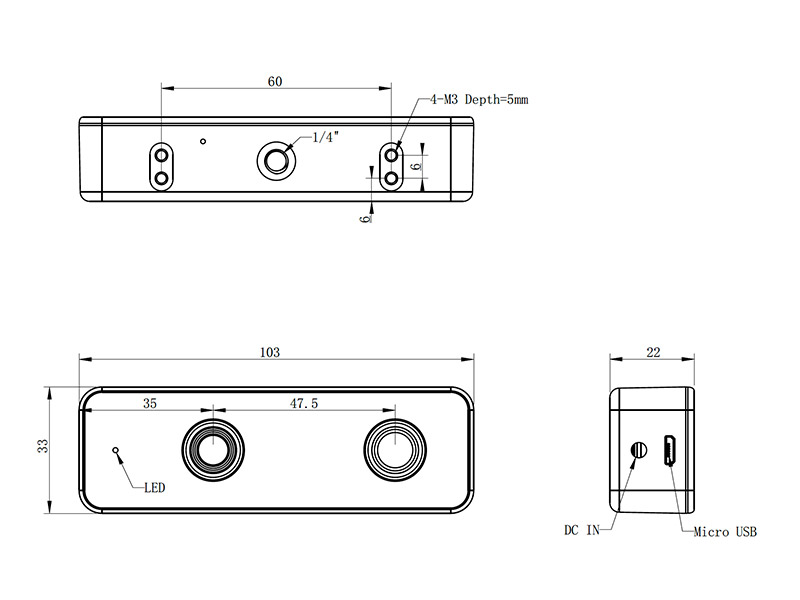

# 简介

## Vzense DCAM710

## 结构图

## 基本参数

| 项目                 | 规格            |
| ------------------- | --------------- |
|尺寸 | 103mmx33mmx22mm|
| 传感器       | ToF CCD+RGB          |
| 激光发射器   |940nm VCSEL |
| ToF分辨率帧率   | 640X480, Max.30fps| 
|RGB分辨率帧率|1920X1080, 30fps|
| ToF FOV  | 69°(H) × 51°(V)         |
| RGB FOV      | 73°(H)X42°(V)          | 
| 输出格式 | RAW12(深度,IR), MJPEG(RGB)|
|检测距离|0.35m~4.4m|
|工作温度|-10℃~50℃|
 
 

