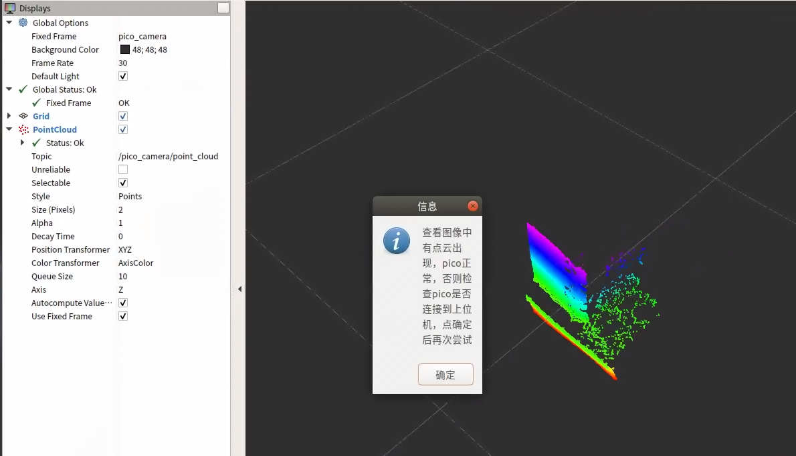
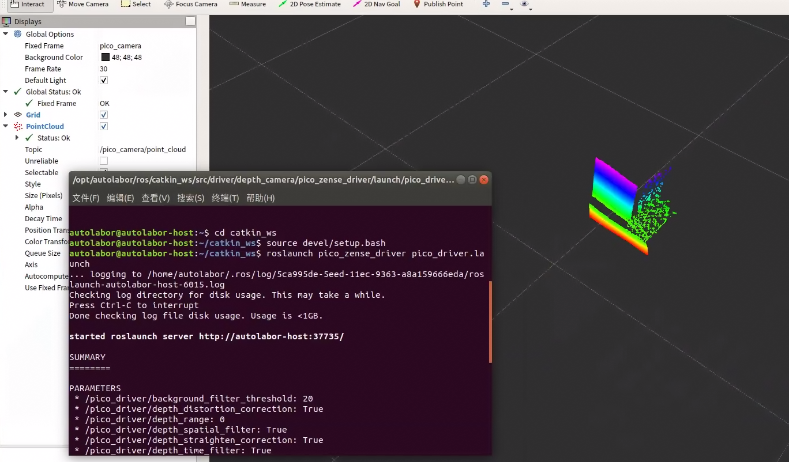
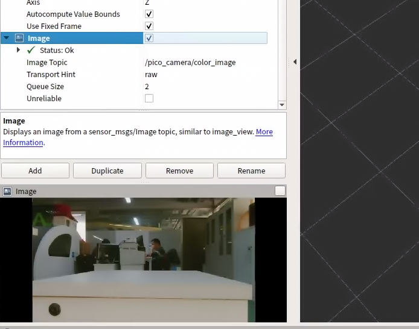

# 使用

## 准备

1. 连接相机的数据线与电源线
2. 相机亮起指示灯（绿色说明数据线连接正确，红色说明数据线与电源线均连接正确）
3. 指示灯亮起代表相机功能正常，可开始使用

## 测试

进入桌面 测试 - > pico 深度相机测试



## 启动驱动

步骤：

1.进入工作空间，打开终端执行
	`cd catkin_ws`
2.配置环境变量，在终端执行
	`source devel/setup.bash`
3.启动驱动，在终端执行
	`roslaunch pico_zense_driver pico_driver.launch`
4.打开终端，执行 `rviz` ，打开RViz，可看到相机的点云数据

注：相机数据加载需要几秒钟

## ROS驱动包(ROS Driver Package)

注：OS系统中使用的Vzense相机ROS驱动包是Autolabor根据相机厂家提供的SDK开发的，非相机厂家提供。

	
### 发布的话题
/pico\_camera/depth\_image ([sensor_msgs/Image](http://docs.ros.org/en/api/sensor_msgs/html/msg/Image.html)) 
深度图像 

/pico\_camera/color\_image([sensor_msgs/Image](http://docs.ros.org/en/api/sensor_msgs/html/msg/Image.html))  
rgb图像

/pico\_camera/point\_cloud([sensor_msgs/PointCloud](http://docs.ros.org/en/api/sensor_msgs/html/msg/PointCloud.html))  
点云
  


### 参数

| 参数  | 名称  | 备注  |
| :------------ | :------------ | :------------ |
| ~namespace (str, default: pico_camera)  | 命名空间  | 多个同一传感器重命名  |
| ~frame_name (str, default: pico_camera)  | frameId  |   |
| ~device_index (int, default: 0)  | 设备索引  |   |
| ~read_frame_interval (int, default: 100)  |  输出时间间隔 | 单位：毫秒  |
| ~depth_range (int, default: 0)  | 深度范围(参数：0/2/5)  | 设置值越大看的越远  |
| ~background_filter_threshold (int, default: 20)  |  滤波参数(最大100) | 设置值越大，去的点越多（噪音和非噪音都会被去掉）  |
| ~skip_row (int, default: 0)  |  每一行中跳过显示的点 | 如设置为1，则跳1个点选1个点显示，一行最多640个点  |
| ~skip_column (int, default: 0)  | 每一列中跳过显示的点  |  如设置为1，则跳1个点选1个点显示，一列最多480个点 |
| ~output_depth_image (bool, default: false)  |  输出深度图像 |  节约性能，默认不输出 |
| ~output_color_image (bool, default: false)  | 输出rgb图像  |  节约性能，默认不输出 |
| ~output_point_cloud (bool, default: true)  |  输出点云 |   |
| ~depth_spatial_filter (bool, default: true)  | 是否使用空间滤波  |   |
| ~depth_time_filter (bool, default: true)  |  是否使用时间滤波 |   |
| ~depth_distortion_correction (bool, default: true)  |  是否使用畸变矫正 |   |
| ~depth_straighten_correction (bool, default: true)  |  是否使用扭曲矫正 |   |

### 驱动示例
	
	
```
<launch>
  <node name="pico_driver" pkg="pico_zense_driver" type="pico_zense_driver">
      <param name="namespace" value="pico_camera"/>
      <param name="frame_name" value="pico_camera"/>
      <param name="device_index" value="0"/>
      <param name="read_frame_interval" value="100"/>
      <param name="depth_range" value="0"/>
      <param name="background_filter_threshold" value="20"/>
      <param name="skip_row" value="2"/>
      <param name="skip_column" value="2"/>
      <param name="output_depth_image" value="false"/>
      <param name="output_color_image" value="false"/>
      <param name="output_point_cloud" value="true"/>
      <param name="depth_spatial_filter" value="true"/>
      <param name="depth_time_filter" value="true"/>
      <param name="depth_distortion_correction" value="true"/>
      <param name="depth_straighten_correction" value="true"/>
  </node>

  <node name="rviz" pkg="rviz" type="rviz" args="-d $(find pico_zense_driver)/rviz/display.rviz"/>
</launch>
```

## 查看rbg图像

1.找到相机驱动launch文件，修改参数

`catkin_ws\src\driver\depth_camera\pico_zense_driver\launch\pico_driver.launch`

2.选择文件右键编辑，将 `output_color_image` 改为 `true`

3.保存并关闭文件

4.进入工作空间，打开终端执行
  `cd catkin_ws`

5.配置环境变量，在终端执行
  `source devel/setup.bash`

6.启动驱动，在终端执行
  `roslaunch pico_zense_driver pico_driver.launch`

7.打开终端，执行 `rviz` ，打开RViz 


8.添加图像话题，点击左下角 `add`，选择 /pico_camera->color_image ，保存



## 资料

* [使用手册](https://cdn.yun.sooce.cn/4/62267/pdf/16361729745086d56be7b53bba3eb.pdf)
* 软件工具及SDK：[github](https://github.com/Vzense)/[gitee](https://gitee.com/Vzense)
* [固件](https://github.com/Vzense/DeviceFirmware-List/tree/master/DCAM710)
* [3D 模型](https://cdn.yun.sooce.cn/4/62267/zip/1636172974507357d659567a57bad.zip)
* [官方下载](https://zh.vzense.com/download.html)/[FAQ](https://zh.vzense.com/FAQ.html)