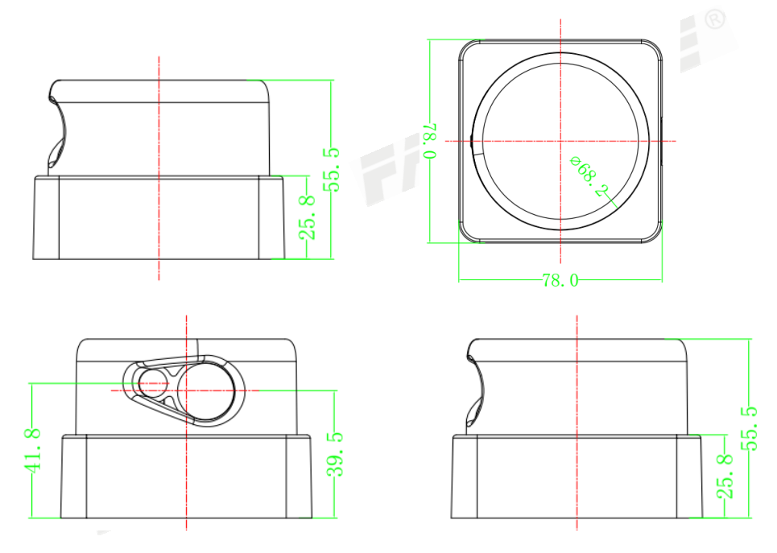
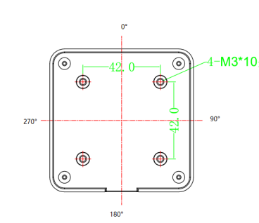

# 简介

## FS-D10

## 结构图

## 基本参数

|项目|指标|
|:----|:----|
|测量距离¹|0.15～10m，6m@10%|
|重复精度²|±3cm@10m@10Hz|
|扫描角度|360°|
|扫描频率³|10Hz|
|测量频率|142800 次/秒|
|输出接口|TTL|
|最小距离分辨率|1cm|
|光源|激光二极管 905nm，≤1mW； 符合 GB7247.1-2001 I 类激光人眼安全要求|
|供电|DC5V±10%，＜3W；启动电流>1.5A|
|体积|78×7 8×56mm|
|操作温度范围|－10℃～＋50℃|
|存储温度范围|－20℃～＋70℃|
|防护等级|IP54|
|重量|190g|
|使用寿命|标准条件下 5 万小时|
注：
1. 指在 6m 处可以测到仅 10%反射率的物体（深黑），最远量程 10 米（柯达白）；
2. ±3cm@10m@10Hz 是指在 10m 处扫描频率 10Hz 情况下的扫描测量精度；
3. 额定转速为每秒钟 10 圈；

