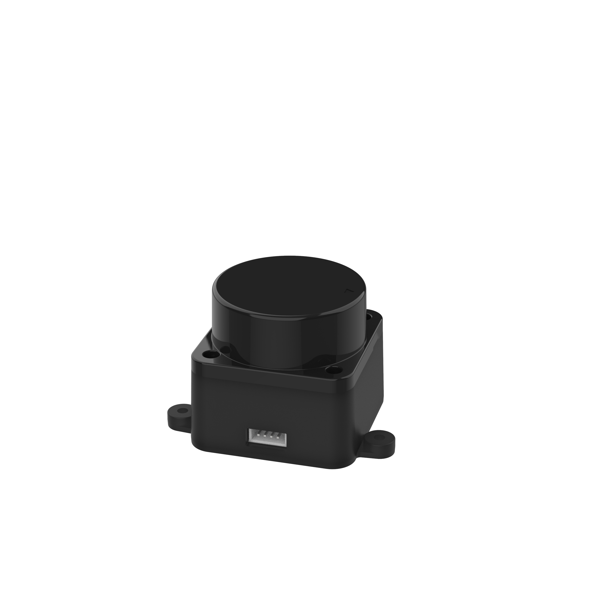
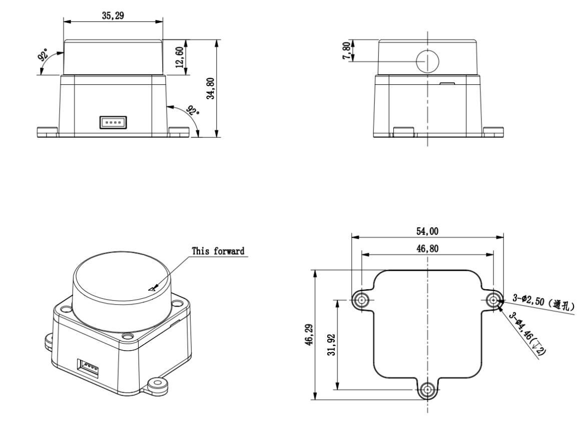

# 简介

## LD19

## 结构图

## 电气与机械参数
|参数名称|单位|最小值 | 典型值 | 最大值 | 备注 | 
|:----|:----|:----|:----|:----|:----|
|输入电压|V|4.5V | 5V | 5.5V |   | 
|PWM 控制频率|KHz|20 | 30 | 50 | 方波信号 | 
|PWM 高电平|V|3.0 | 3.3 | 5.0 |   | 
|PWM  低电平|V|-0.3 | 0 | 0.5 |   | 
|PWM  占空比 |%| 0 | 40 | 100 | 40%  占空比扫描频率为 10Hz | 
|启动电流|mA|- | 300 | - |   | 
|工作电流|mA|- | 180 | - |   | 
|整机尺寸|mm| - |  54x46.29x34.8 (长宽高) | -  |   | 
|整机重量|g|- | 47 | - | 不含连接线 | 
|通讯接口|-|-| UART @ 230400 |- |   |
|UART  高电平|V|2.9 | 3.3 | 3.5 |   | 
|UART  低电平|V|-0.3 | 0 | 0.4 |   | 
|驱动电机|-|BLDC | - | - | 无刷电机 | 
|工作温度|℃|-10 | 25 | 40 |   | 
|存储温度|℃|-30 | 25 | 70 |   | 

## 光学参数
|参数名称|单位 | 最小值 | 典型值 | 最大值 | 备注|
|:----|:----|:----|:----|:----|:----|
|激光波长|nm | 895 | 905 | 915 | 红外波段|
|激光功率|W | - | 25 | - | 激光二极管峰值功率,实际使用功率远低于此值|
|激光脉宽|ns | - | 1 | - |  |
|激光安全等级|- | - |  IEC-60825 Class 1 | - |  |
|俯仰角|° | 0 | 0.5 | 2 |  |

## 性能参数
|参数名称 |单位 | 最小值 | 典型值 | 最大值 | 备注|
|:----|:----|:----|:----|:----|:----|
|测距范围 |  m | 0.02 | - | 12 | 70%目标反射率|
|扫描频率 |  Hz | 5 |  10 | 13 | 外部提供PWM 控速|
|测距频率 |  Hz | - |  4500 | - | 固定频率|
|测距精度 |  mm | - |  - | - | 测距小于  0.3m  时，有数据输出。测距数据变化趋势与实际距离变化趋势一致|
|测距精度  |  m | -45 |  - | 45 | 测距范围在300mm  到  12000mm时，测量  100  次的平均值(70    漫反射面)|
|测距标准差 |  mm | - |  10 | - | 测距范围在  300mm  到  12000mm  时|
|测量分辨率 |  mm | - |  15 | - |  |
|角度误差 |  ° | - | - | 2 |  |
|角度分辨率 |  ° | - |  1 | - |  |
|抗环境光 |  KLux | - |  - | 30 |  |
|整机寿命 |  h | 10000 |  - | - |  |
