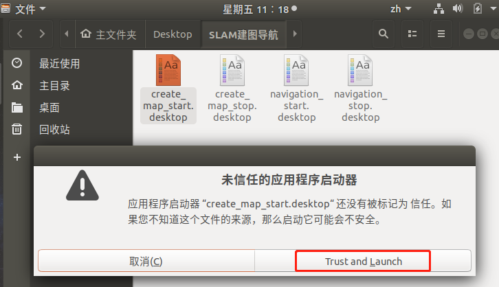
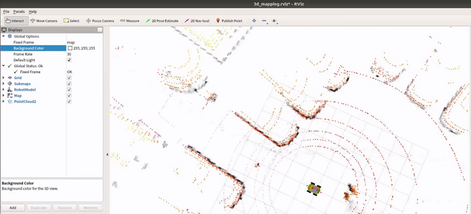
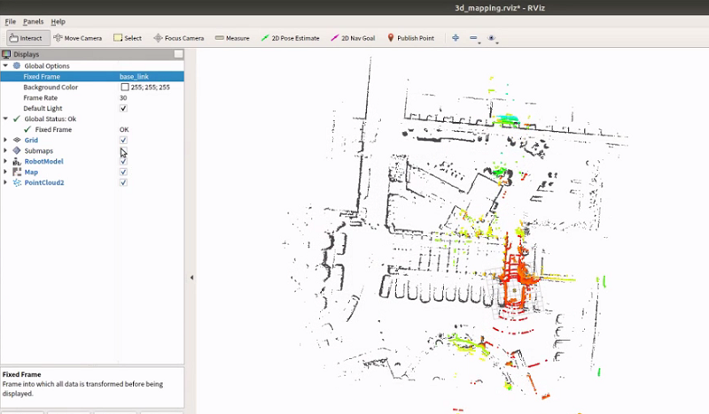
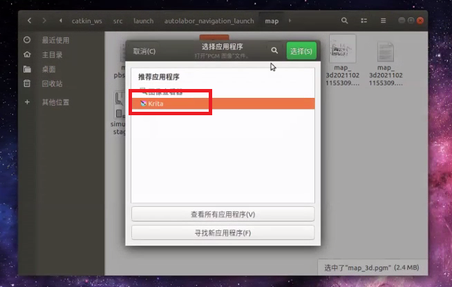
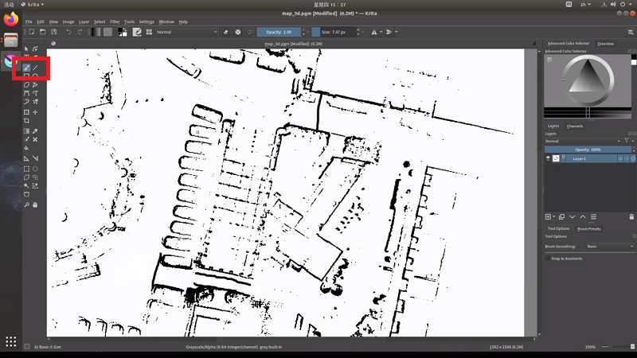
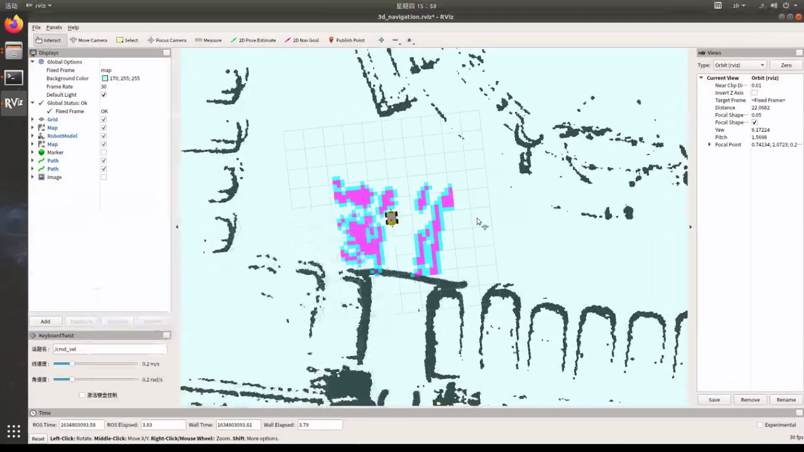
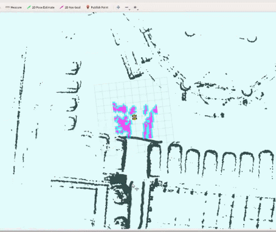

# 建图导航

## 适用系统版本

AutolaborOS-2.2.3及以上

OS系统->设置->详细信息可查看系统版本号，如无版本号则为2.2.1以下版本。

准备工作：
1. AP1 导航机器人
2. 键盘鼠标

## 操作步骤

### 一、连接键鼠
鼠标键盘建议使用普通成套的无线键鼠，避免使用机械键盘、游戏鼠标，请不要同时使用有线、无线鼠标或键盘。

### 二、启动系统
打开电源，打开工控机，等待 Autolabor OS 系统启动，输入密码 autolabor，字母全部是小写，回车。

### 三、建图导航

#### 准备工作：
1. 将 AP1 控制模式切换到上位机控制，右转打开急停开关，确保急停开关没有被按下
2. 禁用工控机无线功能
  在建图过程中，如果工控机连接了无线网络，当AP1走出无线网络的覆盖区域后，网络连接会自动断开，这将导致AP1控制失控，所以在开始建图之前，为了避免失控，需要将工控机的无线网络连接关闭。
3. 进入桌面 SLAM建图导航 - > 3d 文件夹，首次使用时文件如下图，双击打开后点击 trust and launch，程序第一次打开后会重命名。

    

    

#### 1. 点击【开始建图】

RVIZ工具打开，能够看到地图中的 AP1。

使用键盘的上下左右控制 AP1 行走，边走边建图，可以看到环境地图随着 AP1 的行走不断被构建更新。

地图中，黑色是障碍物，白色是可行走区域，彩色的激光点是激光雷达实时数据，颜色从白至黑为障碍物的几率是0%~100%。

##### 键盘控制说明

键盘控制功能在系统中已经安装好，无需安装可直接使用。

有2种键盘控制的方式：

一、直接在电脑上插上键鼠，直接控制机器人（默认模式）

数字键【1/2】线速度增加/减少，数字键【3/4】角速度增加/减少，数字键【9】启用，数字键【0】禁用。

二、使用键盘插件，用另一台电脑远程控制机器人

如使用该插件，则需将机器人上的键鼠拔掉，否则远程给出的速度指令会被机器人上的键鼠指令覆盖，如插上了不使用键鼠控制，程序默认向底盘发送速度指令为0，机器人会停止不动。

如想远程操控机器人，请查看[这里](/usedoc/navigationKit2/version_two/network/setting)。

#### 2. 建图完毕，点击【保存并停止建图】

最终建图结果示意：

#### 3. 修地图

注：此步骤非必须操作，如建图结果与真实环境基本一致，可跳至下一步。

建图完成后，对照真实的建图环境，对地图进行修改，涂抹掉临时障碍物，增加真实环境中实际存在的障碍物，也可以自定义机器人的行走区域。

为避免修改错误无法返回，建议在修改前对要文件做一个备份。

右键点击map_3d.pgm，选择Krita软件打开，选择画笔工具，白色涂掉障碍物，黑色新增障碍物。

地图修改完毕后，保存关闭。

#### 4. 点击【开始导航】
RVIZ工具打开，建好的地图会自动加载。

##### 初始化定位

导航之前，要对机器人做初始化定位，设置方式有两种：

一、使用键盘控制机器人走到初始建图位置，注意车头、车尾方向与之前基本保持一致；

二、使用2D Pose Estimate，点击 2D Pose Estimate（2D nav goal左边），根据机器人现在的所在位置，对比地图，找到机器人在地图中大概的位置，根据真实车头的朝向，方向指向车头朝向的方向，拉动鼠标。

设置后控制机器人行走一段距离，当激光雷达的数据与实时的环境匹配成功时，即为机器人找到在地图中的初始定位。

如上图所示，进行初始化定位操作后，机器人突然跳到了一个新地点，并且地图中的地点与真实环境中机器人位置一致，即为初始化成功，可进行下一步操作。

##### 关闭键盘控制

<b style="color:red;">点击数字键【0】关闭键盘控制功能</b>（非小键盘0），或取消键盘插件的【激活键盘控制】，关闭后控制方式将切换至导航程序，如不切换机器人接收到目标点命令后将不会自动导航行走。

##### 给定目标点

点击 2D Nav Goal，指定目标位置，拉动鼠标，箭头方向是最终车辆运行至目标的车头朝向，鼠标松开，这样就完成了目标点的指定。

目标点给定后在地图中我们能看到一条线，这是规划好的路径。根据这个规划好的路径，AP1 向目标点行走。

当AP1已经到达目标点后，再一次使 2D Nav Goal 设置目标位置，AP1将去到下一个目标点。

### 四、点击【终止导航】，停止导航功能，导航结束。

之后在同一环境中需要再次使用导航功能时，无须重复建图，点击【开始导航】即可。

[>>常见问题](/usedoc/navigationKit2/common/q_a/doc2)

## 附录 - 软件功能图

