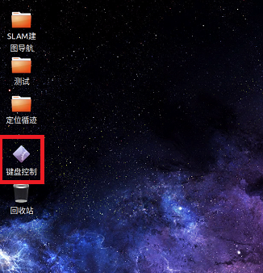
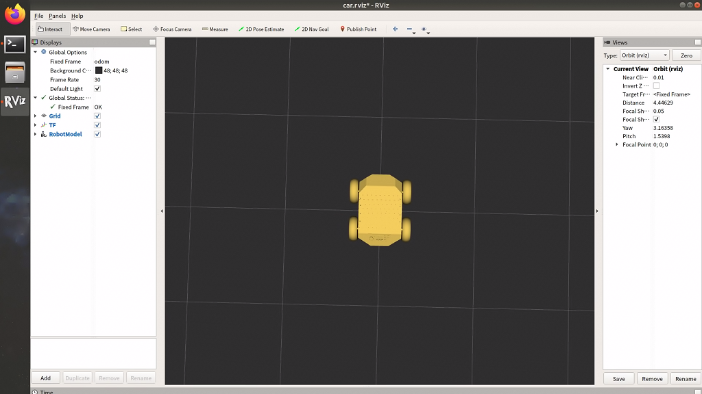

# 键盘控制

准备工作：

1. AP1 导航机器人
2. 键盘鼠标

## 操作步骤

### 一、连接键鼠
鼠标键盘建议使用普通成套的无线键鼠，避免使用机械键盘、游戏鼠标，请不要同时使用有线、无线鼠标或键盘。

### 二、启动系统
打开电源，打开工控机，等待 Autolabor OS 系统启动，输入密码 autolabor，字母全部是小写，回车。

### 三、建图导航

#### 准备工作：
1. 将 AP1 控制模式切换到上位机控制，打开红色急停开关，确认是弹起非按下状态
2. 禁用工控机无线功能
  在建图过程中，如果工控机连接了无线网络，当AP1走出无线网络的覆盖区域后，网络连接会自动断开，这将导致AP1控制失控，所以在开始建图之前，为了避免失控，需要将工控机的无线网络连接关闭。
3. 进入到系统后，可以在桌面上看到【键盘控制】这个图标

#### 1. 点击【键盘控制】

程序启动，可以看到 RVIZ 中有黄色的AP1车，使用键盘上下左右，车开始行走。

