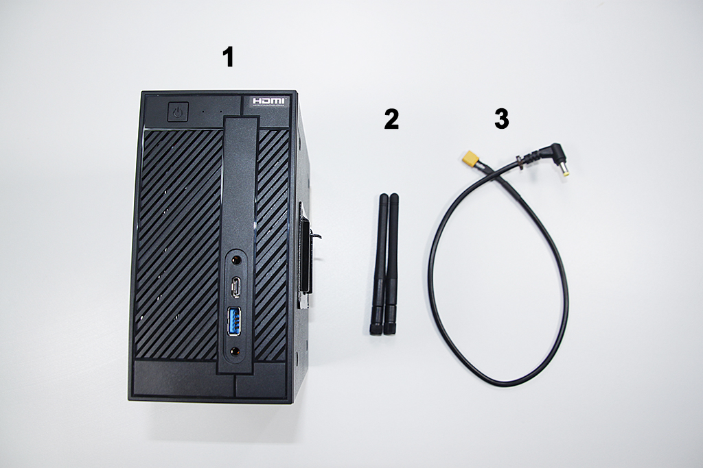
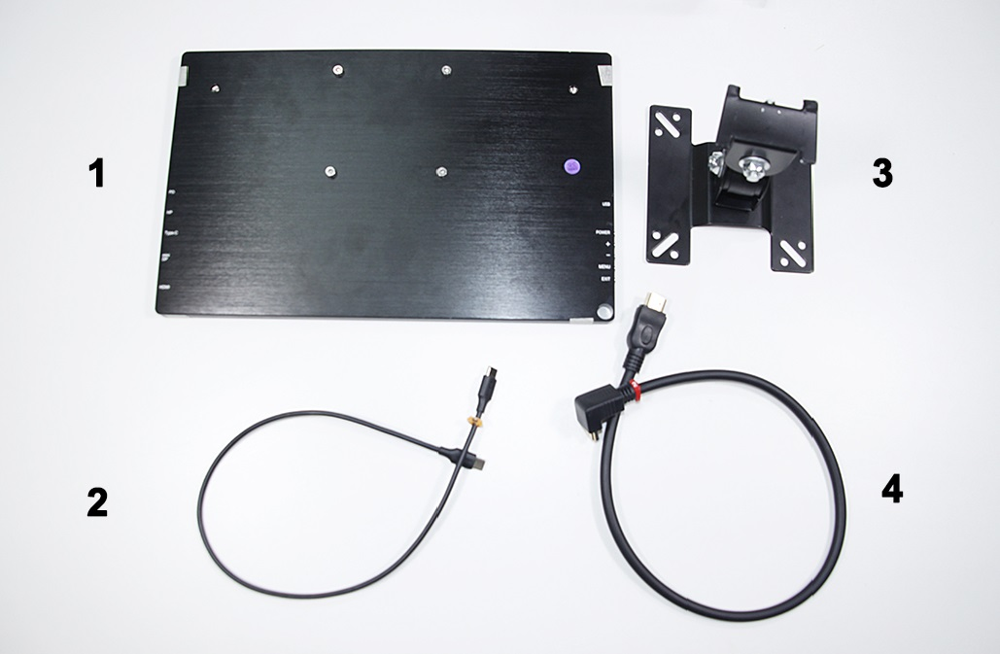
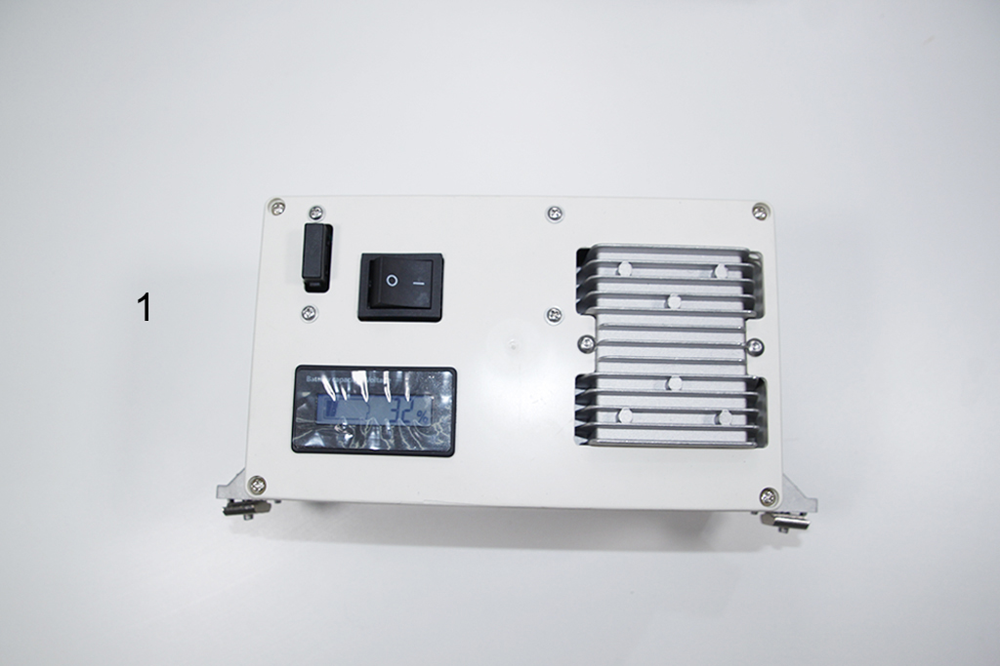
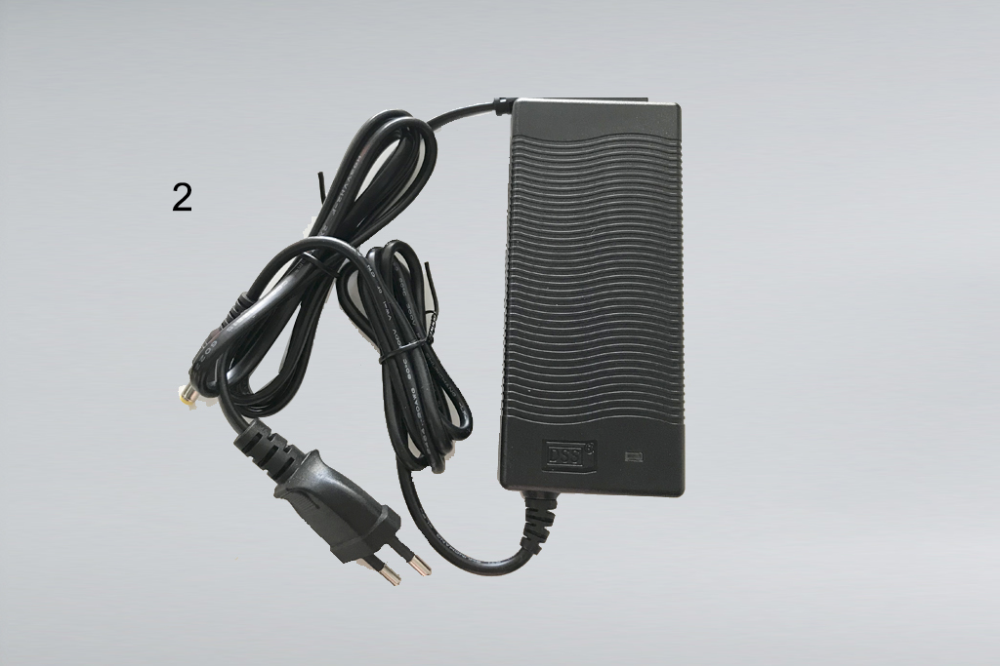
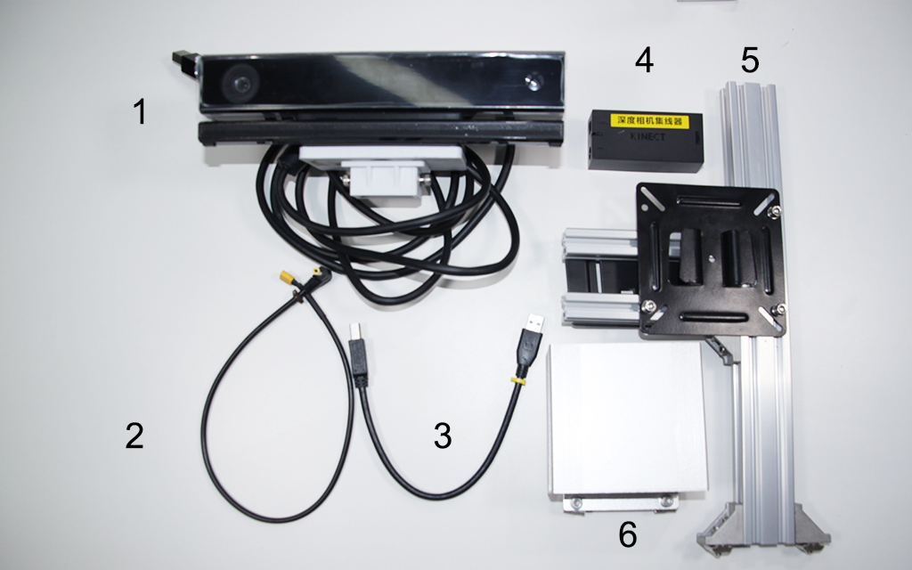
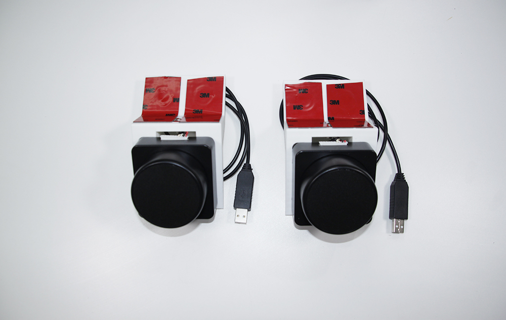
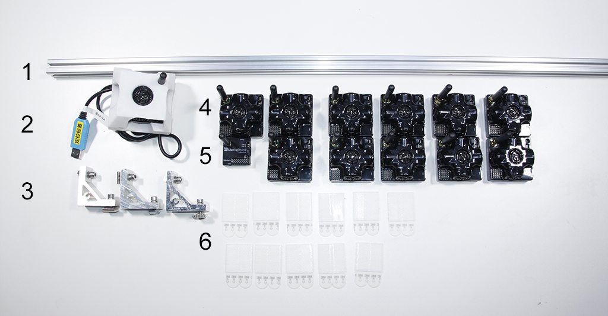

> 以下内容适用于下图台式 Mini 计算机的导航套件。

## Mini 计算机

| 序号 | 名称         | 数量 |
| ---- | ------------ | ---- |
| 1 | Autolabor PC | 1    |
| 2 | 天线         | 1    |
| 3 | 电源线 | 1    |

## 显示器

| 序号 |  名称           | 数量 |
| ---- | -------------- | ---- |
| 1 | 显示器         | 1    |
| 2 | 电源线 | 1    |
| 3 | 360°显示器支架   | 1    |
| 4 | 显示器视频线 | 1    |

## 电源模块

| 序号 | 名称       | 数量 |
| ---- | ---------- | ---- |
| 1    | 电源模块       | 1    |
| 2    | 电源模块充电器 | 1    |

## 深度相机

| 序号 | 名称       | 数量 |
| ---- | ---------- | ---- |
| 1    | 相机       | 1    |
| 2    | 电源线 | 1    |
| 3    | 相机数据线 | 1    |
| 4    | 相机集线器 | 1    |
| 5    | 相机支架   | 1    |
| 6    | 相机集线盒 | 1    |

## 激光雷达

| 名称     | 数量 |
| -------- | ---- |
| 激光雷达 | 2   |

## USB-Hub

| 序号 | 名称 | 数量 |
| ---- | ---- | ---- |
|  1 |USB Hub          | 1    |
|  2 |电源线            | 1    |
|  3 |USB-Hub数据线          | 1    |

## 定位系统

注：仅高配版含此组件

| 序号 | 名称 | 数量 |
| ---- |---- | ---- |
|  1 |车载定位标签支架        | 1    |
|  2 |车载定位标签组件        | 1    |
|  3 |车载定位标签支架角码    | 3    |
|  4 |定位标签                | 11   |
|  5 |定位路由               | 1   |
|  6 | 定位标签胶条                | 11    |

## 其他

| 序号 | 名称                    | 数量 |
| ---- | ----------------------- | ---- |
| 1    | Autolabor OS系统安装U盘 | 1    |
| 2    | 内六角扳手              | 2    |
| 3    | M5x16螺钉               | 2    |
| 4    | 2020角码                | 2    |
| 5    | M5大滑块                | 2    |
| 6    | M5小滑块                | 2    |
| 7    | M5x12螺钉               | 2    |
| 8    | 十字改锥                | 1    |

