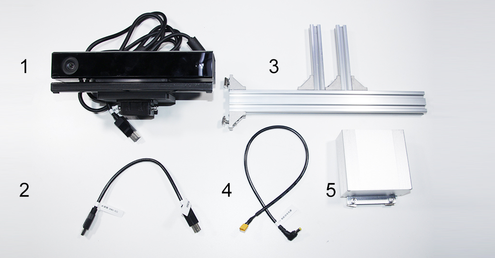

# 收货指南

## 检查

收到货后请不要急于签收，先检查外包装有无破损，如包装破损或贴于外包装上的防震标签感应器显示为红色，请拍照为证，并与快递员一同开箱验货，待确认无误后再签收，如需帮助可联系 Autolabor 客户服务平台。

# 清点

收件后打开包装，对照产品装箱单进行清点，如有短缺请于<u>三日内</u>联系客服，<u>过期不补</u>。

## Mini 计算机

| 序号 | 名称         | 数量 |
| ---- | ------------ | ---- |
| 1 | Autolabor PC | 1    |
| 2 | 天线         | 1    |
| 3 | 计算机电源线 | 1    |

## 显示器

| 序号 |  名称           | 数量 |
| ---- | -------------- | ---- |
| 1 | 显示器         | 1    |
| 2 | 显示器视频线 | 1    |
| 3 | 360°显示器支架   | 1    |
| 4 | 显示器电源线   | 1    |

## 电源模块

注：深度相机集线器位于电量显示模块的背面，深度相机供电、数据传输使用。

| 名称           | 数量 |
| -------------- | ---- |
| 电源模块/深度相机集线器 | 1    |

## 深度相机

| 序号 | 名称           | 数量 |
| ---- | -------------- | ---- |
|  1 |相机                    | 1    |
|  2 |相机数据线                 | 1    |
|  3 |相机支架        | 1    |
|  4 |相机电源线             | 1    |
|  5 |相机集线盒                | 1    |

## 激光雷达

| 序号 | 名称           | 数量 |
| ---- |-------------- | ---- |
|  1 |激光雷达数据线         | 2    |
|  2 |激光雷达组件           | 2    |

## USB-Hub

| 序号 | 名称 | 数量 |
| ---- | ---- | ---- |
|  1 |USB Hub          | 1    |
|  2 |USB-Hub电源线            | 1    |
|  3 |USB-Hub数据线          | 1    |

## 定位系统

注：仅室外导航套件含此组件

| 序号 | 名称 | 数量 |
| ---- |---- | ---- |
|  1 |车载定位标签支架        | 1    |
|  2 |车载定位标签组件        | 1    |
|  3 |车载定位标签支架角码    | 3    |
|  4 |定位标签                | 11   |
|  5 |定位路由               | 1   |
|  6 | 定位标签胶条                | 11    |

## 其他

| 序号 | 名称 | 数量 |
| ---- |---- | ---- |
|  1 |Autolabor OS系统安装U盘 | 1    |
|  2 |内六角扳手                |  2   |
|  3 | M5x16螺钉            | 2    |
|  4 |2020角码                | 2    |
|  5 |M5大滑块                | 2    |
|  6 |M5小滑块                | 2    |
|  7 |M5x12螺钉               | 2    |
|  8 | 十字改锥               | 1    |

温馨提示：
* 为保障产品售后运输途中的安全，请用户保留原厂外包装箱。
* 收货方收到货物后请进行清点，如有短缺请于三日内联系，过期不补。
* 部分配件可能随版本升级有所改动，但不影响性能，恕不另行通知。
