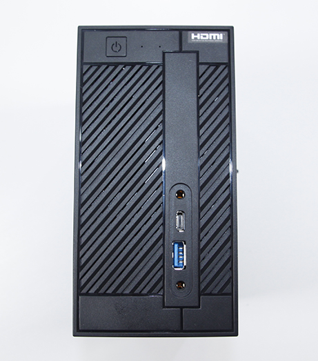
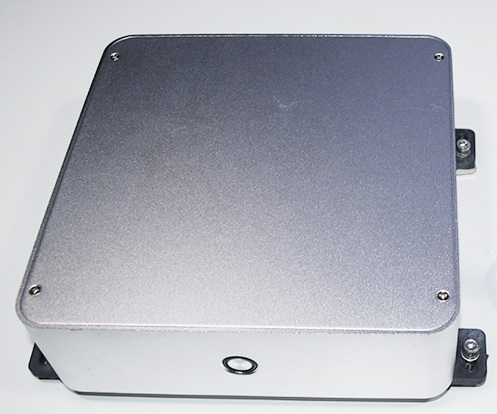

# 收货指南

## 检查

收到货后请不要急于签收，先检查外包装<b style="color:red;">有无破损</b>，如包装破损或贴于外包装上的防震标签感应器显示为红色，请拍照为证，并与快递员一同开箱验货，<b style="color:red;">确认无误</b>后再签收，如需帮助可联系 Autolabor 客户服务平台。

# 清点

温馨提示：

* 收件后打开包装，对照产品装箱单进行清点，如有短缺请于<u>三日内</u>联系客服，<u>过期不补</u>。
* <b style="color:red;">请保留原厂外包装箱用于售后</b>。
* 部分配件可能随版本升级有所改动，但不影响性能，恕不另行通知。

***

## 选择对应的产品类型

<table>
  <tr>
    <td>挂式 Mini 计算机</td>
    <td>台式 Mini 计算机</td>
  </tr>
  <tr>
    <td></td>
    <td></td>
  </tr>
</table>
