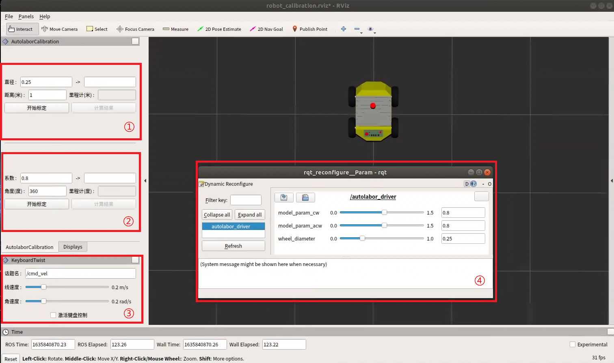

# 里程计标定

本教程适用于 AutolaborOS2.2.3及以上版本，非该版本或未使用AutolaborOS的用户可查看[这里](/usedoc/ap1/odomCalibration)。

OS系统->设置->详细信息可查看系统版本号，如无版本号则为2.2.1以下版本。


***

里程计标定也叫里程计校准，即在当前运行环境下重新计算运动模型，得到里程计的运动模型参数，此教程**只适用于使用ROS控制AP1机器人**的用户。

Autolabor Pro1 出厂时已做过标定了，在一般运行环境下（地毯、水泥、普通瓷砖等平坦路面）不用重新做标定，但如果您的运行环境是非一般环境，机器人可能就需要重新做标定，比如【经过打磨过的】并且还有【镜面效果】的水泥路面，或摩擦力较大路面，如果您觉得建图导航时效果不佳，也可以进行标定。

准备工作：
* 给AP1车轮打满气，规格：胎压250kpa/36psi/2.5bar
* 上位机 （AutolaborOS2.2.3+)


## 操作步骤 

### 一、简介

#### 1. 打开软件

进入 AutolaborOS -> 桌面 -> 测试 -> 标定



#### 2. 功能区介绍


①：车轮半径标定

②：转向运动系数标定

③：键盘控制

④：标定预览

wheel_diameter：车轮半径

model_param_cw：顺时针旋转运动模型参数

model_param_acw：逆时针旋转运动模型参数

标定文件中的底盘参数，数值更改后程序立即更新（暂存在内存，无法存储至实体文件中）。

### 二、使用

#### （一）车轮标定


操作步骤：

1. 在机器人【前轮】处标记此时车的位置为A
2. 点击【开始标定】
3. 点击【激活键盘控制】，控制机器人向前【直行】约2米，此时机器人位置为B，取消勾选【激活键盘控制】
4. 使用尺子量从A前轮至B前轮的距离S
5. 将S填写到①中距离(米)框里，点【计算结果】，得到计算后的车轮直径d'
6. 将d'填入到④中wheel_diameter处


#### (二) 运动转向模型标定

操作步骤：

1. 对机器人的四个轮子做标记，标记此时车的位置
2. 点击【开始标定】
3. 点击【激活键盘控制】，控制机器人原地360度顺时针旋转一圈，控制机器人回到刚刚标记的位置（重合），保持机器人与标记的初始位置方向一致，取消勾选【激活键盘控制】
4. 点【计算结果】，得到计算后的转向参数m'，将m'填入到④中model_param_cw处
5. 重复执行步骤1-4，控制机器人逆时针旋转，则将m'填入到④中model_param_acw处

#### (三) 验证

此时填入④中的结果为第一次标定的结果，将得到的结果填入到①中直径框里、②中系数框里，再重复一次（一）（二）的标定步骤，如果得到的结果接近，表示标定完成。

记住此次的结果，将数值修改至对应的传感器驱动launch中。

##### 文件路径：

```
catkin_ws/src/launch/
├── autolabor_navigation_launch //导航launch
│   ├── launch
│   │   ├── real_environment //实车launch
│   │   │   ├── first_generation_base.launch //单雷达版本-传感器驱动
│   │   │   ├── second_generation_advanced_base.launch //双雷达版本-传感器驱动(含定位标签)
│   │   │   ├── second_generation_basic_base.launch //双雷达版本-传感器驱动
│   │   │   ├── third_generation_base.launch //多线雷达版本-传感器驱动
```

##### 修改参数：

* wheel_diameter
* model_param_cw
* model_param_acw

```
<!-- autolabor pro 1 驱动 -->
	<node name="autolabor_driver" pkg="autolabor_pro1_driver" type="autolabor_pro1_driver" output="screen">
		<remap from="/wheel_odom" to="/odom"/>
		<param name="port_name" value="/dev/autolabor_pro1" />
		<param name="odom_frame" value="odom" />
		<param name="base_frame" value="base_link" />

		<param name="baud_rate" value="115200" />
		<param name="control_rate" value="10" />
		<param name="sensor_rate" value="5" />

		<param name="reduction_ratio" value="1.0" />
		<param name="encoder_resolution" value="1600.0" />

		<param name="wheel_diameter" value="0.25" />
		<param name="model_param_cw" value="0.80" />
		<param name="model_param_acw" value="0.80" />
		<param name="pid_rate" value="50.0" />
		<param name="maximum_encoding" value="32.0" />
		<param name="publish_tf" value="$(arg robot_pub_tf)" />
	</node>
```


