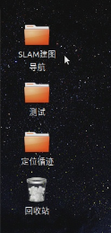

# 建图导航

准备工作：
1. AP1 导航机器人
2. 键盘鼠标

## 操作步骤

### 一、连接键鼠
鼠标键盘建议使用普通成套的无线键鼠，避免有线和无线混合使用。

### 二、启动系统
打开电源，打开工控机，等待 Autolabor OS 系统启动，输入密码 autolabor，字母全部是小写，回车。

### 三、建图导航

#### 准备工作：
1. 将 AP1 控制模式切换到上位机控制，打开急停开关，确保急停开关没有被按下
2. 禁用工控机无线功能
  在建图过程中，如果工控机连接了无线网络，当AP1走出无线网络的覆盖区域后，网络连接会自动断开，这将导致AP1控制失控，所以在开始建图之前，为了避免失控，需要将工控机的无线网络连接关闭。
3. 进入桌面【SLAM建图导航】文件夹

#### 1. 点击【开始建图】

RVIZ工具打开，能够看到地图中的 AP1。

键盘数字键【1/2】线速度增加/减少，数字键【3/4】角速度增加/减少，数字键【9】启用，数字键【0】禁用。

使用键盘的上下左右控制 AP1 行走，边走边建图，可以看到环境地图随着 AP1 的行走不断被构建更新。

地图中，红色是前置激光雷达实时数据，黄色是后置激光雷达实时数据，颜色从白至黑为障碍物的几率是0%~100%。

最终建图结果示意：

#### 2. 建图完毕，点击【保存并停止建图】

#### 3. 点击【开始导航】
RVIZ工具打开，建好的地图会自动加载。

注意：一定要成功完成建图后，才能进行导航，否则会找不到地图文件产生报错。

##### 初始化定位

使用键盘控制机器人行走一段距离，当激光雷达的数据与实时的环境匹配成功时，即为机器人找到在地图中的初始定位。

如果将机器人放置在建图的出发点，会能够帮助机器人加速初始化定位，但此步骤不是必须的。

如上图所示，进行初始化定位操作后，机器人突然跳到了一个新地点，并且地图中的地点与真实环境中机器人位置一致，即为初始化成功，可进行下一步操作。

##### 关闭键盘控制

初始化定位完成后，接下来这一步请一定不要忘记，按键盘数字键【0】关闭键盘控制功能，控制方式将切换至导航程序控制，如不切换机器人接收到目标点命令后将不会自动导航行走。

##### 给定目标点

点击 2D Nav Goal，指定目标位置，拉动鼠标，箭头方向是最终车辆运行至目标的车头朝向，鼠标松开，这样就完成了目标点的指定。

目标点给定后在地图中我们能看到一条线，这是规划好的路径。根据这个规划好的路径，AP1 向目标点行走。

当AP1已经到达目标点后，再一次使 2D Nav Goal 设置目标位置，AP1将去到下一个目标点。

### 四、点击【终止导航】，停止导航功能，导航结束。

之后在同一环境中需要再次使用导航功能时，无须重复建图，点击【开始导航】即可。

[>>常见问题](../../../common/q_a/doc.md)
